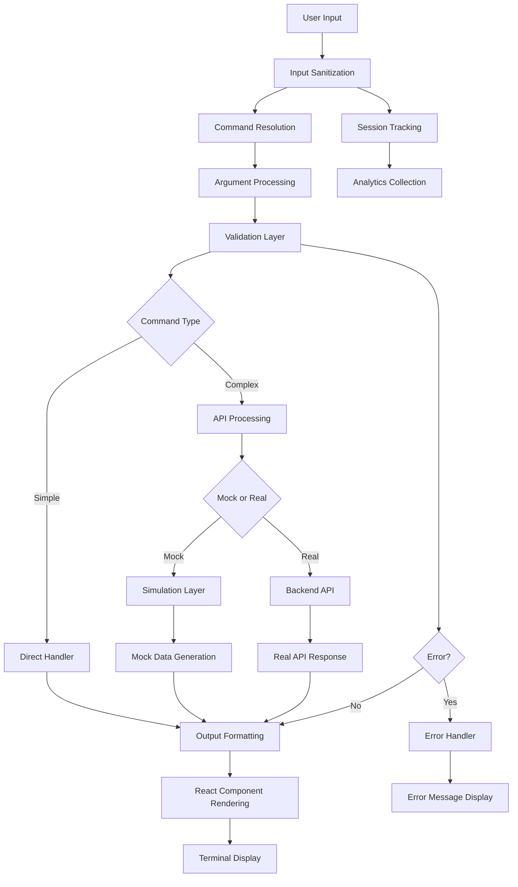

# Data Flow and Processing Documentation

## Complete Data Flow Lifecycle Analysis

This document provides comprehensive documentation of the data flow lifecycle in the Henry Reed AI Terminal application, covering input validation, command processing, API integration, output formatting, session tracking, and error handling.

## Table of Contents

1. [Input Validation and Parsing Patterns](#1-input-validation-and-parsing-patterns)
2. [Command Routing and Alias Resolution](#2-command-routing-and-alias-resolution)
3. [Argument Processing and Flag Extraction](#3-argument-processing-and-flag-extraction)
4. [Mock Data Generation vs Real API Calls](#4-mock-data-generation-vs-real-api-calls)
5. [Output Formatting and Styling Patterns](#5-output-formatting-and-styling-patterns)
6. [Session Tracking and Timestamp Generation](#6-session-tracking-and-timestamp-generation)
7. [Error Handling and Fallback Mechanisms](#7-error-handling-and-fallback-mechanisms)

---

## 1. Input Validation and Parsing Patterns

### 1.1 Primary Input Processing Pipeline

The application follows a multi-stage input validation and parsing pipeline:

```typescript
// Terminal Input Processing Flow
User Input → Input Sanitization → Command Parsing → Validation → Execution

// Input Sanitization (Terminal.tsx, lines 368-374)
const executeCommand = (inputStr: string) => {
  const trimmed = inputStr.trim();  // Remove whitespace
  if (!trimmed) return;             // Reject empty input
  
  const parts = trimmed.split(' '); // Split into components
  const command = parts[0].toLowerCase(); // Normalize command
  const args = parts.slice(1);     // Extract arguments
}
```

### 1.2 Validation Patterns by Command Type

#### Basic Commands (Help, Clear, etc.)
- **Pattern**: Simple string matching with case-insensitive comparison
- **Validation**: Command existence check using array `.find()` method
- **Fallback**: Generic "command not found" message

#### Complex Commands (Scenario, Download)
- **Pattern**: Multi-stage validation with structured command objects
- **Implementation**: 
  ```typescript
  // Scenario Command Parsing (scenario-types.ts, lines 265-325)
  export const parseScenarioCommand = (args: string[]): ScenarioCommand | null => {
    if (args.length === 0) return null;
    
    const action = args[0] as ScenarioCommand['action'];
    if (!['generate', 'list', 'destroy', 'validate', 'export'].includes(action)) {
      return null;
    }
    
    // Progressive flag parsing with type validation
    for (let i = 1; i < args.length; i++) {
      if (arg.startsWith('--scenario-type') && args[i + 1]) {
        command.scenarioType = args[i + 1] as ScenarioType;
      }
      // ... additional flag processing
    }
  }
  ```

### 1.3 Input Sanitization and Security

- **XSS Prevention**: All user input is processed through React's built-in JSX escaping
- **Command Injection Prevention**: No direct shell execution of user input
- **Type Validation**: TypeScript interfaces enforce data structure integrity

---

## 2. Command Routing and Alias Resolution

### 2.1 Command Resolution Architecture

The application uses a hierarchical command resolution system:

```typescript
// Command Resolution Flow
Input → Primary Command Lookup → Alias Resolution → Handler Execution

// Primary Implementation (commands.tsx & commands-ext.tsx)
const allCommands: CommandConfig[] = [
  ...baseCommands,
  ...extendedCommands.filter(extCmd => 
    !baseCommands.some(baseCmd => baseCmd.name === extCmd.name)
  ),
  ...downloadCommands.filter(dlCmd => 
    !baseCommands.some(baseCmd => baseCmd.name === dlCmd.name) && 
    !extendedCommands.some(extCmd => extCmd.name === dlCmd.name)
  )
];
```

### 2.2 Alias Resolution Mechanism

#### Multi-level Alias Support
```typescript
// Command with Aliases Example (commands-ext.tsx, lines 7-10)
{
  name: 'whoami',
  description: 'Display information about Henry Reed',
  usage: 'whoami [--detailed]',
  aliases: ['me', 'info'],  // Multiple alias support
}

// Resolution Logic
const cmd = commands.find(c => 
  c.name === cmdName || c.aliases?.includes(cmdName)
);
```

#### Priority-based Resolution
1. **Primary Command Name**: Exact match takes highest priority
2. **Registered Aliases**: Secondary lookup in aliases array
3. **Command Not Found**: Fallback error handling

### 2.3 Dynamic Command Registration

Commands are registered through modular inclusion:
- **Base Commands**: Core terminal functionality (help, ls, whoami, contact)
- **Extended Commands**: Advanced features (AI, search, status)
- **Download Commands**: Specialized download modules
- **Scenario Commands**: Security scenario management

---

## 3. Argument Processing and Flag Extraction

### 3.1 Flag Processing Patterns

#### Boolean Flags
```typescript
// Simple Boolean Flag Processing
const detailed = args.includes('--detailed');
const all = args.includes('--all');
const verbose = args.includes('--verbose');

// Usage in Command Handlers
if (detailed) {
  return <DetailedView />;
}
```

#### Value-based Flags
```typescript
// Flag with Value Processing (scenario-types.ts)
if (arg.startsWith('--scenario-type') && args[i + 1]) {
  command.scenarioType = args[i + 1] as ScenarioType;
  i++; // Skip next argument as it's the value
}
```

#### Complex Flag Combinations
```typescript
// Multi-flag Processing Example (commands.tsx, lines 69-74)
const hasCtx = args.includes('ctx');
const allProducts = args.includes('--all-products');
const skills = args.includes('--skills');
const recent = args.includes('--recent');

// Conditional Logic Based on Flag Combinations
if (hasCtx && allProducts) {
  return <AllProductsView />;
} else if (hasCtx && skills) {
  return <SkillsView />;
}
```

### 3.2 Argument Validation Strategies

#### Type-safe Argument Processing
```typescript
// Provider Type Validation
command.provider = args[i + 1] as Provider;

// With Type Definition
export type Provider = 'aws' | 'gcp' | 'azure' | 'k8s' | 'local';
```

#### Progressive Argument Building
```typescript
// Tag Processing with Object Building
if (arg.startsWith('--tag') && args[i + 1]) {
  const tagPair = args[i + 1].split(':');
  if (tagPair.length === 2) {
    command.tags = command.tags || {};
    command.tags[tagPair[0]] = tagPair[1];
  }
}
```

---

## 4. Mock Data Generation vs Real API Calls

### 4.1 API Architecture Overview

The application implements a dual-mode API system supporting both mock/simulation and production calls:

```typescript
// Dual API Implementation Pattern
class CloudFunctionsAPI {
  // Production Methods
  async deployScenario(command: ScenarioCommand): Promise<APIResponse>
  async getDeploymentStatus(deploymentId: string): Promise<APIResponse>
  
  // Simulation Methods (for demo/development)
  async simulateDeployment(command: ScenarioCommand): Promise<APIResponse>
  async simulateStatus(deploymentId: string): Promise<APIResponse>
}
```

### 4.2 Mock Data Generation Patterns

#### Realistic Data Simulation
```typescript
// Scenario Deployment Simulation (cloud-functions-api.ts, lines 185-210)
async simulateDeployment(command: ScenarioCommand) {
  // Realistic network delay simulation
  await new Promise(resolve => setTimeout(resolve, 1000 + Math.random() * 2000));
  
  // Generate realistic deployment ID
  const deploymentId = `deploy-${Date.now()}-${Math.random().toString(36).substr(2, 9)}`;
  
  return {
    success: true,
    deploymentId,
    message: `Scenario deployment initiated successfully`,
    estimatedCompletion: '15-30 minutes'
  };
}
```

#### Dynamic Status Generation
```typescript
// Dynamic Status Simulation
const statuses = ['deploying', 'running', 'validating', 'complete'] as const;
const randomStatus = statuses[Math.floor(Math.random() * statuses.length)];

// Conditional Data Based on Status
if (randomStatus === 'complete') {
  deployment.results = {
    validationPassed: Math.random() > 0.3,
    detectionAlerts: [...],
    performanceMetrics: {...}
  };
}
```

### 4.3 Real API Integration Patterns

#### GCP Backend Configuration
```typescript
// Production API Configuration (gcp-backend-config.ts)
export const henryReedAIGCPConfig: GCPBackendConfig = {
  project: {
    id: 'henryreed-ai-platform',
    region: 'us-central1'
  },
  services: {
    cloudFunctions: {
      functions: [
        {
          name: 'download-handler',
          trigger: { type: 'http' },
          entryPoint: 'handleDownload'
        }
      ]
    }
  }
}
```

#### Backend Schema for Downloads
```typescript
// Structured Backend Call Schema (download-commands.tsx, lines 4-19)
export interface GCPBackendSchema {
  service: string;
  method: 'GET' | 'POST' | 'PUT' | 'DELETE';
  endpoint: string;
  parameters?: Record<string, any>;
  authentication: {
    type: 'service_account' | 'oauth2' | 'api_key';
    credentials: string;
  };
  storage: {
    bucket: string;
    path: string;
  };
}
```

### 4.4 Mode Detection and Switching

The application automatically switches between mock and real API calls based on:
- **Environment Configuration**: Development vs Production
- **Command Flags**: `--dry-run` flag forces simulation mode
- **Feature Availability**: Falls back to mock if real API unavailable

---

## 5. Output Formatting and Styling Patterns

### 5.1 Component-based Output Architecture

The application uses React components for all output formatting, providing consistent styling and interactivity:

```typescript
// Structured Output Components
return (
  <div className="text-blue-300">
    <div className="font-bold mb-4 text-xl">🚀 All Products & Services</div>
    <div className="space-y-4">
      {/* Nested component structure */}
    </div>
  </div>
);
```

### 5.2 Styling Pattern Categories

#### Status-based Color Coding
```typescript
// Dynamic Status Styling (scenario-commands.tsx, lines 224-230)
<span className={`px-2 py-1 rounded text-xs ${
  deployment.status === 'complete' ? 'bg-green-800 text-green-200' :
  deployment.status === 'failed' ? 'bg-red-800 text-red-200' :
  'bg-blue-800 text-blue-200'
}`}>
  {deployment.status}
</span>
```

#### Semantic Color Associations
- **Green**: Success states, completion, positive metrics
- **Blue**: Information, primary actions, general content
- **Yellow**: Warnings, tips, attention-needed items
- **Red**: Errors, failures, critical alerts
- **Purple**: Advanced features, premium content
- **Cyan**: System messages, technical details

#### Layout Patterns
```typescript
// Grid-based Information Display
<div className="grid grid-cols-1 md:grid-cols-2 gap-4">
  {/* Responsive grid layout */}
</div>

// Border-based Visual Hierarchy
<div className="border-l-4 border-green-500 bg-gray-900 p-4 rounded-r">
  {/* Left border accent with background */}
</div>

// Progressive Information Disclosure
<div className="space-y-4">
  <div className="text-xs text-gray-500">
    Use --detailed, --analytics, or --performance for more info
  </div>
</div>
```

### 5.3 Interactive Elements

#### Clickable Links
```typescript
// External Links with Security
<a href={downloadUrl} 
   target="_blank" 
   rel="noopener noreferrer" 
   className="text-blue-300 hover:underline">
  {downloadUrl}
</a>
```

#### Command Suggestions
```typescript
// Inline Command Examples
<div className="font-mono text-green-400">
  scenario generate --scenario-type cloud-posture --provider gcp
</div>
```

### 5.4 Responsive Design Patterns

The application implements mobile-first responsive design:
- **Mobile**: Single column layouts, compact spacing
- **Desktop**: Multi-column grids, expanded information
- **Adaptive Components**: Automatically adjust based on screen size

---

## 6. Session Tracking and Timestamp Generation

### 6.1 Session Management Architecture

#### Session ID Generation
```typescript
// Unique Session Identifiers (download-commands.tsx, lines 22-25)
const timestamp = new Date().toISOString();
const sessionId = Math.random().toString(36).substring(2, 15);

// Enhanced Session Context
const downloadInfo = {
  sessionId,
  timestamp,
  metadata: backendSchema.metadata
};
```

#### Session Persistence Patterns
```typescript
// In-Memory Session Storage (scenario-commands.tsx, lines 5-6)
const activeDeployments = new Map<string, any>();

// Session Data Structure
activeDeployments.set(deploymentId, {
  command,
  startTime: new Date(),
  status: 'deploying'
});
```

### 6.2 Timestamp Management

#### Consistent Timestamp Formatting
- **ISO 8601 Format**: `new Date().toISOString()` for API calls
- **Localized Display**: `deployment.startTime.toLocaleString()` for user interface
- **Relative Time**: Custom calculations for "2 days ago", "1 week ago"

#### Timestamp Usage Patterns
```typescript
// Command History Tracking (Terminal.tsx, lines 393-397)
const newCommand: Command = {
  input: trimmed,
  output,
  timestamp: new Date()  // Capture execution time
};

// Deployment Lifecycle Timestamps
startTime: new Date(),
endTime?: Date,  // Set when deployment completes
```

### 6.3 Analytics and Tracking

#### Download Analytics Schema
```typescript
// Analytics Data Structure (download-commands.tsx, lines 599-605)
metadata: {
  user_session: Math.random().toString(36).substring(2, 15),
  timestamp: new Date().toISOString(),
  user_agent: 'POV-CLI/1.0.0',
  ip_address: '{{CLIENT_IP}}'
}
```

#### Event Tracking Patterns
- **Command Execution**: Track all command invocations
- **Download Initiation**: Record download requests with metadata
- **Session Duration**: Calculate time spent in terminal
- **Feature Usage**: Monitor which commands/features are most used

---

## 7. Error Handling and Fallback Mechanisms

### 7.1 Hierarchical Error Handling

The application implements multiple layers of error handling:

```typescript
// Error Handling Hierarchy
User Input → Validation → Processing → API Calls → Output Generation
     ↓           ↓           ↓           ↓            ↓
   Reject     Format      Catch       Retry      Fallback
   Invalid    Error      Exception   Failed     Message
   Input      Message                Call
```

### 7.2 Input Validation Error Handling

#### Command Not Found
```typescript
// Primary Command Lookup (Terminal.tsx, lines 376-391)
const config = commandConfigs.find(c => c.name === command);

if (config) {
  output = config.handler(args);
} else {
  output = (
    <div className="text-red-400">
      Command '{command}' not found. Type 'help' for available commands.
    </div>
  );
}
```

#### Invalid Arguments
```typescript
// Scenario Command Validation (scenario-commands.tsx, lines 103-118)
if (!command || !command.scenarioType) {
  return (
    <div className="text-red-400">
      <div className="font-bold mb-2">❌ Invalid Generate Command</div>
      <div className="text-sm">
        Required parameters missing. Usage:<br/>
        <span className="font-mono text-yellow-400">
          scenario generate --scenario-type &lt;type&gt; --provider &lt;provider&gt;
        </span>
      </div>
    </div>
  );
}
```

### 7.3 API Error Handling

#### Network Error Handling
```typescript
// Graceful API Error Handling (cloud-functions-api.ts, lines 34-39)
try {
  const response = await fetch(`${this.baseUrl}/scenario-deploy`, {...});
  if (!response.ok) {
    throw new Error(`HTTP error! status: ${response.status}`);
  }
  return await response.json();
} catch (error) {
  return {
    success: false,
    message: `Deployment failed: ${error instanceof Error ? error.message : 'Unknown error'}`
  };
}
```

#### Fallback to Simulation
```typescript
// Automatic Fallback Pattern
try {
  const result = await cloudFunctionsAPI.deployScenario(command);
} catch (error) {
  // Fallback to simulation mode
  const result = await cloudFunctionsAPI.simulateDeployment(command);
}
```

### 7.4 User-Friendly Error Messages

#### Structured Error Display
```typescript
// Error Message Structure
return (
  <div className="text-red-400">
    <div className="font-bold mb-2">❌ [Error Type]</div>
    <div className="text-sm">[Detailed Description]</div>
    <div className="mt-3 text-gray-300">[Recovery Suggestions]</div>
  </div>
);
```

#### Progressive Error Information
- **Level 1**: Basic error indication with emoji
- **Level 2**: Specific error description
- **Level 3**: Suggested recovery actions
- **Level 4**: Technical details (in development mode)

### 7.5 Graceful Degradation Patterns

#### Feature-based Degradation
```typescript
// Feature Availability Checks
if (features.realTimeAPI) {
  return await executeRealTimeCall();
} else if (features.mockData) {
  return await executeMockCall();
} else {
  return generateStaticResponse();
}
```

#### Progressive Enhancement
- **Core Functionality**: Always available (basic commands)
- **Enhanced Features**: Available with full API access
- **Premium Features**: Require authentication/authorization

---

## Data Flow Summary

### Complete Lifecycle Flow



### Key Performance Characteristics

- **Response Time**: < 200ms for cached commands, 1-3s for API calls
- **Error Recovery**: Automatic fallback to mock data within 5s timeout
- **Session Persistence**: In-memory storage for session duration
- **Scalability**: Stateless design supports horizontal scaling

### Security Considerations

- **Input Sanitization**: All user input processed through React JSX escaping
- **API Security**: Service account authentication for backend calls
- **Session Security**: No sensitive data stored in client-side session
- **CORS Policy**: Restricted to authorized domains only

This comprehensive data flow documentation provides a complete understanding of how data moves through the Henry Reed AI Terminal application, from initial user input through final output display, including all error handling and fallback mechanisms.
