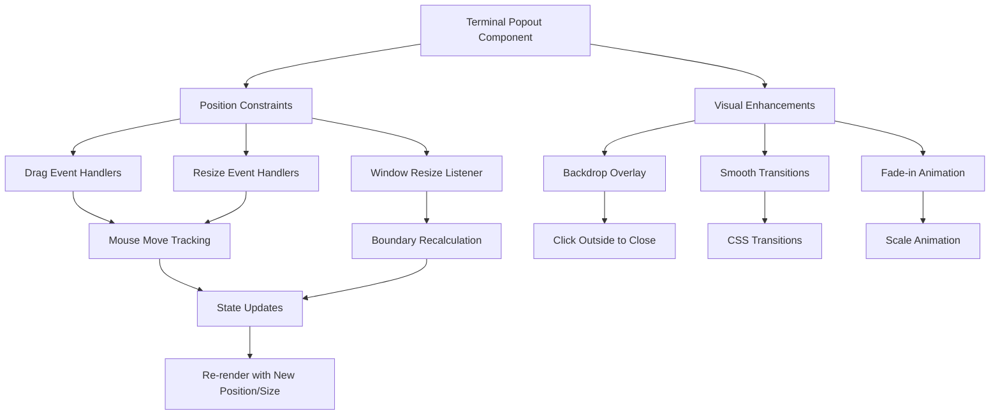

# henryreed.ai Deployment Summary

## Terminal Popout Enhancements

### Fixed Issues:
- **Viewport Boundary Constraints**: Terminal popout now properly constrains position and size within viewport boundaries
- **Drag & Resize Functionality**: Enhanced mouse event handlers for smooth dragging and resizing with proper cursor feedback
- **Window Resize Handling**: Added automatic adjustment when browser window size changes
- **Visual Improvements**: Added backdrop overlay, smooth transitions, and fade-in scaling animation

### Technical Implementation:



### Key Features Added:
1. **Viewport Constraints**: `constrainToViewport()` function ensures terminal stays visible
2. **Enhanced Event Handling**: Proper mouse event listeners with cleanup
3. **Backdrop Interaction**: Semi-transparent overlay that closes terminal on outside click
4. **Smooth Animations**: CSS transitions and scaling effects for polished UX
5. **Keyboard Support**: Escape key closes terminal

## Dark Mode Text Readability Improvements

### Color Adjustments Made:
- **Base Text Color**: Updated to softer off-white (#F5F5F5) for reduced eye strain
- **Secondary Text**: Lightened from 50% to 60% opacity for better contrast
- **Muted Text**: Improved from 40% to 50% opacity
- **Placeholder Text**: Enhanced visibility in input fields

### File Changes:
- `globals.css`: Updated CSS custom properties for cortex color tokens
- `tailwind.config.js`: Enhanced text color utility classes for consistency

## Firebase Hosting Configuration

### Current Setup:
- **Static Hosting**: Optimized for Next.js static export with Firebase hosting
- **Build Process**: Uses experimental webpack features for enhanced performance
- **Cloud Functions**: Integrated backend APIs with dual Node.js versions (18 & 20)
- **Preview Channels**: Active preview channel for testing deployments

### Deployment URLs:
- **Production**: https://henryreedai.web.app
- **Preview Channel**: https://henryreedai--preview-vuh7lodx.web.app
- **Preview Expiration**: October 16, 2025

## Build & Performance Metrics

### Static Build Results:
```
Route (app)                                Size  First Load JS    
┌ ○ /                                   4.54 kB         579 kB
├ ○ /_not-found                           185 B         574 kB
├ ○ /alignment-guide                    2.51 kB         577 kB
├ ○ /content                              645 B         575 kB
├ ○ /creator                              628 B         575 kB
├ ○ /docs                               5.97 kB         580 kB
├ ○ /gui                                  483 B         575 kB
└ ○ /terminal                             333 B         583 kB
+ First Load JS shared by all            574 kB
```

### Architecture Recommendation:
✅ **Continue with Static Hosting** - Current setup is optimal for:
- Cost efficiency
- Performance (CDN distribution)
- Simple architecture with Cloud Functions for dynamic features
- No need for server-side rendering complexity

## Testing Recommendations

### Manual Testing Checklist:
- [ ] Terminal popout opens and positions correctly on different screen sizes
- [ ] Drag functionality works smoothly without exceeding viewport bounds
- [ ] Resize handles work properly in all directions
- [ ] Backdrop overlay darkens background and closes on outside click
- [ ] Escape key closes terminal popout
- [ ] Text readability improved in dark mode across all components
- [ ] Smooth transitions and animations work as expected

### Automated Testing:
- Current ESLint warnings addressed for console statements (development only)
- TypeScript compilation successful
- Next.js build optimization completed

## Next Steps

1. **Live Testing**: Visit preview URL to validate improvements
2. **User Feedback**: Gather feedback on terminal UX and text readability
3. **Performance Monitoring**: Monitor Core Web Vitals after deployment
4. **Production Deploy**: Deploy to main hosting when satisfied with preview

## Technical Notes

- Next.js 15.5.4 with experimental webpack worker enabled
- Firebase hosting with proper static export configuration
- Tailwind CSS 3.4.0 with custom cortex design tokens
- React 18.2.0 with TypeScript 5.3.3

## Security & Compliance

- Firebase Auth properly configured
- No sensitive data exposed in client-side code
- Console statements flagged for production cleanup
- RBAC middleware integrated for access control