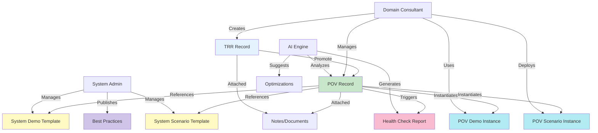
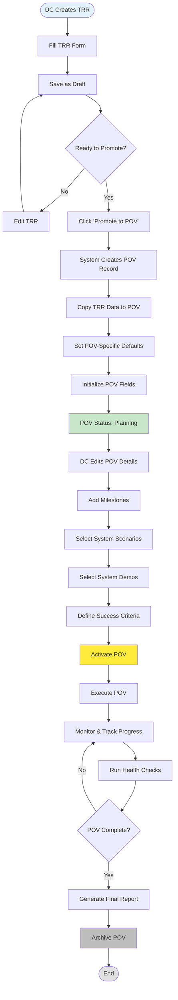
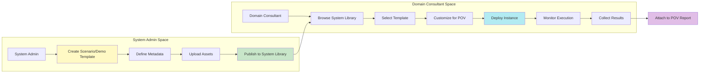
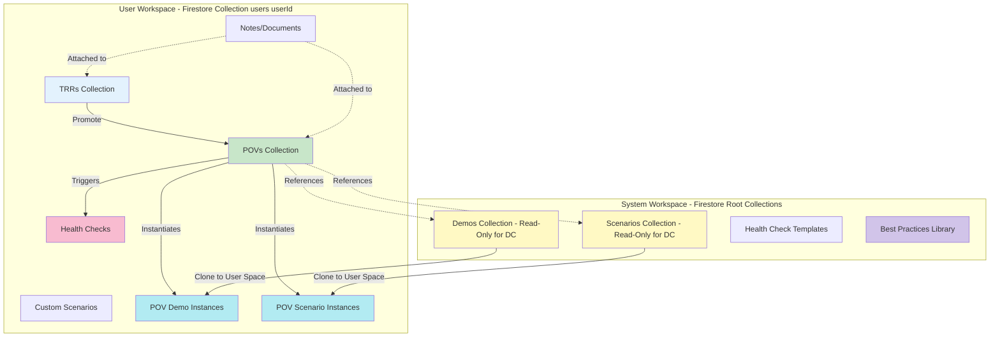

# Cortex Domain Consultant Portal

> **Professional POV Management & Customer Engagement Platform**
> *Powered by Palo Alto Networks Cortex Platform*

[](https://nextjs.org/)
[](https://www.typescriptlang.org/)
[](https://firebase.google.com/)
[](https://henryreedai.web.app)

A professional-grade web application designed specifically for Palo Alto Networks Domain Consultants to manage Proof of Value (POV) engagements, customer demonstrations, and technical sales activities. Built with Next.js 15 and optimized for both desktop and mobile experiences.

---

## Table of Contents

1. [Repository Objective & Scope](#-repository-objective--scope)
2. [Authentication](#-authentication)
3. [Functional Scope & Roles](#-functional-scope--roles)
4. [Data Objects & Relationships](#-data-objects--relationships)
5. [Core Workflows](#-core-workflows)
6. [Features & Capabilities](#-features--capabilities)
7. [Technical Stack](#-technical-stack)
8. [Deployment Architecture](#-current-deployment-architecture)
9. [Project Structure](#-project-structure)
10. [Getting Started](#-getting-started)
11. [UI/UX Optimization](#-uiux-optimization)
12. [Component Architecture](#-component-architecture)
13. [Data Flow Summary](#-data-flow-summary)
14. [Optimization Opportunities](#-optimization-opportunities)
15. [Additional Documentation](#-additional-documentation)

---

## 🎯 Repository Objective & Scope

### **Purpose**
This repository provides a **Domain Consultant Workspace** for managing XSIAM Proof-of-Value (POV) engagements, from initial Technical Readiness Review (TRR) through POV execution, scenario demonstration, and health monitoring.

### **Core Scope**
- **User-Space (Domain Consultant)**: Create, manage, and execute POVs, Scenarios, Demos, and Health Checks
- **System-Admin-Space**: Manage system-wide Demos, Scenarios, Health Check templates, and best practices
- **Data Promotion Flow**: TRR → POV workflow with structured data promotion
- **Isolated Workspaces**: Firebase-based user isolation with role-based access control

### **Out of Scope**
- Multi-tenant POV collaboration (single DC per POV)
- Real-time collaborative editing (async updates only)
- Deep Salesforce/JIRA integration (hooks available, not bi-directional sync)

---

## 🔐 Authentication

The application supports simple username/password authentication with two pre-configured accounts:

- **Regular User**: `user1` / `paloalto1` - Domain Consultant with standard permissions
- **System Admin**: `cortex` / `xsiam` - Full administrative access

*Note: The app runs in mock authentication mode for development and demonstration purposes.*

---

## 👥 Functional Scope & Roles

### Role Definitions

| Role | Persona | Capabilities | Data Access |
|------|---------|--------------|-------------|
| **DC (Domain Consultant)** | Sales engineer / technical consultant | Create TRRs, promote to POVs, manage POV lifecycle, use system demos/scenarios, create custom scenarios | Own TRRs, own POVs, read-only system templates |
| **System Admin** | Platform maintainer / content curator | Manage system demo library, manage system scenario templates, manage health check templates, publish best practices | All system templates, user analytics (aggregated), platform health |
| **AI Engine** | Automated assistant | Generate detection rules, analyze POV health, suggest optimizations, auto-generate reports | Context-aware read access to user data with permission |

---

## 📊 Data Objects & Relationships

### Primary Data Objects

| Object | Type | Owner | Lifecycle | Firestore Path | Key Attributes |
|--------|------|-------|-----------|----------------|----------------|
| **TRR** | Record | DC | Draft → Submitted → Archived | `users/{userId}/trrs/{trrId}` | Customer info, requirements, tech stack |
| **POV** | Record | DC | Promoted from TRR → Planning → Active → Complete | `users/{userId}/povs/{povId}` | Customer, milestones, scenarios, success criteria |
| **Demo** | Template/Instance | System Admin (template), DC (instance) | Template: Published → Archived<br>Instance: Scheduled → Complete | System: `demos/{demoId}`<br>User: `users/{userId}/pov-demos/{demoId}` | XSIAM features, target audience, assets |
| **Scenario** | Template/Instance | System Admin (template), DC (instance) | Template: Published → Archived<br>Instance: Deployed → Running → Destroyed | System: `scenarios/{scenarioId}`<br>User: `users/{userId}/pov-scenarios/{scenarioId}` | Attack type, MITRE ATT&CK, deployment config |
| **Health Check** | Monitoring Report | DC (triggered), AI Engine (generated) | Scheduled → Running → Complete | `users/{userId}/health-checks/{checkId}` | Tenant health, license usage, detection effectiveness |
| **Note/Document** | Attachment | DC | Created → Edited → Deleted | `users/{userId}/notes/{noteId}` (with POV/TRR refs) | Markdown content, tags, attachments |

### Data Relationships



---

## 🔄 Core Workflows

### 1. TRR to POV Promotion Flow



**Key Data Mappings (TRR → POV):**
- `trr.customer` → `pov.customer`
- `trr.requirements[]` → `pov.technicalRequirements[]`
- `trr.techStack` → `pov.environment`
- `trr.notes` → `pov.initialNotes`
- New POV fields initialized: `milestones[]`, `scenarios[]`, `demos[]`, `successCriteria{}`

### 2. Scenario & Demo Management Flow



**System Template Attributes:**
- **Scenario Template**: Attack type, MITRE ATT&CK mapping, deployment script, validation criteria, XQL queries
- **Demo Template**: XSIAM features demonstrated, target audience, step-by-step guide, assets (videos, screenshots)

**User Instance Attributes:**
- Inherits template metadata
- Adds: POV ID, deployment timestamp, custom parameters, execution logs, results

### 3. User vs System Data Flow



---

## ✨ Features & Capabilities

### 🎯 Core Modules

#### 1. **Dashboard**
*Central engagement hub with real-time metrics*
- Real-time POV progress and customer engagement stats
- Customizable widgets and quick actions
- Activity feed and executive reporting
- Mobile-responsive design

#### 2. **POV Management**
*Complete Proof of Value lifecycle management*
- Template-based POV initialization and planning
- TRR to POV promotion workflow with data mapping
- Milestone tracking with visual timelines
- Customer engagement and stakeholder management
- Scenario and demo instance management
- Competitive analysis and ROI calculations
- Success metrics and business value demonstrations
- Opportunity stage tracking (Salesforce stages 1-8)

#### 3. **TRR & Requirements**
*Technical Requirements Review and documentation*
- Interactive TRR forms with validation
- CSV import/export for bulk operations
- Solution Design Workbook (SDW) integration
- Workflow automation and status tracking
- One-click promotion to POV with data migration
- AI-assisted field population and validation

#### 4. **AI Assistant**
*AI-powered customer engagement optimization*
- Context-aware recommendations
- POV optimization suggestions
- Predictive analytics for timeline and risk assessment
- Auto-generated executive summaries
- Detection rule generation with MITRE ATT&CK mapping
- Health check analysis and insights

#### 5. **Platform Health**
*Real-time system monitoring and analytics*
- Cortex platform health monitoring
- Demo environment management
- Performance metrics and alerting
- Integration status monitoring
- Automated health check scheduling
- AI-powered anomaly detection

#### 6. **Content Creator**
*Unified content generation for DC workflows*
- POV documentation automation
- TRR report templates
- Customer presentations with real data
- Template management and version control

#### 7. **Best Practices Library**
*XSIAM PoV phase-based guidance*
- 30+ best practices across 5 POV phases
- Opportunity stage mapping (stages 1-8)
- XQL query examples
- Related tools and resources
- Phase-specific recommendations
- Searchable and filterable content

#### 8. **Demo Hub**
*System-wide demo template library*
- Pre-built XSIAM demonstration scenarios
- Target audience segmentation
- Asset library (videos, screenshots, guides)
- POV-specific demo instance management

#### 9. **Scenario Engine**
*Security scenario deployment and management*
- System scenario template library
- Attack simulation deployment
- MITRE ATT&CK framework alignment
- Custom scenario creation
- Deployment lifecycle management
- Results collection and analysis

#### 10. **NICCEE Framework** ✨ NEW
*XSIAM Data Integration Framework*
- **N**etwork, **I**dentity, **C**loud Identity Engine, **C**loud, **E**ndpoint, **E**mail
- 6 security layers with comprehensive data source mapping
- 50+ data sources categorized by risk impact and complexity
- Playbook automation engine with deployment steps
- Business value matrix linking analytics to ROI
- Test case validation framework
- MITRE ATT&CK technique coverage
- Interactive architecture diagrams
- Time-to-value metrics for each data source

---

## 🏗️ Technical Stack

**Frontend**
- **Next.js 15** - React framework with Turbopack for fast development
- **TypeScript** - Full type safety throughout the application
- **Tailwind CSS** - Utility-first CSS framework for responsive design
- **React Hooks** - Modern state management and lifecycle handling

**Backend & Services**
- **Firebase Hosting** - Static site hosting with global CDN
- **Google Cloud Functions** - Serverless backend (Node.js 18/20)
- **Firebase Firestore** - Real-time document database with optimized indexes
- **PostgreSQL Data Connect** - Advanced data relationships and queries
- **Firebase Authentication** - Mock auth mode for development
- **Firebase Storage** - Secure file and asset management

**Key Features**
- **Role-Based Access Control (RBAC)** - Granular permissions system
- **Dual Interface** - Both GUI and terminal interfaces
- **Real-time Updates** - Live data synchronization
- **Mobile Responsive** - Optimized for all device sizes
- **Performance Optimized** - Memoized components to prevent re-render issues
- **Multi-tenant Architecture** - User workspace isolation

---

## 🏧 Current Deployment Architecture

### **Google Cloud Platform Services**

```
┌─────────────────────────────────────────────────────────────────┐
│                    Firebase Hosting (Global CDN)                │
│                  https://henryreedai.web.app                    │
└─────────────────┬───────────────────────────────────────────────┘
                  │
┌─────────────────┴───────────────────────────────────────────────┐
│                 Next.js Static Export                           │
│              (Client-side React App)                            │
└─────────────────┬───────────────────────────────────────────────┘
                  │
         ┌────────┴────────┐
         │                 │
┌─────────────────┐ ┌─────────────────┐
│ Cloud Functions │ │ Firebase        │
│                 │ │ Services        │
│ • Default       │ │                 │
│   (Node.js 18)  │ │ • Firestore     │
│ • Genkit AI     │ │ • Authentication│
│   (Node.js 20)  │ │ • Storage       │
│                 │ │ • Data Connect  │
└─────────────────┘ └─────────────────┘
         │                 │
         └────────┬────────┘
                  │
┌─────────────────────────────────────────────────────────────────┐
│              PostgreSQL (Data Connect)                          │
│          Enhanced schema for POV/TRR management                 │
└─────────────────────────────────────────────────────────────────┘
```

### **Key GCP Integrations**

| Service | Purpose | Configuration |
|---------|---------|---------------|
| **Firebase Hosting** | Static site delivery with global CDN | `firebase.json` - rewrites, caching headers |
| **Cloud Functions** | Dual codebase serverless backend | Default + Genkit AI functions |
| **Firebase Firestore** | Real-time document database | Role-based security rules |
| **Firebase Storage** | File uploads and document storage | Secure bucket policies |
| **Firebase Authentication** | User management and RBAC | Email/password + future OKTA SSO |
| **Data Connect** | PostgreSQL integration | GraphQL schema with audit trails |
| **Remote Config** | Feature flags and user settings | Role-based feature enablement |

---

## 📁 Project Structure

```
henryreed.ai/
├── hosting/                    # Next.js Application
│   ├── app/                   # App Router (Next.js 15)
│   │   ├── layout.tsx         # Root layout with providers
│   │   ├── page.tsx           # Landing/auth page
│   │   └── gui/               # Main application routes
│   ├── components/            # React Components
│   │   ├── POVManagement.tsx  # POV project management
│   │   ├── TRRManagement.tsx  # Technical requirements tracking
│   │   ├── CortexGUIInterface.tsx # Main dashboard interface
│   │   ├── POVBestPractices.tsx   # Best practices library
│   │   ├── terminal/          # Terminal components
│   │   └── auth/              # Authentication components
│   ├── lib/                   # Core Libraries
│   │   ├── scenario-commands.tsx    # Security scenario management
│   │   ├── cloud-functions-api.ts   # GCP integration layer
│   │   ├── scenario-types.ts        # TypeScript definitions
│   │   └── auth/                    # Authentication providers
│   ├── types/                 # TypeScript Type Definitions
│   │   ├── timeline.ts              # Timeline event types
│   │   ├── pov-best-practices.ts    # Best practices types
│   │   └── pov.ts                   # POV data models
│   ├── hooks/                 # Custom React Hooks
│   │   └── useTimeline.ts           # Timeline data fetching
│   ├── contexts/              # React Context Providers
│   │   ├── AppStateContext.tsx      # Global app state
│   │   └── AuthContext.tsx          # Authentication context
│   ├── next.config.ts         # Next.js configuration (static export)
│   └── package.json           # Dependencies and scripts
├── functions/                 # Default Cloud Functions (Node.js 18)
│   ├── src/                   # TRR management, analytics, exports
│   └── package.json
├── henryreedai/              # Genkit AI Functions (Node.js 20)
│   ├── src/                   # AI-powered analysis and chat
│   └── package.json
├── dataconnect/              # PostgreSQL Data Connect
│   ├── schema/               # Database schema definitions
│   └── dataconnect.yaml      # Configuration
├── firebase.json             # Firebase project configuration
└── deploy.sh                # Automated deployment script
```

---

## 🚀 Getting Started

### Prerequisites
- **Node.js** 18.0+ (LTS recommended)
- **Firebase CLI**: `npm install -g firebase-tools`
- **Git** for version control

### Local Development

1. **Clone and setup:**
   ```bash
   git clone https://github.com/henryreed/henryreed.ai.git
   cd henryreed.ai/hosting
   npm install
   ```

2. **Start development server:**
   ```bash
   # With Turbopack (faster development)
   npm run dev

   # Without Turbopack (if issues occur)
   npm run dev:no-turbo
   ```

3. **Access the application:**
   - **Login Page**: [http://localhost:3000](http://localhost:3000)
   - **Main Application**: [http://localhost:3000/gui](http://localhost:3000/gui) (after login)

4. **Login with demo accounts:**
   - **Regular User**: `user1` / `paloalto1`
   - **System Admin**: `cortex` / `xsiam`

5. **Firebase emulation (optional):**
   ```bash
   npm run firebase:emulators
   # Starts local Firebase services
   ```

### **Production Build & Test**

```bash
# Build static export
cd hosting
npm run build

# Test locally with Firebase emulator
npm run firebase:serve
```

---

## 🎨 UI/UX Optimization

### Recommended UI/UX Improvements

| Component | Current State | Proposed Enhancement | Benefit |
|-----------|--------------|---------------------|---------|
| **POV Cards** | Static list view | Dynamic tiles with quick actions, status badges, progress rings | Faster scanning, clear status at-a-glance |
| **TRR → POV** | Separate pages | Inline promotion flow with data preview modal | Reduced clicks, transparent data mapping |
| **Scenario Selection** | Dropdown list | Visual gallery with filtering by attack type, MITRE, complexity | Better discoverability, informed selection |
| **Demo Instances** | Table view | Card grid with screenshots, tags, deployment status | Visual appeal, easier browsing |
| **Navigation** | Top-level tabs | Hierarchical sidebar with collapsible sections | Better organization, faster navigation |
| **Health Checks** | Manual trigger | Auto-schedule + on-demand dashboard widget | Proactive monitoring, reduced manual work |
| **Notes** | Separate section | Inline commenting on POV/TRR with markdown support | Contextual documentation, collaboration |
| **Reports** | Static export | Live dashboard with drill-down + export options | Real-time insights, flexible reporting |

### Navigation Optimization

**Current Navigation:**
```
Dashboard | POV Management | TRR | AI Assistant | Health | Content | Best Practices
```

**Proposed Hierarchical Navigation:**
```
📊 Dashboard
├── 📈 Overview
├── 🎯 Quick Actions
└── 📢 Activity Feed

🎯 POV Workspace
├── 📋 Active POVs
├── 🔄 TRR → POV Promotion
├── 📚 Demo Library (System)
├── 🎭 Scenario Library (System)
└── 📖 Best Practices

🔧 TRR Management
├── ✏️ Create TRR
├── 📂 My TRRs
└── 🚀 Ready to Promote

🤖 AI Assistant
├── 💬 Chat
├── 🔍 Analysis
└── 📊 Insights

🏥 Health Monitoring
├── ⚡ Live Status
├── 📅 Scheduled Checks
└── 📜 History

👤 Profile & Settings
```

### Interaction Patterns

**Shallow Routing for Speed:**
- Use Next.js shallow routing for tab/view changes within POV detail pages
- Preserve filter/sort state in URL query params
- Enable browser back/forward navigation

**Accordion Panels for Dense Content:**
- Collapse/expand sections in TRR forms
- Progressive disclosure for POV configuration
- Minimize vertical scrolling

**Drawer Overlays for Quick Actions:**
- Right-side drawer for "Add Scenario to POV"
- Modal-free editing for notes and comments
- Keyboard shortcuts (e.g., `Cmd+K` for quick search)

---

## 🏛️ Component Architecture

### Recommended Next.js Component Hierarchy

```
app/gui/
├── layout.tsx                    # Root GUI layout with sidebar
├── page.tsx                      # Dashboard overview
├── pov/
│   ├── page.tsx                  # POV list view (active POVs)
│   ├── [povId]/
│   │   ├── page.tsx              # POV detail with tabs
│   │   ├── scenarios/page.tsx    # Scenario instances
│   │   ├── demos/page.tsx        # Demo instances
│   │   ├── health/page.tsx       # Health checks for this POV
│   │   └── reports/page.tsx      # POV reports
│   └── create/page.tsx           # Create new POV (rare, usually promoted from TRR)
├── trr/
│   ├── page.tsx                  # TRR list view
│   ├── [trrId]/
│   │   ├── page.tsx              # TRR detail
│   │   └── promote/page.tsx      # TRR → POV promotion flow
│   └── create/page.tsx           # Create new TRR
├── library/
│   ├── demos/page.tsx            # System demo templates (read-only for DC)
│   ├── scenarios/page.tsx        # System scenario templates (read-only for DC)
│   └── best-practices/page.tsx   # Best practices library
├── health/
│   ├── page.tsx                  # Health monitoring dashboard
│   └── [checkId]/page.tsx        # Health check detail
├── ai-assistant/page.tsx         # AI chat and analysis
└── settings/page.tsx             # User settings
```

### Component Reusability

**Shared Components:**
- `<POVCard />` - Reusable POV card with actions
- `<TRRCard />` - TRR card with promotion button
- `<ScenarioTile />` - Visual scenario template card
- `<DemoTile />` - Demo template card with preview
- `<TimelineView />` - Reusable timeline for POV/TRR history
- `<HealthWidget />` - Dashboard widget for health status
- `<PromotionModal />` - TRR → POV data mapping preview

---

## 📊 Data Flow Summary

### User-Initiated Flows

1. **TRR Creation → POV Promotion**
   - DC creates TRR in `users/{userId}/trrs/{trrId}`
   - Promotes TRR → Creates POV in `users/{userId}/povs/{povId}`
   - System copies TRR data, initializes POV-specific fields

2. **Scenario Selection → Deployment**
   - DC browses `scenarios/{scenarioId}` (system templates)
   - Selects scenario → Clones to `users/{userId}/pov-scenarios/{instanceId}`
   - Deploys instance → Logs results in instance document

3. **Demo Execution**
   - DC browses `demos/{demoId}` (system templates)
   - Schedules demo → Creates instance in `users/{userId}/pov-demos/{instanceId}`
   - Tracks completion status

4. **Health Monitoring**
   - DC triggers health check
   - System reads POV config, calls XSIAM APIs
   - Generates report in `users/{userId}/health-checks/{checkId}`
   - AI Engine analyzes results, suggests optimizations

### System-Admin Flows

1. **Template Publishing**
   - Admin creates demo/scenario template
   - Publishes to system collection (`demos/`, `scenarios/`)
   - DCs can now reference in POVs

2. **Best Practices Updates**
   - Admin updates best practices content
   - Changes reflected in `pov-best-practices` type definitions
   - UI automatically updates with new guidance

---

## 🚀 Optimization Opportunities

### 1. **Timeline Event System** ✅ Implemented
- User timeline events tracked in `users/{userId}/events/{eventId}`
- Real-time activity feed with `useTimeline` hook
- Supports filtering by source, action, object type, POV ID

### 2. **Bulk TRR Import with Auto-Promotion**
- CSV upload with column mapping
- Batch create TRRs
- Option to auto-promote qualified TRRs to POVs

### 3. **POV Templates**
- Pre-configured POV templates by industry (Finance, Healthcare, Retail)
- Include recommended scenarios, demos, success criteria
- One-click POV creation from template

### 4. **Smart Scenario Recommendations**
- AI analyzes TRR requirements
- Suggests matching system scenarios
- Auto-populate POV scenario list

### 5. **Real-time Collaboration Notifications**
- Firestore `onSnapshot` for POV updates
- Toast notifications for milestone completion, health check results
- Activity feed with @mentions

### 6. **Advanced Analytics Dashboard**
- Executive view: POV success rate, avg cycle time, top scenarios
- DC view: Personal metrics, best-performing demos
- AI-powered insights and recommendations

---

## 🔧 Configuration & Environment

### **Firebase Configuration**
```json
{
  "hosting": {
    "public": "hosting/out",
    "rewrites": [{"source": "**", "destination": "/index.html"}],
    "headers": [
      {
        "source": "**/*.@(js|css)",
        "headers": [{"key": "Cache-Control", "value": "max-age=31536000"}]
      }
    ]
  }
}
```

### **Next.js Static Export**
```typescript
// next.config.ts
const nextConfig: NextConfig = {
  output: 'export',              // Static site generation
  trailingSlash: true,          // Firebase compatibility
  distDir: 'out',               // Build directory
  images: { unoptimized: true }, // Required for static hosting
  experimental: {
    turbo: { rules: {} }         // Turbopack configuration
  }
}
```

### **Environment Variables**
```env
# Firebase configuration (auto-configured)
NEXT_PUBLIC_FIREBASE_API_KEY=
NEXT_PUBLIC_FIREBASE_AUTH_DOMAIN=
NEXT_PUBLIC_FIREBASE_PROJECT_ID=

# Feature flags
NEXT_PUBLIC_USE_FUNCTIONS=1
NEXT_PUBLIC_AI_ENABLED=true
NEXT_PUBLIC_AUTH_PROVIDER=local

# Optional: OKTA integration
NEXT_PUBLIC_OKTA_DOMAIN=
NEXT_PUBLIC_OKTA_CLIENT_ID=
```

---

## 🔐 Security & Authentication

### **Role-Based Access Control**
- **Admin**: Full system access, user management, template publishing, advanced features
- **User**: POV/TRR creation and management, read-only system templates, basic analytics
- **Viewer**: Read-only access to assigned projects

### **Security Features**
- Firebase Authentication with email validation
- Firestore security rules with domain restrictions (`@henryreed.ai`, `@paloaltonetworks.com`)
- Role-based feature gating throughout the application
- Secure file upload/download with user isolation
- Audit trails for all critical operations (via timeline events)

---

## 🤖 AI & Advanced Features

### **Google Genkit AI Integration**
The application leverages Google's Genkit framework for advanced AI capabilities:

- **POV Analysis**: Risk assessment, strategic recommendations, success factors
- **TRR Automation**: Implementation guidance, technical validation
- **Detection Generation**: Security rules, MITRE ATT&CK mapping
- **Scenario Optimization**: Performance tuning recommendations
- **Chat Assistant**: Domain expert AI for real-time assistance
- **Competitive Analysis**: Strategic positioning insights
- **Health Check Analysis**: Anomaly detection, optimization suggestions

### **Scenario Management**
Comprehensive security scenario framework supporting:
- **Providers**: GCP, AWS, Azure, local environments
- **Scenario Types**: cloud-posture, insider-threat, ransomware, container-vuln, code-vuln, waas-exploit, ai-threat, pipeline-breach
- **Lifecycle**: generate → deploy → validate → export → destroy
- **Integration**: Direct XSIAM/Cortex platform connectivity
- **Template System**: System-admin curated templates with DC customization

---

## 📊 Performance & Monitoring

### **Build Performance**
- **Turbopack**: Next.js 15 with experimental bundler for fast development
- **Static Export**: Optimized for global CDN delivery
- **Bundle Analysis**: Automated optimization and tree-shaking

### **Runtime Performance**
- **CDN Caching**: 1-year cache for static assets, 1-hour for HTML
- **Client-side Routing**: SPA behavior with Firebase rewrites
- **Lazy Loading**: Component-level code splitting
- **Memoization**: React.memo and useMemo for expensive components

### **Monitoring**
- Firebase Analytics integration
- Cloud Functions logging and monitoring
- User activity tracking via timeline events
- Performance metrics dashboard
- Real-time health check monitoring

---

## 🔗 External Integrations

### **Current Integrations**
- **XSIAM/Cortex**: Real-time platform connectivity and health monitoring
- **BigQuery**: Data export and analytics pipeline
- **Calendar Systems**: Meeting scheduling (cal.com)
- **GitHub**: Repository integration for CDR platform

### **Planned Integrations**
- **OKTA SSO**: Enterprise authentication
- **Slack**: POV communication and notifications
- **Salesforce/HubSpot**: CRM integration hooks for opportunity stage sync
- **ServiceNow/Jira**: TRR workflow integration

---

## 🚀 Deployment

### **Automated Deployment**
```bash
# From project root
./deploy.sh
```

### **Manual Deployment**
```bash
# Build application
cd hosting && npm run build && cd ..

# Deploy to Firebase Hosting
firebase deploy --only hosting

# Deploy functions (if changed)
firebase deploy --only functions
```

### **Preview Channel Deployment**
```bash
cd hosting
npm run deploy:preview
# Creates temporary URL for testing
```

---

## 📚 Additional Documentation

### Architecture & Design
- [`docs/architecture.md`](docs/architecture.md) - Detailed system architecture
- [`docs/firebase-architecture.md`](docs/firebase-architecture.md) - Firestore schema and security rules
- [`UNIFIED_SCHEMA_DOCUMENTATION.md`](UNIFIED_SCHEMA_DOCUMENTATION.md) - Complete command system schema
- [`DATA_FLOW_LIFECYCLE_DOCUMENTATION.md`](DATA_FLOW_LIFECYCLE_DOCUMENTATION.md) - Data flow and processing patterns

### Workflows & Guides
- [`TRR_MANAGEMENT_OPTIMIZATION_SUMMARY.md`](TRR_MANAGEMENT_OPTIMIZATION_SUMMARY.md) - TRR workflow optimization
- [`POV_SCENARIO_GUIDE.md`](POV_SCENARIO_GUIDE.md) - Scenario deployment guide
- [`FIREBASE_STORAGE_GUIDE.md`](FIREBASE_STORAGE_GUIDE.md) - Asset management guide
- [`TIMELINE_SYSTEM_README.md`](TIMELINE_SYSTEM_README.md) - Timeline event system documentation

### Development
- [`WARP.md`](WARP.md) - Development workflows and terminal integration
- [`docs/development.md`](docs/development.md) - Development guidelines
- [`docs/components.md`](docs/components.md) - Component documentation

### Operations
- [`FIREBASE_CONFIGURATION_SUMMARY.md`](FIREBASE_CONFIGURATION_SUMMARY.md) - Detailed GCP service configuration
- [`docs/DEPLOYMENT.md`](docs/DEPLOYMENT.md) - Deployment runbook
- [`docs/OPERATIONS.md`](docs/OPERATIONS.md) - Operations guide

---

## 🚨 Production Notes

### **Current Status**
✅ **Production Ready** - Deployed at [henryreedai.web.app](https://henryreedai.web.app)

### **Known Limitations**
- Terminal interface is legacy (GUI-first approach)
- OKTA SSO integration in development
- Some AI features require function deployment
- Real-time collaborative editing not yet implemented

### **Performance Characteristics**
- **Build Time**: ~30 seconds (with Turbopack)
- **Deployment Time**: ~2 minutes (Firebase Hosting)
- **Cold Start**: <1 second (static site)
- **Function Latency**: 200-500ms (Cloud Functions)
- **Firestore Read/Write**: <100ms (optimized indexes)

---

## 📈 Next Steps

### Immediate Priorities
1. **Implement TRR → POV promotion UI flow** with data preview modal
2. **Create demo/scenario instance management** components
3. **Build health check scheduling** and dashboard widgets
4. **Enhance AI assistant** with POV-specific context
5. **Add bulk import/export** for TRRs and POVs

### Future Enhancements
1. **Advanced analytics dashboard** with executive metrics
2. **Real-time collaboration** with presence indicators
3. **Mobile app** for POV status monitoring
4. **OKTA SSO integration** for enterprise deployment
5. **Salesforce bidirectional sync** for opportunity stage updates
6. **Custom report builder** with drag-and-drop components

---

## 📞 Support & Contributions

- **Issues**: GitHub Issues for bug reports and feature requests
- **Development**: Follow the WARP.md development workflows
- **Deployment**: Use automated `./deploy.sh` script for consistency
- **Documentation**: Keep all workflow docs up-to-date with implementation

**Deployed Version**: https://henryreedai.web.app
**Repository**: https://github.com/henryreed/henryreed.ai

---

## 🎯 Quick Start Checklist

- [ ] Clone repository and install dependencies
- [ ] Start development server (`npm run dev`)
- [ ] Login with demo credentials (`user1` / `paloalto1`)
- [ ] Explore Dashboard and POV Management
- [ ] Create a test TRR
- [ ] Promote TRR to POV
- [ ] Browse Best Practices library
- [ ] Review system demo and scenario templates
- [ ] Run a health check (if XSIAM tenant configured)
- [ ] Generate a POV report

**Ready to build the future of POV management?** Start with the workflows above and refer to the component architecture for implementation guidance.
