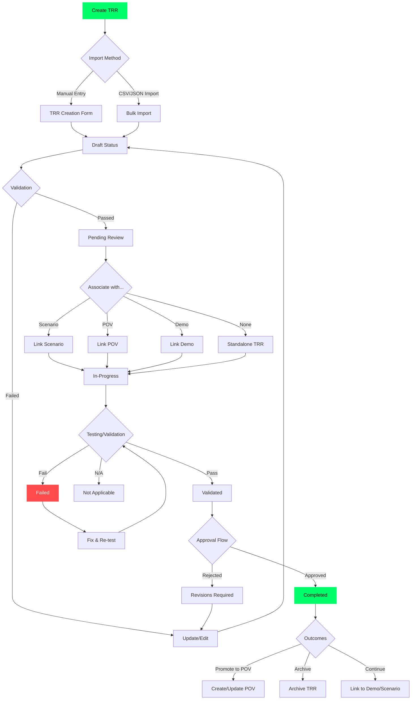
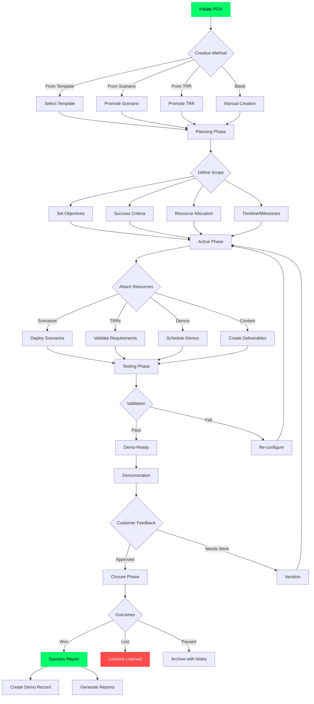
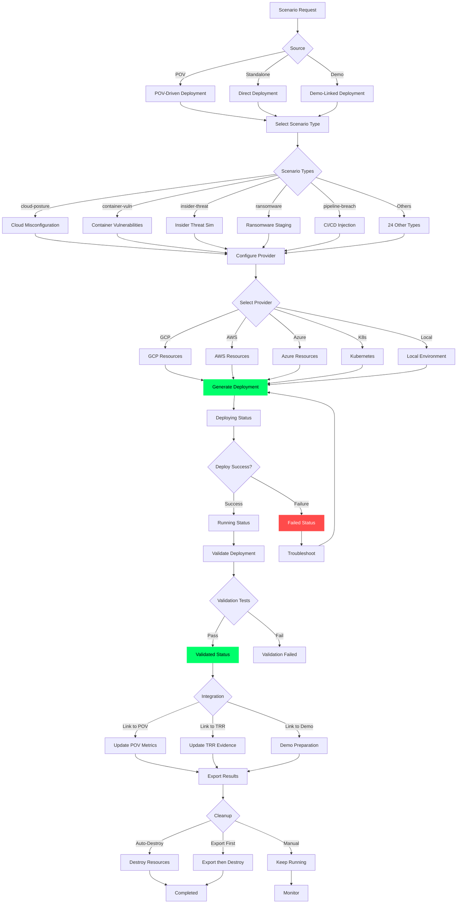
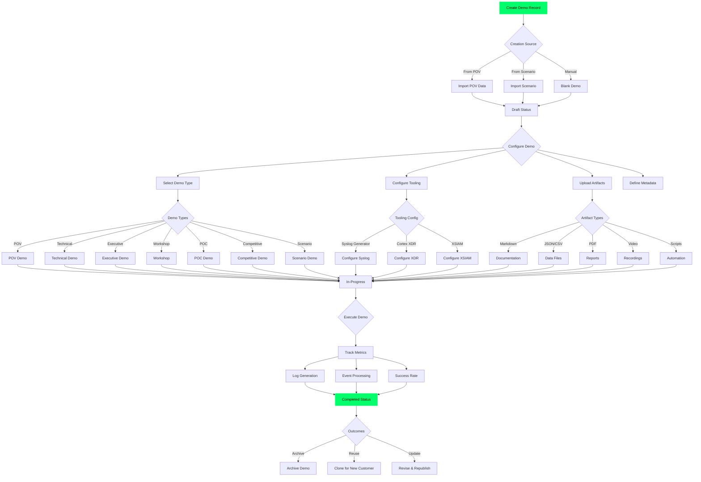
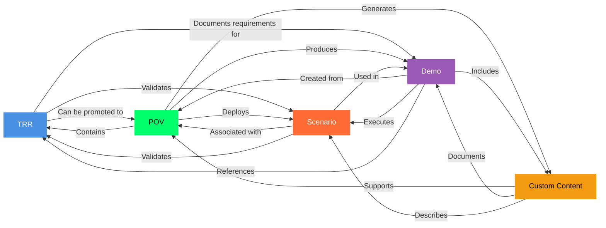
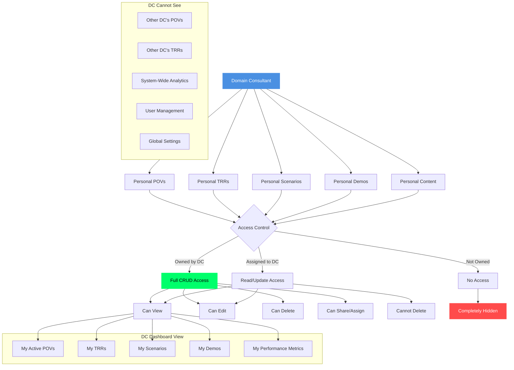
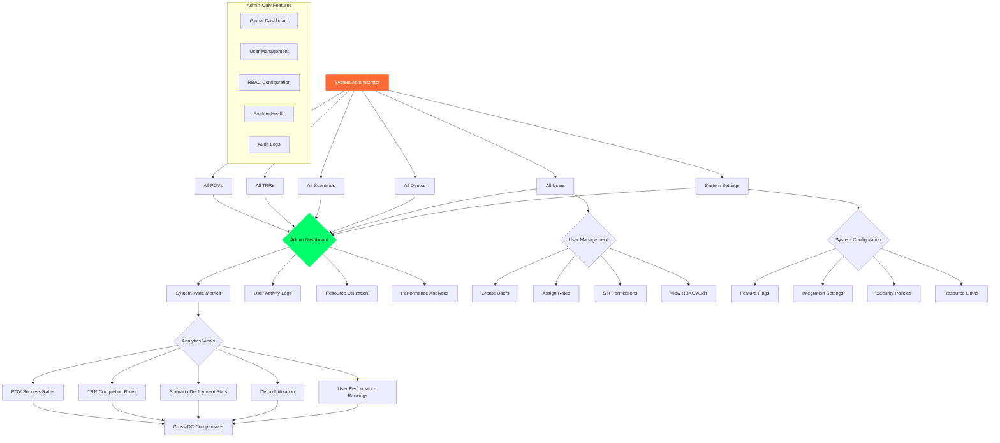
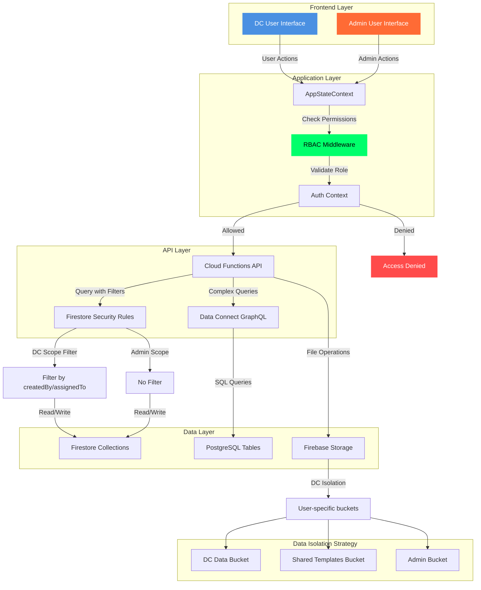
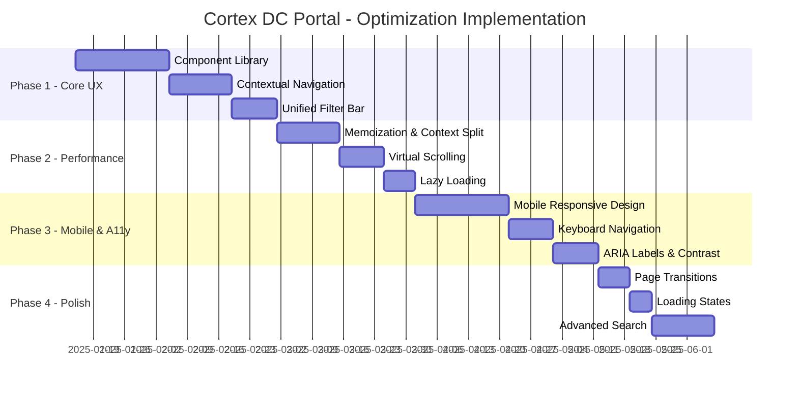

# Cortex DC Portal - Comprehensive Workflow & Optimization Analysis

**Document Version:** 1.0
**Date:** 2025-01-15
**Purpose:** Complete workflow mapping, data isolation analysis, and UI optimization recommendations

---

## Table of Contents

1. [Record Lifecycle Workflows](#1-record-lifecycle-workflows)
2. [Data Flow & User Isolation](#2-data-flow--user-isolation)
3. [UI/UX Optimization Proposals](#3-uiux-optimization-proposals)

---

## 1. Record Lifecycle Workflows

### 1.1 TRR (Technical Requirements Review) Lifecycle



**TRR Key Data Points:**
- **Owner:** Domain Consultant (isolated to DC)
- **Associated Records:** POVs, Scenarios, Demos (many-to-many)
- **Evidence:** Attachments, screenshots, validation results
- **Workflow Stages:** draft → pending → in-progress → validated → completed
- **Promotion Path:** TRR can be promoted to POV when business value is established

---

### 1.2 POV (Proof of Value) Lifecycle



**POV Key Data Points:**
- **Owner:** Domain Consultant (isolated to DC)
- **Lifecycle Phases:** planning → active → testing → demo-ready → completed
- **Associated Records:**
  - **Scenarios** (1-to-many): Security scenarios deployed for validation
  - **TRRs** (1-to-many): Technical requirements validated during POV
  - **Demos** (1-to-many): Demo sessions scheduled with customer
  - **Deliverables** (1-to-many): Reports, presentations, documentation
- **Metrics Tracked:** detections covered, scenarios deployed, stakeholder satisfaction, business value
- **Promotion Path:** Successful POV creates Demo Record for reusability

---

### 1.3 Scenario Deployment Lifecycle



**Scenario Key Data Points:**
- **Owner:** Domain Consultant (isolated to DC)
- **Deployment Lifecycle:** pending → deploying → running → validating → validated/failed → destroying → completed
- **Associated Records:**
  - **POV** (many-to-one): Scenarios belong to POV projects
  - **TRR** (many-to-many): Scenarios validate TRRs
  - **Demo** (many-to-one): Scenarios used in demo environments
- **Resource Management:** Auto-cleanup with configurable retention
- **Validation:** Automated testing against expected detection rules

---

### 1.4 Demo Record Management Lifecycle



**Demo Key Data Points:**
- **Owner:** Domain Consultant (isolated to DC)
- **Lifecycle:** draft → in-progress → completed → archived
- **Associated Records:**
  - **POV** (many-to-one): Demos are deliverables of POV
  - **Scenarios** (many-to-many): Demos execute scenarios
  - **Artifacts** (1-to-many): Supporting files and documentation
- **Tooling Integration:** Syslog Generator, Cortex XDR, XSIAM configurations
- **Metrics:** Views, logs generated, duration, success rate, events processed
- **Reusability:** Demos can be cloned and customized for new customers

---

### 1.5 Cross-Record Relationship Matrix



**Relationship Rules:**

| From → To | Cardinality | Description | Promotion Path |
|-----------|-------------|-------------|----------------|
| **TRR → POV** | Many-to-One | TRRs validate requirements for POV | TRR promoted when business value identified |
| **TRR → Scenario** | Many-to-Many | TRRs validated through scenario execution | Bidirectional association |
| **TRR → Demo** | Many-to-Many | TRRs documented in demo execution | Documentation reference |
| **POV → TRR** | One-to-Many | POV contains multiple technical requirements | Creation/association |
| **POV → Scenario** | One-to-Many | POV deploys security scenarios for validation | Deployment action |
| **POV → Demo** | One-to-Many | POV produces demo sessions as deliverables | Successful POV creates demos |
| **POV → Content** | One-to-Many | POV generates reports, presentations | Automated generation |
| **Scenario → POV** | Many-to-One | Scenarios belong to POV projects | Assignment |
| **Scenario → Demo** | Many-to-Many | Scenarios executed in demo environments | Execution reference |
| **Demo → Scenario** | One-to-Many | Demos run multiple scenarios | Composition |
| **Demo → Artifacts** | One-to-Many | Demos contain supporting files | Upload/attachment |

---

## 2. Data Flow & User Isolation

### 2.1 Domain Consultant (DC) Data Scope



**DC Data Isolation Rules:**

| Resource Type | Ownership Filter | Visibility | CRUD Operations |
|---------------|------------------|------------|-----------------|
| **POV** | `createdBy === DC.id OR assignedTo === DC.id` | Own + Assigned | Full CRUD on owned, RU on assigned |
| **TRR** | `createdBy === DC.id OR assignedTo === DC.id` | Own + Assigned | Full CRUD on owned, RU on assigned |
| **Scenario** | `createdBy === DC.id` | Own only | Full CRUD |
| **Demo** | `createdBy === DC.id` | Own only | Full CRUD |
| **Content** | `createdBy === DC.id` | Own + Public | Full CRUD on owned, R on public |
| **Dashboard** | Aggregates own records only | Personal metrics | View only (system-computed) |
| **Users** | Self only | Own profile | Update profile only |

**Database Query Filters (Firestore/Data Connect):**

```typescript
// POV Query - DC Scope
const dcPOVs = await firestore
  .collection('povs')
  .where('createdBy', '==', currentUser.id)
  .or('assignedTo', '==', currentUser.id)
  .get();

// TRR Query - DC Scope
const dcTRRs = await firestore
  .collection('trrs')
  .where('createdBy', '==', currentUser.id)
  .or('assignedTo', '==', currentUser.id)
  .get();

// Scenario Query - DC Scope
const dcScenarios = await firestore
  .collection('scenarios')
  .where('createdBy', '==', currentUser.id)
  .get();

// Demo Query - DC Scope
const dcDemos = await firestore
  .collection('demos')
  .where('createdBy', '==', currentUser.id)
  .get();
```

---

### 2.2 System Admin Data Scope



**System Admin Access Rules:**

| Resource Type | Scope | Visibility | CRUD Operations | Special Permissions |
|---------------|-------|------------|-----------------|---------------------|
| **POV** | All DCs | System-wide | Full CRUD | Can reassign, archive, export |
| **TRR** | All DCs | System-wide | Full CRUD | Can approve, reject, reassign |
| **Scenario** | All DCs | System-wide | Full CRUD | Can deploy globally, set templates |
| **Demo** | All DCs | System-wide | Full CRUD | Can publish, archive, clone |
| **Users** | All | System-wide | Full CRUD | Manage roles, permissions, access |
| **Content** | All | System-wide | Full CRUD | Publish templates, set defaults |
| **Dashboard** | All aggregates | System metrics | View + Export | Cross-DC analytics |
| **Settings** | Global | System-wide | Full CRUD | Feature flags, integrations |
| **RBAC** | All events | Audit log | View + Export | Permission management |

**Database Query - Admin Scope:**

```typescript
// Admin can query ALL records without filters
const allPOVs = await firestore
  .collection('povs')
  .get();  // No ownership filter

const allTRRs = await firestore
  .collection('trrs')
  .get();  // No ownership filter

// Admin-specific aggregations
const systemMetrics = {
  totalPOVs: await firestore.collection('povs').count().get(),
  totalTRRs: await firestore.collection('trrs').count().get(),
  activeUsers: await firestore.collection('users').where('isActive', '==', true).count().get(),
  completionRates: await calculateSystemCompletionRates(),
  userPerformance: await calculateUserPerformanceMetrics()
};
```

---

### 2.3 Data Flow Architecture



**Security Rules (Firestore):**

```javascript
// Firestore Security Rules
rules_version = '2';
service cloud.firestore {
  match /databases/{database}/documents {

    // POV Collection - DC Isolation
    match /povs/{povId} {
      allow read: if request.auth != null && (
        resource.data.createdBy == request.auth.uid ||
        resource.data.assignedTo == request.auth.uid ||
        get(/databases/$(database)/documents/users/$(request.auth.uid)).data.role == 'admin'
      );

      allow create: if request.auth != null && request.resource.data.createdBy == request.auth.uid;

      allow update: if request.auth != null && (
        resource.data.createdBy == request.auth.uid ||
        resource.data.assignedTo == request.auth.uid ||
        get(/databases/$(database)/documents/users/$(request.auth.uid)).data.role == 'admin'
      );

      allow delete: if request.auth != null && (
        resource.data.createdBy == request.auth.uid ||
        get(/databases/$(database)/documents/users/$(request.auth.uid)).data.role == 'admin'
      );
    }

    // TRR Collection - DC Isolation
    match /trrs/{trrId} {
      allow read: if request.auth != null && (
        resource.data.createdBy == request.auth.uid ||
        resource.data.assignedTo == request.auth.uid ||
        get(/databases/$(database)/documents/users/$(request.auth.uid)).data.role == 'admin'
      );

      allow create: if request.auth != null && request.resource.data.createdBy == request.auth.uid;

      allow update: if request.auth != null && (
        resource.data.createdBy == request.auth.uid ||
        resource.data.assignedTo == request.auth.uid ||
        get(/databases/$(database)/documents/users/$(request.auth.uid)).data.role == 'admin'
      );

      allow delete: if request.auth != null && (
        resource.data.createdBy == request.auth.uid ||
        get(/databases/$(database)/documents/users/$(request.auth.uid)).data.role == 'admin'
      );
    }

    // Scenarios - DC Isolation (owned only)
    match /scenarios/{scenarioId} {
      allow read: if request.auth != null && (
        resource.data.createdBy == request.auth.uid ||
        get(/databases/$(database)/documents/users/$(request.auth.uid)).data.role == 'admin'
      );

      allow write: if request.auth != null && (
        request.resource.data.createdBy == request.auth.uid ||
        get(/databases/$(database)/documents/users/$(request.auth.uid)).data.role == 'admin'
      );
    }

    // Demos - DC Isolation (owned only)
    match /demos/{demoId} {
      allow read: if request.auth != null && (
        resource.data.createdBy == request.auth.uid ||
        get(/databases/$(database)/documents/users/$(request.auth.uid)).data.role == 'admin'
      );

      allow write: if request.auth != null && (
        request.resource.data.createdBy == request.auth.uid ||
        get(/databases/$(database)/documents/users/$(request.auth.uid)).data.role == 'admin'
      );
    }

    // Users - Self or Admin only
    match /users/{userId} {
      allow read: if request.auth != null && (
        request.auth.uid == userId ||
        get(/databases/$(database)/documents/users/$(request.auth.uid)).data.role == 'admin'
      );

      allow update: if request.auth != null && (
        request.auth.uid == userId ||
        get(/databases/$(database)/documents/users/$(request.auth.uid)).data.role == 'admin'
      );

      allow create, delete: if request.auth != null &&
        get(/databases/$(database)/documents/users/$(request.auth.uid)).data.role == 'admin';
    }
  }
}
```

---

### 2.4 Dashboard Data Population

#### DC Dashboard (Personal View)

```typescript
// Domain Consultant Dashboard Data
interface DCDashboard {
  metrics: {
    myActivePOVs: number;           // Count of owned/assigned POVs with status !== 'completed'
    myCompletedPOVs: number;        // Count of owned/assigned POVs with status === 'completed'
    myPendingTRRs: number;          // Count of owned/assigned TRRs with status !== 'completed'
    myCompletedTRRs: number;        // Count of owned/assigned TRRs with status === 'completed'
    myScenariosDeployed: number;    // Count of owned scenarios with status === 'validated'
    myDemosCompleted: number;       // Count of owned demos with status === 'completed'
    myAvgPOVSuccessRate: number;    // Percentage of won POVs
  };
  recentActivity: {
    type: 'pov' | 'trr' | 'scenario' | 'demo';
    id: string;
    title: string;
    action: string;
    timestamp: Date;
  }[];
  upcomingMilestones: {
    povId: string;
    milestoneName: string;
    dueDate: Date;
    status: 'on-track' | 'at-risk' | 'overdue';
  }[];
  myPOVs: POVProject[];             // Filtered to owned/assigned
  myTRRs: TRR[];                    // Filtered to owned/assigned
  myScenarios: ScenarioDeployment[]; // Filtered to owned
  myDemos: DemoRecord[];            // Filtered to owned
}

// Data Query Example
async function loadDCDashboard(userId: string): Promise<DCDashboard> {
  const [povs, trrs, scenarios, demos] = await Promise.all([
    firestore.collection('povs')
      .where('createdBy', '==', userId)
      .or('assignedTo', '==', userId)
      .get(),
    firestore.collection('trrs')
      .where('createdBy', '==', userId)
      .or('assignedTo', '==', userId)
      .get(),
    firestore.collection('scenarios')
      .where('createdBy', '==', userId)
      .get(),
    firestore.collection('demos')
      .where('createdBy', '==', userId)
      .get()
  ]);

  return {
    metrics: calculateDCMetrics(povs, trrs, scenarios, demos),
    recentActivity: getRecentActivity(userId),
    upcomingMilestones: extractMilestones(povs),
    myPOVs: povs.docs.map(doc => doc.data()),
    myTRRs: trrs.docs.map(doc => doc.data()),
    myScenarios: scenarios.docs.map(doc => doc.data()),
    myDemos: demos.docs.map(doc => doc.data())
  };
}
```

#### Admin Dashboard (System-Wide View)

```typescript
// System Administrator Dashboard Data
interface AdminDashboard {
  systemMetrics: {
    totalUsers: number;
    activeUsers: number;
    totalPOVs: number;
    activePOVs: number;
    totalTRRs: number;
    pendingTRRs: number;
    totalScenariosDeployed: number;
    totalDemosCreated: number;
    avgPOVSuccessRate: number;
    avgTRRCompletionTime: number;  // in days
  };
  userPerformance: {
    userId: string;
    userName: string;
    activePOVs: number;
    completedPOVs: number;
    successRate: number;
    avgPOVDuration: number;
    totalScenariosDeployed: number;
  }[];
  systemHealth: {
    firestoreReadOps: number;
    firestoreWriteOps: number;
    functionsInvocations: number;
    storageUsageGB: number;
    dataConnectQueries: number;
  };
  recentSystemActivity: {
    userId: string;
    userName: string;
    resourceType: 'pov' | 'trr' | 'scenario' | 'demo' | 'user';
    resourceId: string;
    action: 'created' | 'updated' | 'deleted' | 'approved' | 'deployed';
    timestamp: Date;
  }[];
  rbacAuditLog: RBACEvent[];
}

// Data Query Example
async function loadAdminDashboard(): Promise<AdminDashboard> {
  const [users, povs, trrs, scenarios, demos, rbacEvents] = await Promise.all([
    firestore.collection('users').get(),
    firestore.collection('povs').get(),
    firestore.collection('trrs').get(),
    firestore.collection('scenarios').get(),
    firestore.collection('demos').get(),
    firestore.collection('rbacEvents').orderBy('timestamp', 'desc').limit(100).get()
  ]);

  return {
    systemMetrics: calculateSystemMetrics(users, povs, trrs, scenarios, demos),
    userPerformance: calculateUserPerformance(users, povs, trrs, scenarios),
    systemHealth: await getSystemHealthMetrics(),
    recentSystemActivity: await getSystemActivityLog(100),
    rbacAuditLog: rbacEvents.docs.map(doc => doc.data())
  };
}
```

---

## 3. UI/UX Optimization Proposals

### 3.1 Navigation & Layout Improvements

#### Current Issues:
1. **Flat navigation** - All modules at same level causes cognitive overload
2. **Context switching** - Moving between POV → TRR → Scenario → Demo requires multiple clicks
3. **No breadcrumbs** - Users lose track of location in complex workflows
4. **Sidebar overload** - Too many top-level menu items

#### Proposed Solution: **Contextual Workspace Navigation**

```
┌─────────────────────────────────────────────────────────────┐
│  Logo  [Workspace: My Active POVs ▼]  [Search...]   [User] │
├─────────────────────────────────────────────────────────────┤
│                                                               │
│  Breadcrumb: Home > POVs > Acme Corp > Scenarios > Deploy   │
│                                                               │
├─────────────────────────────────────────────────────────────┤
│  ┌───────────┐  Main Content Area                           │
│  │           │                                               │
│  │  Context  │  ┌──────────────────────────────────────┐   │
│  │  Sidebar  │  │  Primary View                        │   │
│  │           │  │                                       │   │
│  │  Active:  │  │  [Content based on selection]        │   │
│  │  • POV    │  │                                       │   │
│  │  • TRRs   │  │                                       │   │
│  │  • Scen.  │  └──────────────────────────────────────┘   │
│  │  • Demos  │                                               │
│  │           │  ┌──────────────────────────────────────┐   │
│  │  Quick:   │  │  Related/Linked Items                │   │
│  │  • Create │  │  [Contextual suggestions]            │   │
│  │  • Import │  └──────────────────────────────────────┘   │
│  │  • Export │                                               │
│  └───────────┘                                               │
└─────────────────────────────────────────────────────────────┘
```

**Key Improvements:**
- **Workspace Switcher** (top bar): Switch between "My Active POVs", "All POVs", "TRRs", "Scenarios", "Demos", "Admin"
- **Contextual Sidebar**: Changes based on active workspace (POV workspace shows POV-specific actions)
- **Breadcrumb Navigation**: Always visible, shows hierarchical path
- **Related Items Panel**: Shows linked TRRs, Scenarios, Demos for current POV
- **Persistent Context**: When viewing POV, sidebar shows quick actions for that POV

---

### 3.2 Page Transition & Animation Optimizations

#### Current Issues:
1. **Abrupt transitions** - No visual continuity between pages
2. **Loading states** - Generic spinners don't indicate what's loading
3. **No transition context** - Users don't know how pages relate

#### Proposed Solution: **Contextual Slide Transitions**

```typescript
// Route transition animation strategy
const transitionConfig = {
  // Hierarchical down (POV → TRR detail)
  'drill-down': {
    enter: 'slide-in-right',
    exit: 'slide-out-left',
    duration: 250,
    easing: 'ease-out'
  },

  // Hierarchical up (TRR detail → POV list)
  'drill-up': {
    enter: 'slide-in-left',
    exit: 'slide-out-right',
    duration: 250,
    easing: 'ease-in'
  },

  // Sibling navigation (POVs → TRRs tab)
  'lateral': {
    enter: 'fade-in',
    exit: 'fade-out',
    duration: 150,
    easing: 'ease-in-out'
  },

  // Modal/overlay (Create POV)
  'modal': {
    enter: 'scale-in + fade-in',
    exit: 'scale-out + fade-out',
    duration: 200,
    easing: 'ease-out'
  }
};
```

**Implementation:**
```tsx
// Example: POV List → POV Detail transition
import { motion, AnimatePresence } from 'framer-motion';

<AnimatePresence mode="wait">
  <motion.div
    key={location.pathname}
    initial={{ x: '100%', opacity: 0 }}
    animate={{ x: 0, opacity: 1 }}
    exit={{ x: '-100%', opacity: 0 }}
    transition={{ duration: 0.25, ease: 'easeOut' }}
  >
    {children}
  </motion.div>
</AnimatePresence>
```

**Loading State Improvements:**
```tsx
// Replace generic spinner with contextual skeleton
<div className="space-y-4">
  {/* POV Card Skeleton */}
  <div className="cortex-card p-6 animate-pulse">
    <div className="h-4 bg-cortex-bg-tertiary rounded w-3/4 mb-3"></div>
    <div className="h-3 bg-cortex-bg-tertiary rounded w-1/2 mb-4"></div>
    <div className="grid grid-cols-3 gap-4">
      <div className="h-2 bg-cortex-bg-tertiary rounded"></div>
      <div className="h-2 bg-cortex-bg-tertiary rounded"></div>
      <div className="h-2 bg-cortex-bg-tertiary rounded"></div>
    </div>
  </div>
</div>
```

---

### 3.3 Component Architecture Enhancements

#### Current Issues:
1. **Monolithic components** - POVManagement.tsx, TRRManagement.tsx are 600+ lines
2. **No shared layouts** - Each page implements own header/footer
3. **Inconsistent card patterns** - Each list view has custom card design

#### Proposed Solution: **Component Library + Composition**

```typescript
// 1. Shared Layout Components
components/
  layouts/
    WorkspaceLayout.tsx           // Main app layout with sidebar
    DetailLayout.tsx              // Detail view with back button
    ListLayout.tsx                // List view with filters + search

  cards/
    ResourceCard.tsx              // Generic resource card (POV, TRR, Scenario, Demo)
    StatCard.tsx                  // Metric display card
    TimelineCard.tsx              // Milestone/timeline card

  forms/
    ResourceForm.tsx              // Generic create/edit form with validation
    FileUploadZone.tsx            // Drag-drop file upload
    TagInput.tsx                  // Tag management input

  data-display/
    DataTable.tsx                 // Sortable, filterable table
    MetricsPanel.tsx              // KPI display panel
    ProgressTimeline.tsx          // Visual timeline with milestones

  navigation/
    Breadcrumbs.tsx               // Hierarchical breadcrumb trail
    ContextSidebar.tsx            // Contextual action sidebar
    WorkspaceSwitcher.tsx         // Top-bar workspace dropdown
```

**Example Refactor:**

Before (POVManagement.tsx - 668 lines):
```tsx
export const POVManagement: React.FC = () => {
  // 668 lines of mixed concerns: state, logic, UI
  return <div>...</div>;
};
```

After (Composed from shared components):
```tsx
// components/pov/POVList.tsx (50 lines)
import { ListLayout, ResourceCard, StatCard } from '@/components';

export const POVList: React.FC = () => {
  const { povs, stats } = usePOVData();

  return (
    <ListLayout
      title="POV Management"
      stats={<POVStats data={stats} />}
      filters={<POVFilters />}
      actions={<POVActions />}
    >
      {povs.map(pov => (
        <ResourceCard
          key={pov.id}
          type="pov"
          data={pov}
          onClick={() => router.push(`/pov/${pov.id}`)}
        />
      ))}
    </ListLayout>
  );
};

// components/pov/POVDetail.tsx (80 lines)
import { DetailLayout, MetricsPanel, ProgressTimeline } from '@/components';

export const POVDetail: React.FC<{ id: string }> = ({ id }) => {
  const { pov, scenarios, trrs } = usePOVDetail(id);

  return (
    <DetailLayout
      title={pov.name}
      breadcrumbs={[
        { label: 'POVs', path: '/povs' },
        { label: pov.customer, path: `/pov/${id}` }
      ]}
    >
      <MetricsPanel metrics={pov.metrics} />
      <ProgressTimeline milestones={pov.timeline.milestones} />
      <LinkedResources scenarios={scenarios} trrs={trrs} />
    </DetailLayout>
  );
};
```

---

### 3.4 Filter & Search UX Improvements

#### Current Issues:
1. **Filters scattered** - Each page has different filter UI
2. **No filter persistence** - Filters reset on navigation
3. **Poor mobile UX** - Filters don't stack well on small screens

#### Proposed Solution: **Unified Filter Bar + Advanced Search**

```tsx
// components/search/UnifiedFilterBar.tsx
interface FilterBarProps {
  resourceType: 'pov' | 'trr' | 'scenario' | 'demo';
  onFilterChange: (filters: ResourceFilters) => void;
  savedFilters?: SavedFilter[];
}

export const UnifiedFilterBar: React.FC<FilterBarProps> = ({
  resourceType,
  onFilterChange,
  savedFilters
}) => {
  return (
    <div className="cortex-card p-4">
      <div className="flex flex-wrap gap-3">
        {/* Search */}
        <div className="flex-1 min-w-[300px]">
          <SearchInput
            placeholder={`Search ${resourceType}s...`}
            onSearch={handleSearch}
            suggestions={<SearchSuggestions type={resourceType} />}
          />
        </div>

        {/* Quick Filters */}
        <FilterDropdown label="Status" options={statusOptions} />
        <FilterDropdown label="Priority" options={priorityOptions} />
        <FilterDropdown label="Date Range" component={<DateRangePicker />} />

        {/* Advanced Filters */}
        <Button onClick={() => setShowAdvanced(true)}>
          More Filters {activeFilterCount > 0 && `(${activeFilterCount})`}
        </Button>

        {/* Saved Filters */}
        {savedFilters && (
          <FilterDropdown
            label="Saved Filters"
            options={savedFilters.map(f => ({ label: f.name, value: f.id }))}
            onSelect={loadSavedFilter}
          />
        )}

        {/* Clear All */}
        {activeFilterCount > 0 && (
          <Button variant="outline" onClick={clearFilters}>
            Clear All
          </Button>
        )}
      </div>

      {/* Active Filters Pills */}
      {activeFilters.length > 0 && (
        <div className="flex flex-wrap gap-2 mt-3">
          {activeFilters.map(filter => (
            <FilterPill
              key={filter.key}
              label={`${filter.label}: ${filter.value}`}
              onRemove={() => removeFilter(filter.key)}
            />
          ))}
        </div>
      )}
    </div>
  );
};
```

**Filter Persistence:**
```typescript
// hooks/usePersistedFilters.ts
export function usePersistedFilters(resourceType: string) {
  const [filters, setFilters] = useState<ResourceFilters>(() => {
    // Load from localStorage
    const saved = localStorage.getItem(`filters:${resourceType}`);
    return saved ? JSON.parse(saved) : {};
  });

  useEffect(() => {
    // Save to localStorage on change
    localStorage.setItem(`filters:${resourceType}`, JSON.stringify(filters));
  }, [filters, resourceType]);

  return [filters, setFilters];
}
```

---

### 3.5 Mobile Responsiveness Improvements

#### Current Issues:
1. **Table overflow** - Data tables don't adapt to mobile
2. **Multi-column layouts** - Break awkwardly on small screens
3. **Touch targets** - Buttons too small for touch

#### Proposed Solution: **Mobile-First Responsive Design**

```tsx
// Mobile-optimized card (replaces table on small screens)
const ResponsiveResourceList: React.FC = ({ items }) => {
  const isMobile = useMediaQuery('(max-width: 768px)');

  if (isMobile) {
    return (
      <div className="space-y-3">
        {items.map(item => (
          <MobileCard key={item.id} data={item} />
        ))}
      </div>
    );
  }

  return <DataTable data={items} />;
};

// Mobile-optimized card
const MobileCard: React.FC<{ data: POV }> = ({ data }) => (
  <div className="cortex-card p-4">
    <div className="flex items-start justify-between mb-2">
      <h3 className="font-bold text-cortex-text-primary">{data.name}</h3>
      <StatusBadge status={data.status} />
    </div>

    <p className="text-sm text-cortex-text-secondary mb-3">
      {data.customer}
    </p>

    {/* Stack metrics vertically on mobile */}
    <div className="space-y-2 mb-3">
      <MetricRow label="Progress" value={`${data.progress}%`} />
      <MetricRow label="Scenarios" value={data.scenarios.length} />
      <MetricRow label="Due Date" value={formatDate(data.endDate)} />
    </div>

    {/* Touch-friendly buttons */}
    <div className="flex gap-2">
      <Button size="lg" fullWidth>View Details</Button>
      <IconButton size="lg" icon={<MoreIcon />} />
    </div>
  </div>
);
```

---

### 3.6 Performance Optimizations

#### Current Issues:
1. **Re-render storms** - AppStateContext triggers re-renders on all components
2. **Large lists** - No virtualization for 50+ items
3. **Eager loading** - All data loaded upfront

#### Proposed Solutions:

**1. Memoization & Context Splitting:**
```typescript
// Split AppStateContext into smaller contexts
export const AuthContext = createContext<AuthState>();
export const DataContext = createContext<DataState>();
export const UIContext = createContext<UIState>();

// Memoize expensive computations
const Dashboard: React.FC = () => {
  const { povs, trrs } = useData();

  const stats = useMemo(() =>
    calculateStats(povs, trrs),
    [povs, trrs]  // Only recalculate when data changes
  );

  return <StatsPanel stats={stats} />;
};
```

**2. Virtual Scrolling for Large Lists:**
```tsx
import { useVirtualizer } from '@tanstack/react-virtual';

const VirtualizedPOVList: React.FC<{ povs: POV[] }> = ({ povs }) => {
  const parentRef = useRef<HTMLDivElement>(null);

  const virtualizer = useVirtualizer({
    count: povs.length,
    getScrollElement: () => parentRef.current,
    estimateSize: () => 100,  // Estimated item height
    overscan: 5  // Render 5 extra items above/below viewport
  });

  return (
    <div ref={parentRef} style={{ height: '600px', overflow: 'auto' }}>
      <div style={{ height: `${virtualizer.getTotalSize()}px`, position: 'relative' }}>
        {virtualizer.getVirtualItems().map(virtualItem => (
          <div
            key={virtualItem.key}
            style={{
              position: 'absolute',
              top: 0,
              left: 0,
              width: '100%',
              height: `${virtualItem.size}px`,
              transform: `translateY(${virtualItem.start}px)`
            }}
          >
            <POVCard data={povs[virtualItem.index]} />
          </div>
        ))}
      </div>
    </div>
  );
};
```

**3. Lazy Loading & Infinite Scroll:**
```typescript
// hooks/useInfiniteQuery.ts
export function useInfiniteQuery<T>(
  queryKey: string,
  fetchFn: (page: number) => Promise<T[]>,
  pageSize: number = 20
) {
  const [data, setData] = useState<T[]>([]);
  const [page, setPage] = useState(0);
  const [hasMore, setHasMore] = useState(true);
  const [loading, setLoading] = useState(false);

  const loadMore = useCallback(async () => {
    if (loading || !hasMore) return;

    setLoading(true);
    const newData = await fetchFn(page);
    setData(prev => [...prev, ...newData]);
    setHasMore(newData.length === pageSize);
    setPage(prev => prev + 1);
    setLoading(false);
  }, [page, loading, hasMore, fetchFn, pageSize]);

  // Auto-load on scroll
  useIntersectionObserver({
    onIntersect: loadMore,
    enabled: hasMore && !loading
  });

  return { data, loading, hasMore, loadMore };
}

// Usage
const POVList: React.FC = () => {
  const { data: povs, loading, hasMore, loadMore } = useInfiniteQuery(
    'povs',
    (page) => fetchPOVs(page),
    20
  );

  return (
    <div>
      {povs.map(pov => <POVCard key={pov.id} data={pov} />)}
      {loading && <LoadingSpinner />}
      {hasMore && <div ref={sentinelRef} />}
    </div>
  );
};
```

---

### 3.7 Accessibility (A11y) Improvements

#### Current Issues:
1. **No keyboard navigation** - All interactions require mouse
2. **Missing ARIA labels** - Screen readers can't identify elements
3. **Low contrast** - Some text doesn't meet WCAG AA standards
4. **No focus indicators** - Can't see which element is focused

#### Proposed Solutions:

**1. Keyboard Navigation:**
```tsx
// Make all interactive elements keyboard accessible
<button
  onClick={handleClick}
  onKeyDown={(e) => {
    if (e.key === 'Enter' || e.key === ' ') {
      e.preventDefault();
      handleClick();
    }
  }}
  aria-label="Create new POV"
  className="focus:ring-2 focus:ring-cortex-primary focus:outline-none"
>
  Create POV
</button>

// Implement keyboard shortcuts
useHotkeys('cmd+k', () => openCommandPalette());
useHotkeys('cmd+n', () => createNewPOV());
useHotkeys('esc', () => closeModal());
```

**2. ARIA Labels & Roles:**
```tsx
<nav aria-label="Main navigation">
  <ul role="menubar">
    <li role="none">
      <a href="/povs" role="menuitem" aria-current="page">POVs</a>
    </li>
  </ul>
</nav>

<div role="search" aria-label="Search POVs">
  <input
    type="search"
    aria-label="Search POV projects by name or customer"
    aria-describedby="search-help"
  />
  <span id="search-help" className="sr-only">
    Press enter to search, or use filters to refine results
  </span>
</div>
```

**3. Contrast Improvements:**
```css
/* Update low-contrast elements */
.cortex-text-muted {
  /* Old: #666 (3.1:1 contrast - fails WCAG AA) */
  color: #999; /* New: 4.7:1 contrast - passes WCAG AA */
}

.cortex-border {
  /* Old: rgba(255, 255, 255, 0.1) - barely visible */
  border-color: rgba(255, 255, 255, 0.2); /* More visible */
}
```

**4. Focus Indicators:**
```css
/* Global focus styles */
*:focus-visible {
  outline: 2px solid var(--cortex-primary);
  outline-offset: 2px;
  border-radius: 4px;
}

/* Interactive elements */
.cortex-button:focus-visible,
.cortex-card-interactive:focus-visible {
  box-shadow: 0 0 0 3px rgba(0, 255, 107, 0.3);
}
```

---

## Summary of Optimization Priorities

### High Priority (Implement First)
1. **Component Architecture Refactor** - Break down monolithic components into shared library
2. **Contextual Navigation** - Implement workspace switcher and contextual sidebar
3. **Unified Filter Bar** - Create consistent filter/search experience across all views
4. **Mobile Responsiveness** - Mobile-first card layouts and touch-friendly UI
5. **Performance - Memoization** - Prevent unnecessary re-renders with React.memo and useMemo

### Medium Priority (Next Quarter)
6. **Page Transitions** - Add contextual slide animations
7. **Virtual Scrolling** - For lists with 50+ items
8. **Keyboard Navigation** - Implement keyboard shortcuts and focus management
9. **Loading States** - Replace spinners with skeleton screens
10. **ARIA Labels** - Full accessibility audit and fixes

### Low Priority (Future Enhancement)
11. **Infinite Scroll** - For very large datasets
12. **Advanced Search** - Natural language search with AI
13. **Drag-and-Drop** - For reordering and linking records
14. **Dark/Light Mode** - Theme switching
15. **Customizable Dashboards** - User-configured dashboard layouts

---

## Implementation Roadmap



---

**End of Analysis Document**
