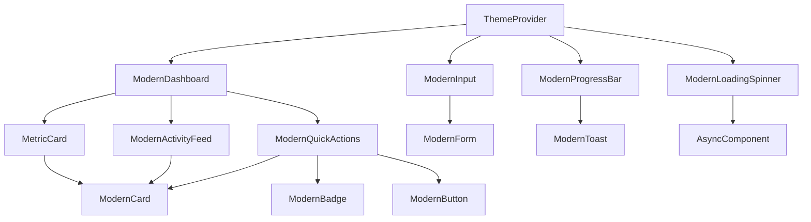
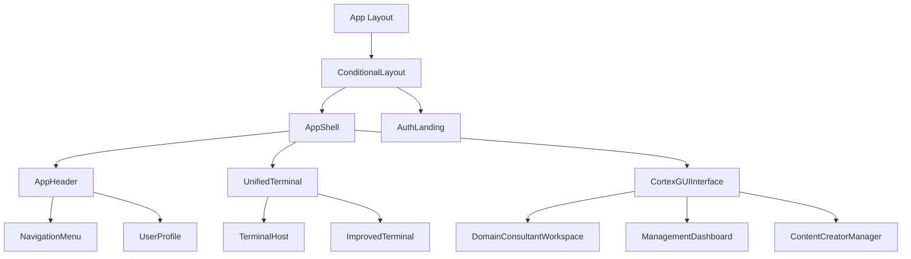
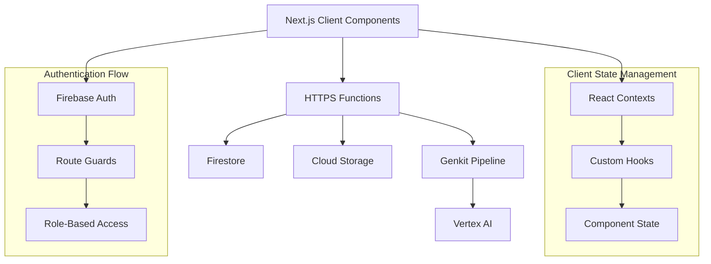
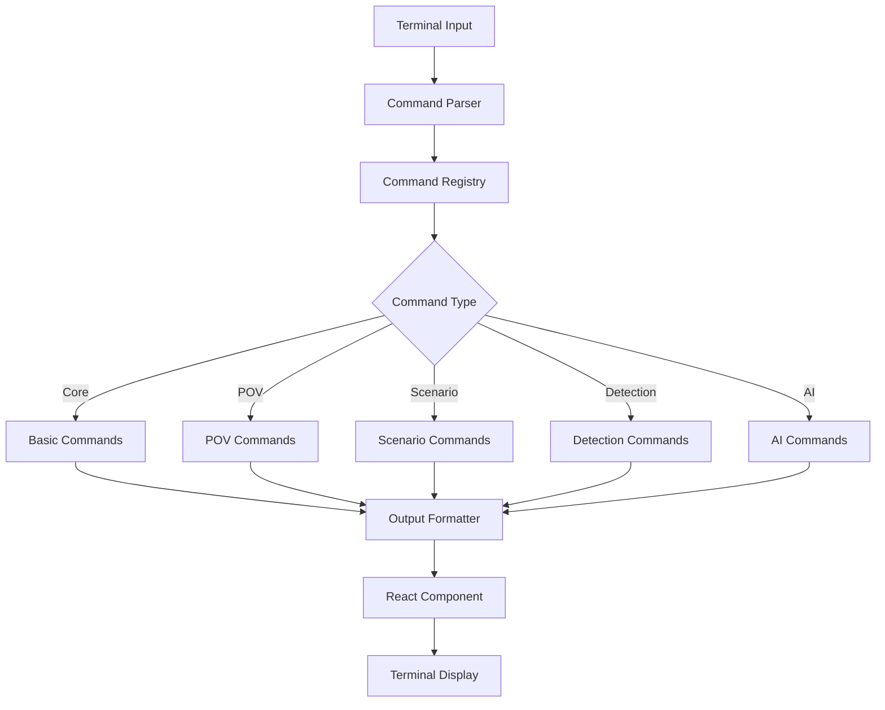
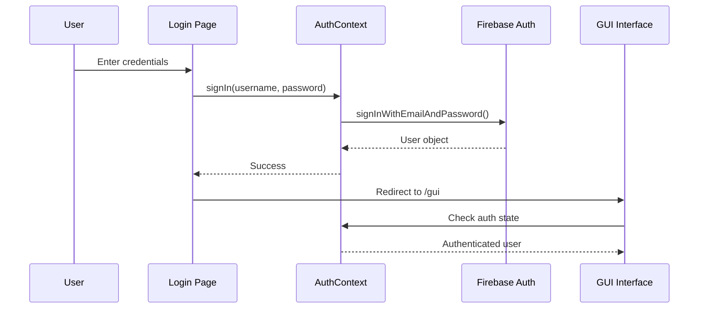
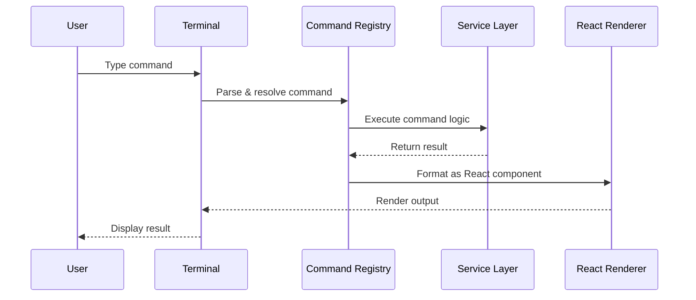
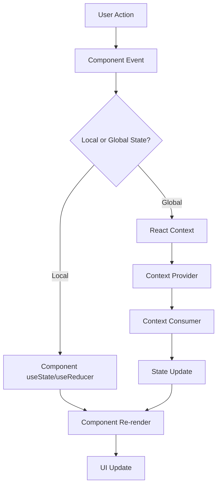

# Component Map - henryreed.ai Application

## Web Component Architecture

### Modern UI Component Hierarchy



### Core Application Components



### Data Flow Architecture



### Terminal Command System



### Component File Structure

```
hosting/
├── app/                          # Next.js App Router
│   ├── layout.tsx               # Root layout with providers
│   ├── page.tsx                 # Login/landing page
│   ├── gui/                     # GUI interface routes
│   ├── terminal/                # Terminal-focused routes
│   └── globals.css              # Global styles
│
├── components/                   # React components
│   ├── ui/                      # Reusable UI components
│   │   ├── modern/              # Modern design system
│   │   │   ├── index.tsx        # Modern component exports
│   │   │   └── Dashboard.tsx    # Dashboard components
│   │   └── CleanTerminalPopout.tsx
│   │
│   ├── AppShell.tsx             # Main application shell
│   ├── ConditionalLayout.tsx    # Route-based layout logic
│   ├── UnifiedTerminal.tsx      # Terminal interface
│   ├── CortexGUIInterface.tsx   # Main GUI interface
│   └── DomainConsultantWorkspace.tsx
│
├── contexts/                     # React context providers
│   ├── AuthContext.tsx          # Authentication state
│   └── AppStateContext.tsx      # Global application state
│
├── providers/                    # Higher-order providers
│   └── ThemeProvider.tsx        # Theme management
│
├── lib/                         # Utility libraries
│   ├── auth-service.ts          # Authentication logic
│   ├── firebase-config.ts       # Firebase configuration
│   ├── command-registry.ts      # Terminal commands
│   └── utils.ts                 # Helper functions
│
└── hooks/                       # Custom React hooks
    ├── useAuth.ts               # Authentication hook
    └── useCommand.ts            # Command execution hook
```

## Component Relationships

### Authentication Flow



### Command Execution Flow



### State Management Architecture



## Key Component APIs

### ModernCard Component
```typescript
interface CardProps {
  variant?: 'glass' | 'solid' | 'outline' | 'elevated';
  padding?: 'none' | 'sm' | 'md' | 'lg' | 'xl';
  hover?: boolean;
  className?: string;
  children: React.ReactNode;
}
```

### ModernButton Component
```typescript
interface ButtonProps {
  variant?: 'primary' | 'secondary' | 'outline' | 'ghost' | 'danger' | 'success';
  size?: 'sm' | 'md' | 'lg' | 'xl';
  isLoading?: boolean;
  icon?: React.ReactNode;
  iconPosition?: 'left' | 'right';
}
```

### AuthContext API
```typescript
interface AuthContextType {
  user: User | null;
  loading: boolean;
  signIn: (username: string, password: string) => Promise<void>;
  signOut: () => Promise<void>;
  resetPassword: (email: string) => Promise<void>;
}
```

### Command Registry API
```typescript
interface CommandConfig {
  name: string;
  description: string;
  usage: string;
  category: string;
  handler: (args: string[]) => Promise<React.ReactNode>;
  permissions?: string[];
  aliases?: string[];
}
```

## Design System Integration

### Color System
- Primary: Cortex accent colors
- Semantic: Success, warning, error, info variants
- Neutral: Background and text color scales

### Typography Scale
- Headings: h1-h6 with responsive sizing
- Body: Regular and emphasized text
- Code: Monospace for terminal output

### Spacing System
- Base unit: 0.25rem (4px)
- Scale: 1, 2, 3, 4, 6, 8, 12, 16, 20, 24, 32, 40, 48, 64

### Component Variants
Each component supports multiple visual variants for different use cases and contexts within the application.