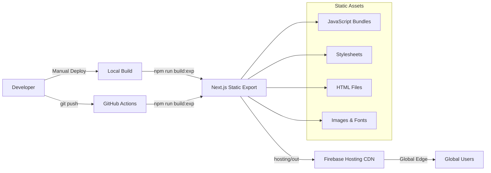

# Deployment Guide - HenryReed.ai Cortex Platform

**Last Updated:** 2025-01-08  
**Deployment Model:** Firebase Hosting (Static Export)

## Overview

This deployment guide covers the simplified hosting-only deployment strategy for the HenryReed.ai Cortex Domain Consultant Platform. The application is built as a static Next.js export and deployed to Firebase Hosting CDN for global distribution.

## Architecture Summary



## Prerequisites

### Required Tools
- **Node.js:** Version 20+ (LTS recommended)
- **npm:** Version 10+ (comes with Node.js)
- **Firebase CLI:** Latest version
- **Git:** For version control

### Installation Commands
```bash
# Install Node.js (via Homebrew on macOS)
brew install node

# Install Firebase CLI globally
npm install -g firebase-tools

# Verify installations
node --version    # Should show v20+
npm --version     # Should show v10+
firebase --version # Should show latest
```

### Firebase Project Setup
```bash
# Login to Firebase (one-time setup)
firebase login

# Verify project access
firebase use henryreedai
firebase projects:list
```

## Development Workflow

### 🔧 Local Development
```bash
# Start development server with Turbopack
cd hosting
npm run dev

# Alternative: Development with experimental webpack
npm run dev:exp

# Access application
open http://localhost:3000
```

**Development Features:**
- **Hot Reload:** Instant updates on file changes
- **Turbopack:** Ultra-fast bundling for development
- **TypeScript:** Full type checking and IntelliSense
- **Terminal Integration:** Single canonical terminal system

### 🏗️ Local Build Testing
```bash
# Build for production
cd hosting
npm run build:exp

# Serve built files locally
npm run start

# Access built application
open http://localhost:3000
```

### 🧪 Firebase Emulator Testing
```bash
# Method 1: Using npm script (from hosting directory)
cd hosting
npm run firebase:serve

# Method 2: Direct Firebase command (from root)
firebase emulators:start --only hosting

# Access emulated application
open http://localhost:5000
```

**Emulator Benefits:**
- **Exact Firebase Environment:** Matches production hosting behavior
- **Rewrite Testing:** Validates SPA routing configuration
- **Header Verification:** Tests caching and security headers
- **Performance Simulation:** CDN-like behavior locally

## Production Deployment

### 🚀 Method 1: Root Deploy Script (Recommended)
```bash
# From repository root
./deploy.sh
```

**What the script does:**
1. Navigates to `hosting/` directory
2. Runs `npm run build:exp` (Next.js build with experimental webpack)
3. Returns to root directory
4. Executes `firebase deploy --only hosting`
5. Provides deployment confirmation and URL

### ⚡ Method 2: Manual Commands
```bash
# Step-by-step manual deployment
cd hosting
npm run build:exp
cd ..
firebase deploy --only hosting
```

### 🔄 Method 3: Direct NPM Script
```bash
# From hosting directory
cd hosting
npm run deploy
```

## Preview Deployment

### 🧪 Preview Channels (Staging)
```bash
# Create preview deployment
cd hosting
npm run deploy:preview

# Alternative: Direct Firebase command
firebase hosting:channel:deploy preview-$(date +%s)
```

**Preview Benefits:**
- **Safe Testing:** Test changes without affecting production
- **Shareable URLs:** Get temporary URLs for review
- **Automatic Cleanup:** Preview channels auto-expire
- **Branch Integration:** Perfect for feature branch testing

### 📋 Preview URL Management
```bash
# List active preview channels
firebase hosting:channel:list

# Delete specific preview channel
firebase hosting:channel:delete preview-channel-id

# Open preview channel
firebase hosting:channel:open preview-channel-id
```

## Build Configuration

### 📦 Next.js Static Export Settings
```typescript
// hosting/next.config.ts
const nextConfig: NextConfig = {
  output: 'export',           // Static export mode
  trailingSlash: true,        // Firebase Hosting compatibility
  distDir: 'out',            // Build output directory
  images: { unoptimized: true }, // Static hosting requirement
  
  // Performance optimizations
  compiler: {
    removeConsole: process.env.NODE_ENV === 'production',
  },
  
  // Command module code splitting
  webpack: (config, { dev, isServer }) => {
    if (!dev && !isServer) {
      config.optimization = {
        splitChunks: {
          cacheGroups: {
            commands: {
              test: /[\\/]lib[\\/].*-commands\.tsx?$/,
              name: 'commands',
              chunks: 'all',
              priority: 5
            }
          }
        }
      };
    }
    return config;
  }
}
```

### 🔥 Firebase Hosting Configuration
```json
// firebase.json (Hosting-Only)
{
  "hosting": {
    "public": "hosting/out",
    "rewrites": [
      { "source": "**", "destination": "/index.html" }
    ],
    "headers": [
      {
        "source": "**/*.@(js|css|png|jpg|jpeg|gif|svg|webp|ico|woff|woff2)",
        "headers": [{ 
          "key": "Cache-Control", 
          "value": "public,max-age=31536000,immutable" 
        }]
      }
    ],
    "cleanUrls": false,
    "trailingSlash": true
  }
}
```

## NPM Script Reference

### 🏃 Development Scripts
```json
{
  "dev": "next dev --turbo",                    // Fast development with Turbopack
  "dev:exp": "... next dev --turbo",          // Development with webpack experiments
  "build": "next build",                       // Standard production build
  "build:exp": "... next build",              // Build with webpack experiments
}
```

### 🚀 Deployment Scripts  
```json
{
  "deploy": "npm run build:exp && npm run export && cd .. && firebase deploy --only hosting",
  "deploy:preview": "npm run build:exp && npm run export && cd .. && firebase hosting:channel:deploy",
  "firebase:serve": "cd .. && firebase emulators:start --only hosting",
}
```

### 🧪 Testing Scripts
```json
{
  "test": "jest",                             // Unit tests
  "test:e2e": "playwright test",             // End-to-end tests
  "test:smoke": "npm run test:e2e -- --grep=\"@smoke\"", // Smoke tests
  "validate": "npm run typecheck && npm run test:all"    // Full validation
}
```

## Environment Variables

### 🔧 Build-time Variables
```bash
# Enable webpack experiments
NEXT_ENABLE_WEBPACK_EXPERIMENTS=1

# Production optimizations
NODE_ENV=production
```

### 🎯 Feature Flags (Optional)
```bash
# Mock mode toggles (for integrations)
NEXT_PUBLIC_USE_MOCK_XSIAM=true
NEXT_PUBLIC_USE_MOCK_GENAI=true
NEXT_PUBLIC_USE_MOCK_BIGQUERY=true
```

## Deployment Validation

### ✅ Automated Checks
```bash
# Build validation
cd hosting && npm run build:exp

# Type checking
npm run typecheck  

# Linting
npm run lint

# Testing
npm run test:smoke
```

### 🔍 Manual Verification
```bash
# Check deployment URL
curl -I https://henryreedai.web.app

# Verify static routing
curl -I https://henryreedai.web.app/scenarios
curl -I https://henryreedai.web.app/pov
curl -I https://henryreedai.web.app/terminal

# Verify cache headers
curl -I https://henryreedai.web.app/static/js/main-[hash].js
```

### 📊 Performance Checks
- **Lighthouse Audit:** Run via Chrome DevTools
- **Bundle Analysis:** Check JavaScript bundle sizes
- **CDN Distribution:** Verify global edge distribution
- **Loading Times:** Test from multiple geographic locations

## Troubleshooting

### 🚨 Common Issues

#### Build Failures
```bash
# Clear Next.js cache
cd hosting
rm -rf .next

# Clear npm cache
npm cache clean --force

# Reinstall dependencies
rm -rf node_modules package-lock.json
npm install

# Try build again
npm run build:exp
```

#### Firebase Deployment Issues
```bash
# Check Firebase CLI authentication
firebase login --reauth

# Verify project access
firebase use henryreedai

# Check hosting quota
firebase hosting:channel:list

# Force deployment
firebase deploy --only hosting --force
```

#### Routing Problems
```bash
# Verify static export generated correctly
ls -la hosting/out/

# Check for missing index.html files
find hosting/out -name "index.html"

# Verify Firebase rewrites configuration
cat firebase.json | jq '.hosting.rewrites'
```

### 🔧 Debug Commands
```bash
# Verbose build output
cd hosting
npm run build:exp -- --debug

# Firebase deployment with debug info
firebase deploy --only hosting --debug

# Check build output structure
tree hosting/out -L 3
```

## Security Considerations

### 🔒 Headers Configuration
The hosting configuration includes security headers:
- **Cache-Control:** Optimized for static assets
- **X-Content-Type-Options:** Prevents MIME type sniffing
- **Content-Security-Policy:** Applied via Next.js middleware

### 🛡️ Firebase Security
- **Project Access Control:** Managed via Firebase IAM
- **Hosting Rules:** Public read-only access for static assets
- **SSL/TLS:** Automatic HTTPS enforcement
- **CDN Security:** Firebase CDN includes DDoS protection

## Performance Optimization

### 📈 Bundle Optimization
- **Code Splitting:** Commands modules split separately  
- **Tree Shaking:** Dead code elimination
- **Minification:** Production builds automatically minified
- **Compression:** Gzip/Brotli compression via Firebase CDN

### 🚀 CDN Optimization
- **Global Distribution:** Firebase Hosting global CDN
- **Edge Caching:** Static assets cached at edge locations
- **Cache Headers:** Long-term caching for immutable assets
- **HTTP/2:** Modern protocol support

### 🎯 Loading Performance
- **Static Export:** Zero server-side dependencies
- **Preload Hints:** Critical resources preloaded
- **Lazy Loading:** Component-level code splitting
- **Service Worker:** Optional PWA capabilities

## Monitoring and Analytics

### 📊 Firebase Console
- **Deployment History:** Track all deployments
- **Usage Analytics:** Traffic and performance metrics
- **Error Monitoring:** Client-side error tracking
- **Performance Insights:** Core Web Vitals monitoring

### 🔍 External Monitoring
- **Google Analytics:** User behavior tracking
- **Lighthouse CI:** Automated performance monitoring
- **Uptime Monitoring:** External service monitoring
- **Error Tracking:** Sentry or similar service integration

---

## Quick Reference

### 🏃‍♂️ Common Commands
```bash
# Start development
cd hosting && npm run dev

# Build and test locally
cd hosting && npm run build:exp && npm run start

# Deploy to production
./deploy.sh

# Create preview deployment
cd hosting && npm run deploy:preview

# Test with Firebase emulator
firebase emulators:start --only hosting
```

### 📞 Support Links
- **Firebase Console:** https://console.firebase.google.com/project/henryreedai
- **GitHub Repository:** https://github.com/[user]/henryreed.ai
- **Production URL:** https://henryreedai.web.app
- **Documentation:** DOCS/ARCHITECTURE.md

---

**Created:** 2025-01-08  
**Deployment Model:** Static Export + Firebase Hosting CDN  
**Next Review:** After successful production validation