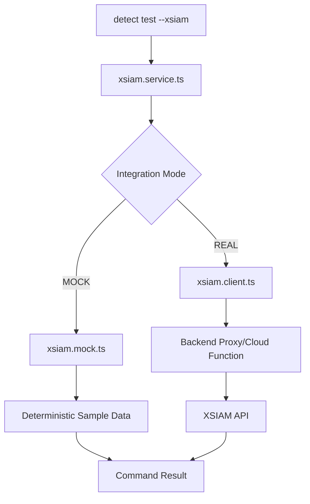
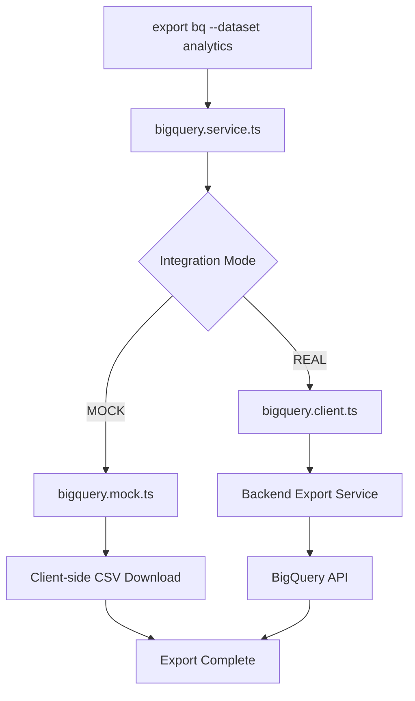
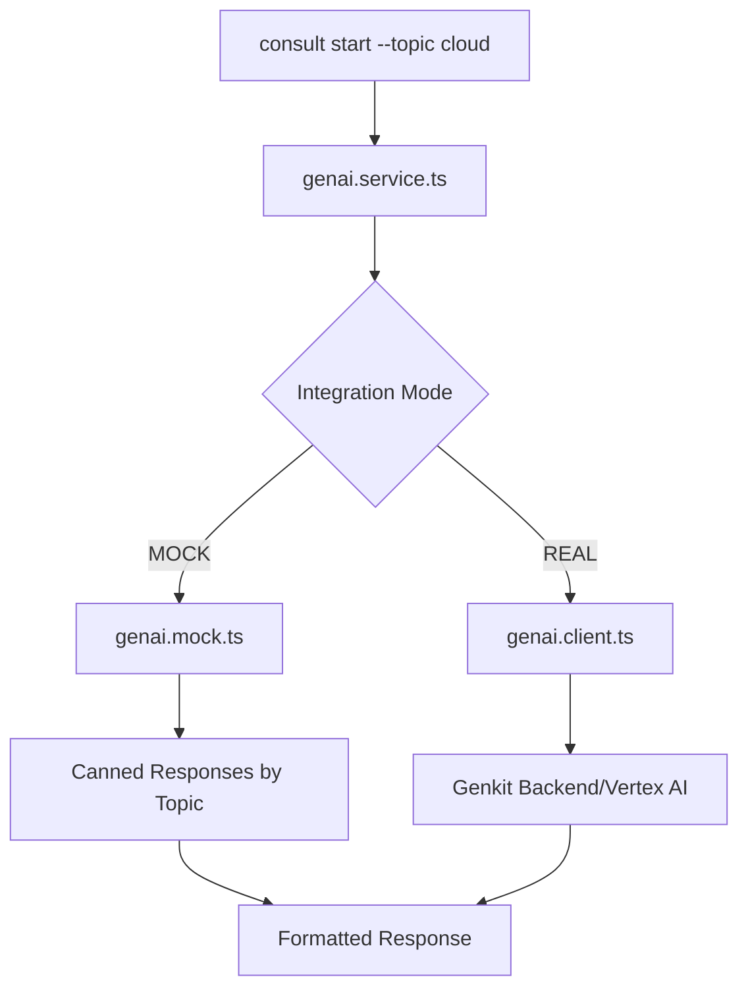

# Integration Strategy

This document outlines the integration architecture for external services (XSIAM, BigQuery, GenAI) within the hosting-only Firebase deployment constraints.

## Core Philosophy: Mock-First with Real Mode

All integrations follow a **mock-first approach** to ensure:
- Full functionality in static hosting environments
- Offline development and testing capabilities  
- Graceful degradation when backend services are unavailable
- Easy toggle between mock and real implementations

## Environment Configuration

```typescript
// Environment variables control integration modes
NEXT_PUBLIC_USE_MOCK_XSIAM=true          // Default: true (mock mode)
NEXT_PUBLIC_USE_MOCK_BIGQUERY=true       // Default: true (mock mode)
NEXT_PUBLIC_USE_MOCK_GENAI=true          // Default: true (mock mode)

// Real mode requires additional configuration
NEXT_PUBLIC_BACKEND_URL=https://api.example.com  // Backend proxy URL
NEXT_PUBLIC_XSIAM_ENDPOINT=https://xsiam.example.com
```

## XSIAM Integration

### Architecture



### Implementation Structure

```
hosting/lib/integrations/xsiam/
├── index.ts                    # Public API exports
├── xsiam.service.ts           # Main orchestration service
├── xsiam.types.ts             # TypeScript interfaces
├── xsiam.mock.ts              # Mock implementation
├── xsiam.client.ts            # Real API client
└── xsiam.commands.ts          # Command handlers
```

### Mock Mode (Default)

```typescript
// hosting/lib/integrations/xsiam/xsiam.mock.ts
export class XSIAMMockClient {
  async testEndpoint(endpoint: string): Promise<XSIAMTestResult> {
    // Return deterministic sample data based on endpoint
    const mockResults = {
      'alerts': {
        status: 'healthy',
        alerts: [
          { id: 'alert-1', severity: 'high', description: 'Suspicious login detected' },
          { id: 'alert-2', severity: 'medium', description: 'Unusual network activity' }
        ],
        timestamp: new Date().toISOString()
      },
      'incidents': {
        status: 'healthy',
        incidents: [
          { id: 'inc-1', priority: 'high', status: 'active', title: 'Security breach investigation' }
        ]
      }
    };
    
    // Simulate network delay
    await new Promise(resolve => setTimeout(resolve, 800));
    
    return mockResults[endpoint] || { status: 'unknown', data: null };
  }

  async runDetectionTest(scenario: string): Promise<DetectionTestResult> {
    const mockDetections = {
      'ransomware': {
        rules_triggered: 12,
        coverage_percentage: 87,
        mitre_techniques: ['T1486', 'T1083', 'T1005'],
        test_duration: '45s',
        status: 'completed'
      },
      'cloud-posture': {
        rules_triggered: 8,
        coverage_percentage: 92,
        mitre_techniques: ['T1078', 'T1110'],
        test_duration: '32s',
        status: 'completed'
      }
    };

    await new Promise(resolve => setTimeout(resolve, 1200));
    return mockDetections[scenario] || { status: 'scenario_not_found' };
  }
}
```

### Real Mode Implementation

```typescript
// hosting/lib/integrations/xsiam/xsiam.client.ts
export class XSIAMRealClient {
  private baseUrl: string;
  private apiKey: string;

  constructor() {
    this.baseUrl = process.env.NEXT_PUBLIC_XSIAM_ENDPOINT || '';
    this.apiKey = process.env.XSIAM_API_KEY || '';
  }

  async testEndpoint(endpoint: string): Promise<XSIAMTestResult> {
    // Real implementation calls backend proxy
    const response = await fetch(`${process.env.NEXT_PUBLIC_BACKEND_URL}/xsiam/test`, {
      method: 'POST',
      headers: { 'Content-Type': 'application/json' },
      body: JSON.stringify({ endpoint, apiKey: this.apiKey })
    });
    
    if (!response.ok) {
      throw new Error(`XSIAM test failed: ${response.statusText}`);
    }
    
    return response.json();
  }
}
```

### Service Layer

```typescript
// hosting/lib/integrations/xsiam/xsiam.service.ts
import { XSIAMMockClient } from './xsiam.mock';
import { XSIAMRealClient } from './xsiam.client';

export class XSIAMService {
  private client: XSIAMMockClient | XSIAMRealClient;

  constructor() {
    const useMock = process.env.NEXT_PUBLIC_USE_MOCK_XSIAM !== 'false';
    this.client = useMock ? new XSIAMMockClient() : new XSIAMRealClient();
  }

  async testConnection(endpoint: string = 'alerts'): Promise<XSIAMTestResult> {
    return this.client.testEndpoint(endpoint);
  }

  async runDetectionTest(scenario: string): Promise<DetectionTestResult> {
    return this.client.runDetectionTest(scenario);
  }
}

// Singleton instance
export const xsiamService = new XSIAMService();
```

### Command Integration

```typescript
// Integration with detect-commands.tsx
{
  name: 'detect test',
  description: 'Run detection tests against XSIAM',
  usage: 'detect test --scenario [scenario] --endpoint [endpoint] --xsiam',
  handler: async (args: string[]) => {
    const scenario = extractArg(args, '--scenario') || 'ransomware';
    const endpoint = extractArg(args, '--endpoint') || 'alerts';
    
    try {
      if (args.includes('--xsiam')) {
        const result = await xsiamService.runDetectionTest(scenario);
        return <DetectionTestOutput result={result} scenario={scenario} />;
      } else {
        const result = await xsiamService.testConnection(endpoint);
        return <XSIAMTestOutput result={result} endpoint={endpoint} />;
      }
    } catch (error) {
      return <ErrorOutput message={`Detection test failed: ${error.message}`} />;
    }
  }
}
```

## BigQuery Integration

### Architecture



### Implementation Structure

```
hosting/lib/integrations/bigquery/
├── index.ts                    # Public API exports
├── bigquery.service.ts        # Main orchestration service
├── bigquery.types.ts          # TypeScript interfaces
├── bigquery.mock.ts           # Mock implementation (client-side export)
├── bigquery.client.ts         # Real API client
└── bigquery.utils.ts          # Data formatting utilities
```

### Mock Mode - Client-side Export

```typescript
// hosting/lib/integrations/bigquery/bigquery.mock.ts
export class BigQueryMockClient {
  async exportDataset(dataset: string, table: string, data: any[]): Promise<ExportResult> {
    // Convert data to CSV format
    const csv = this.convertToCSV(data);
    
    // Trigger client-side download
    const blob = new Blob([csv], { type: 'text/csv' });
    const url = URL.createObjectURL(blob);
    const link = document.createElement('a');
    link.href = url;
    link.download = `${dataset}_${table}_${new Date().toISOString().split('T')[0]}.csv`;
    link.click();
    
    URL.revokeObjectURL(url);
    
    return {
      status: 'completed',
      exportType: 'csv_download',
      filename: link.download,
      recordCount: data.length,
      timestamp: new Date().toISOString()
    };
  }

  private convertToCSV(data: any[]): string {
    if (!data.length) return '';
    
    const headers = Object.keys(data[0]);
    const csvRows = [
      headers.join(','),
      ...data.map(row => 
        headers.map(header => 
          JSON.stringify(row[header] || '')
        ).join(',')
      )
    ];
    
    return csvRows.join('\n');
  }
}
```

### Real Mode - Backend Integration

```typescript
// hosting/lib/integrations/bigquery/bigquery.client.ts
export class BigQueryRealClient {
  async exportDataset(dataset: string, table: string, data: any[]): Promise<ExportResult> {
    const response = await fetch(`${process.env.NEXT_PUBLIC_BACKEND_URL}/bigquery/export`, {
      method: 'POST',
      headers: { 'Content-Type': 'application/json' },
      body: JSON.stringify({ dataset, table, data })
    });
    
    if (!response.ok) {
      throw new Error(`BigQuery export failed: ${response.statusText}`);
    }
    
    return response.json();
  }
}
```

### Command Integration

```typescript
// New export command
{
  name: 'export bq',
  description: 'Export data to BigQuery or download as CSV',
  usage: 'export bq --dataset [name] --table [name] --source [scenario|pov|trr]',
  handler: async (args: string[]) => {
    const dataset = extractArg(args, '--dataset') || 'henryreed_analytics';
    const table = extractArg(args, '--table') || 'scenario_results';
    const source = extractArg(args, '--source') || 'scenario';
    
    // Gather data based on source
    const data = await gatherExportData(source);
    
    try {
      const result = await bigQueryService.exportDataset(dataset, table, data);
      return <ExportResultOutput result={result} />;
    } catch (error) {
      return <ErrorOutput message={`Export failed: ${error.message}`} />;
    }
  }
}
```

## GenAI Integration

### Architecture



### Implementation Structure

```
hosting/lib/integrations/genai/
├── index.ts                    # Public API exports
├── genai.service.ts           # Main orchestration service
├── genai.types.ts             # TypeScript interfaces
├── genai.mock.ts              # Mock completions
├── genai.client.ts            # Real Genkit/Vertex client
└── genai.prompts.ts           # Prompt templates
```

### Mock Mode - Canned Responses

```typescript
// hosting/lib/integrations/genai/genai.mock.ts
export class GenAIMockClient {
  private responses = {
    'cloud-security': [
      "Based on current cloud security trends, I recommend focusing on three key areas:\n\n1. **Identity & Access Management**: Implement zero-trust principles with MFA and just-in-time access\n2. **Data Protection**: Use encryption at rest and in transit, with proper key management\n3. **Monitoring**: Deploy SIEM/SOAR solutions with automated threat detection\n\nWould you like me to elaborate on any of these areas?",
      
      "For cloud security assessment, consider this structured approach:\n\n• **Asset Discovery**: Inventory all cloud resources and data flows\n• **Compliance Mapping**: Align with frameworks like SOC2, ISO27001\n• **Risk Assessment**: Prioritize vulnerabilities by business impact\n• **Incident Response**: Test and refine your cloud incident playbooks\n\nI can help you develop specific scenarios for each area."
    ],
    'network-security': [
      "Network security in cloud environments requires a layered approach:\n\n**Perimeter Defense**: Web Application Firewalls (WAF) and DDoS protection\n**Microsegmentation**: Zero-trust network access with software-defined perimeters\n**Traffic Analysis**: Deep packet inspection and behavioral analytics\n**Endpoint Security**: EDR solutions with cloud workload protection\n\nShall we dive deeper into any of these controls?"
    ]
  };

  async generateCompletion(prompt: string, context?: any): Promise<GenAIResponse> {
    // Simple keyword matching for topic detection
    const topic = this.detectTopic(prompt);
    const responses = this.responses[topic] || this.responses['cloud-security'];
    
    // Simulate thinking time
    await new Promise(resolve => setTimeout(resolve, 1500));
    
    // Rotate through responses for variety
    const responseIndex = Math.floor(Math.random() * responses.length);
    
    return {
      content: responses[responseIndex],
      metadata: {
        model: 'mock-consultant-v1',
        topic: topic,
        confidence: 0.85,
        timestamp: new Date().toISOString()
      }
    };
  }

  private detectTopic(prompt: string): string {
    const keywords = {
      'cloud-security': ['cloud', 'aws', 'gcp', 'azure', 'container'],
      'network-security': ['network', 'firewall', 'vpn', 'traffic', 'intrusion'],
      'identity': ['identity', 'access', 'authentication', 'authorization', 'iam']
    };
    
    for (const [topic, words] of Object.entries(keywords)) {
      if (words.some(word => prompt.toLowerCase().includes(word))) {
        return topic;
      }
    }
    
    return 'cloud-security';
  }
}
```

### Real Mode - Genkit Integration

```typescript
// hosting/lib/integrations/genai/genai.client.ts
export class GenAIRealClient {
  async generateCompletion(prompt: string, context?: any): Promise<GenAIResponse> {
    const response = await fetch(`${process.env.NEXT_PUBLIC_BACKEND_URL}/genai/complete`, {
      method: 'POST',
      headers: { 'Content-Type': 'application/json' },
      body: JSON.stringify({
        prompt,
        context,
        model: 'gemini-pro',
        temperature: 0.7
      })
    });
    
    if (!response.ok) {
      throw new Error(`GenAI completion failed: ${response.statusText}`);
    }
    
    return response.json();
  }
}
```

### Command Integration

```typescript
// Domain Consultant commands enhanced with GenAI
{
  name: 'consult start',
  description: 'Start an interactive security consultation',
  usage: 'consult start --topic [cloud|network|identity] --mode [interactive|quick]',
  handler: async (args: string[]) => {
    const topic = extractArg(args, '--topic') || 'cloud';
    const mode = extractArg(args, '--mode') || 'interactive';
    
    const prompt = `Provide security consulting guidance for ${topic} security. Focus on practical, actionable recommendations.`;
    
    try {
      const response = await genaiService.generateCompletion(prompt, { topic, mode });
      return <ConsultantResponseOutput response={response} topic={topic} />;
    } catch (error) {
      return <ErrorOutput message={`Consultation failed: ${error.message}`} />;
    }
  }
}
```

## Backend Services (Optional)

For real mode integrations, backend services can be deployed separately:

### Cloud Functions Structure

```
functions/
├── src/
│   ├── xsiam-proxy.ts         # XSIAM API proxy
│   ├── bigquery-export.ts     # BigQuery export handler
│   ├── genai-completion.ts    # Genkit wrapper
│   └── index.ts               # Function exports
├── package.json
└── tsconfig.json
```

### Deployment Strategy

Backend services are **optional** and deployed separately:

```bash
# Deploy backend functions (optional)
cd functions
npm run deploy

# Update environment variables
export NEXT_PUBLIC_BACKEND_URL=https://api-region-project.cloudfunctions.net
export NEXT_PUBLIC_USE_MOCK_XSIAM=false
export NEXT_PUBLIC_USE_MOCK_BIGQUERY=false
export NEXT_PUBLIC_USE_MOCK_GENAI=false

# Rebuild and deploy frontend with real integrations
cd ../hosting
npm run build
firebase deploy --only hosting
```

## Feature Flags and Configuration

### Runtime Toggle Support

```typescript
// hosting/lib/config/features.ts
export const featureFlags = {
  integrations: {
    xsiam: process.env.NEXT_PUBLIC_USE_MOCK_XSIAM !== 'false',
    bigquery: process.env.NEXT_PUBLIC_USE_MOCK_BIGQUERY !== 'false',
    genai: process.env.NEXT_PUBLIC_USE_MOCK_GENAI !== 'false'
  },
  
  // Runtime toggle support (for development)
  canToggleMode: process.env.NODE_ENV === 'development'
};

// Optional: Runtime toggle component for development
export const IntegrationModeToggle = () => {
  if (!featureFlags.canToggleMode) return null;
  
  return (
    <div className="integration-toggles">
      <button onClick={() => toggleXSIAMMode()}>
        XSIAM: {featureFlags.integrations.xsiam ? 'MOCK' : 'REAL'}
      </button>
      {/* ... other toggles ... */}
    </div>
  );
};
```

## Testing Strategy

### Mock Mode Testing

```typescript
// tests/integrations/xsiam.test.ts
describe('XSIAM Integration', () => {
  beforeEach(() => {
    process.env.NEXT_PUBLIC_USE_MOCK_XSIAM = 'true';
  });

  it('should return mock detection results', async () => {
    const service = new XSIAMService();
    const result = await service.runDetectionTest('ransomware');
    
    expect(result.status).toBe('completed');
    expect(result.rules_triggered).toBeGreaterThan(0);
    expect(result.mitre_techniques).toBeDefined();
  });
});
```

### Integration Testing

```typescript
// tests/e2e/commands.spec.ts (Playwright)
test('detect test command with XSIAM integration', async ({ page }) => {
  await page.goto('/');
  
  // Open terminal
  await page.click('[data-testid="terminal-toggle"]');
  
  // Execute command
  await page.fill('[data-testid="terminal-input"]', 'detect test --scenario ransomware --xsiam');
  await page.press('[data-testid="terminal-input"]', 'Enter');
  
  // Wait for mock response
  await page.waitForSelector('[data-testid="detection-results"]');
  
  // Verify mock data appears
  await expect(page.locator('[data-testid="rules-triggered"]')).toContainText('12');
  await expect(page.locator('[data-testid="coverage"]')).toContainText('87%');
});
```

## Deployment Configurations

### Static-Only Deployment (Default)

```json
{
  "hosting": {
    "public": "hosting/out",
    "rewrites": [{ "source": "**", "destination": "/index.html" }]
  }
}
```

**Environment**: All integrations in mock mode
**Commands work**: All commands functional with mock data
**External deps**: None required

### Full Integration Deployment

```json
{
  "functions": { "source": "functions" },
  "hosting": {
    "public": "hosting/out",
    "rewrites": [
      { "source": "/api/**", "function": "api" },
      { "source": "**", "destination": "/index.html" }
    ]
  }
}
```

**Environment**: Real integrations enabled via environment variables
**Commands work**: All commands with live data
**External deps**: Service accounts, API keys, backend functions deployed

## Rollback and Troubleshooting

### Quick Rollback to Mock Mode

```bash
# Immediate rollback to full mock mode
export NEXT_PUBLIC_USE_MOCK_XSIAM=true
export NEXT_PUBLIC_USE_MOCK_BIGQUERY=true
export NEXT_PUBLIC_USE_MOCK_GENAI=true

# Rebuild and redeploy
cd hosting
npm run build
firebase deploy --only hosting
```

### Common Issues

1. **Backend Unavailable**: Integrations automatically fallback to mock responses with error logging
2. **API Key Issues**: Clear error messages guide users to configuration docs
3. **Network Timeouts**: Configurable timeout settings with graceful fallbacks

### Debug Mode

```typescript
// Enable detailed logging in development
if (process.env.NODE_ENV === 'development') {
  console.log('XSIAM Integration Mode:', featureFlags.integrations.xsiam ? 'MOCK' : 'REAL');
  console.log('Backend URL:', process.env.NEXT_PUBLIC_BACKEND_URL);
}
```

## Summary

This integration strategy ensures that:

✅ **Full functionality** in static hosting environments  
✅ **Easy development** with no external dependencies required  
✅ **Production ready** with optional real integration backends  
✅ **Graceful degradation** when services are unavailable  
✅ **Clear toggle path** between mock and real modes  
✅ **Comprehensive testing** for both integration modes  

All commands remain functional regardless of integration mode, providing a consistent user experience while enabling powerful real-world integrations when needed.