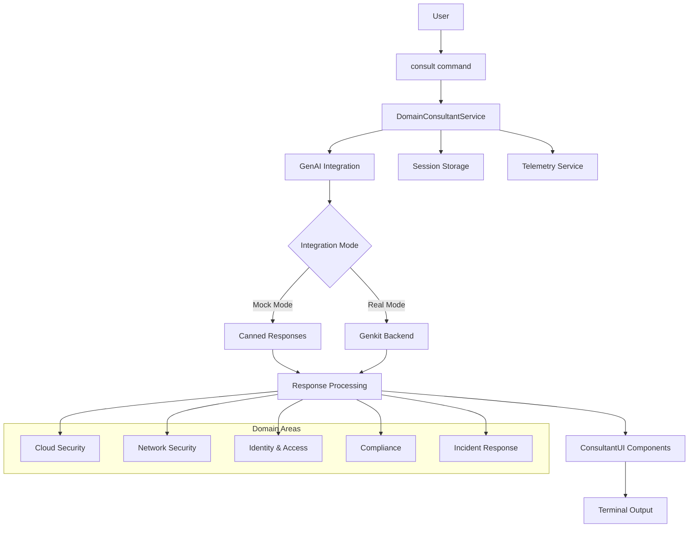

# Domain Consultant Module

## Overview

The Domain Consultant module provides AI-powered security consulting capabilities directly through the terminal interface. It offers contextual guidance, recommendations, and interactive consultations across multiple security domains.

## Architecture



## Module Structure

```
hosting/lib/domain-consultant/
├── index.ts                        # Public API exports
├── domain-consultant.service.ts    # Core orchestration service
├── domain-consultant.types.ts      # TypeScript interfaces and types
├── domain-consultant.store.ts      # Session state management
├── domain-consultant.ui.tsx        # React components for output
├── prompts/
│   ├── cloud-security.ts          # Cloud security prompt templates
│   ├── network-security.ts        # Network security prompt templates
│   ├── identity-access.ts         # Identity & access prompt templates
│   ├── compliance.ts              # Compliance prompt templates
│   └── incident-response.ts       # Incident response prompt templates
└── commands/
    └── consult-commands.tsx        # Command definitions
```

## Type Definitions

```typescript
// hosting/lib/domain-consultant/domain-consultant.types.ts

export interface ConsultationRequest {
  topic: SecurityDomain;
  mode: ConsultationMode;
  context?: ConsultationContext;
  prompt?: string;
}

export interface ConsultationResponse {
  content: string;
  recommendations: Recommendation[];
  nextSteps: string[];
  relatedTopics: string[];
  metadata: ConsultationMetadata;
}

export interface Recommendation {
  priority: 'high' | 'medium' | 'low';
  category: string;
  title: string;
  description: string;
  implementationSteps: string[];
  estimatedEffort: string;
  businessImpact: string;
}

export interface ConsultationContext {
  customerProfile?: CustomerProfile;
  currentScenarios?: string[];
  activePOV?: string;
  previousConsultations?: ConsultationHistory[];
}

export interface ConsultationMetadata {
  sessionId: string;
  timestamp: string;
  topic: SecurityDomain;
  mode: ConsultationMode;
  model: string;
  confidence: number;
  responseTime: number;
}

export type SecurityDomain = 
  | 'cloud-security'
  | 'network-security' 
  | 'identity-access'
  | 'compliance'
  | 'incident-response'
  | 'general';

export type ConsultationMode = 
  | 'interactive'  // Multi-turn conversation
  | 'quick'        // Single response
  | 'assessment'   // Structured evaluation
  | 'planning';    // Implementation roadmap

export interface CustomerProfile {
  name: string;
  industry: string;
  size: 'startup' | 'smb' | 'enterprise';
  currentSolutions: string[];
  painPoints: string[];
  complianceRequirements: string[];
}

export interface ConsultationSession {
  id: string;
  startTime: string;
  topic: SecurityDomain;
  mode: ConsultationMode;
  exchanges: ConsultationExchange[];
  context: ConsultationContext;
  status: 'active' | 'completed' | 'paused';
}

export interface ConsultationExchange {
  timestamp: string;
  userInput: string;
  consultantResponse: ConsultationResponse;
}
```

## Service Implementation

```typescript
// hosting/lib/domain-consultant/domain-consultant.service.ts

import { genaiService } from '../integrations/genai';
import { userActivityService } from '../services/user-activity.service';
import { DomainConsultantStore } from './domain-consultant.store';
import { 
  ConsultationRequest, 
  ConsultationResponse, 
  ConsultationSession,
  SecurityDomain 
} from './domain-consultant.types';
import { buildPromptForDomain } from './prompts';

export class DomainConsultantService {
  private store: DomainConsultantStore;

  constructor() {
    this.store = new DomainConsultantStore();
  }

  /**
   * Start a new consultation session
   */
  async startConsultation(request: ConsultationRequest): Promise<ConsultationResponse> {
    const sessionId = this.generateSessionId();
    const session: ConsultationSession = {
      id: sessionId,
      startTime: new Date().toISOString(),
      topic: request.topic,
      mode: request.mode,
      context: request.context || {},
      exchanges: [],
      status: 'active'
    };

    // Track consultation start
    await userActivityService.track({
      event: 'consultation-started',
      source: 'domain-consultant',
      payload: {
        sessionId,
        topic: request.topic,
        mode: request.mode,
        hasContext: !!request.context
      }
    });

    const response = await this.processConsultation(request, session);
    
    // Store the session
    this.store.saveSession(session);
    
    return response;
  }

  /**
   * Continue an existing consultation session
   */
  async continueConsultation(
    sessionId: string, 
    userInput: string
  ): Promise<ConsultationResponse> {
    const session = this.store.getSession(sessionId);
    if (!session) {
      throw new Error('Consultation session not found');
    }

    const request: ConsultationRequest = {
      topic: session.topic,
      mode: session.mode,
      context: session.context,
      prompt: userInput
    };

    const response = await this.processConsultation(request, session);
    
    // Update session with new exchange
    session.exchanges.push({
      timestamp: new Date().toISOString(),
      userInput,
      consultantResponse: response
    });

    this.store.updateSession(session);
    
    return response;
  }

  /**
   * Get quick recommendation for a specific topic
   */
  async getQuickRecommendation(
    topic: SecurityDomain, 
    context?: any
  ): Promise<ConsultationResponse> {
    const request: ConsultationRequest = {
      topic,
      mode: 'quick',
      context
    };

    return this.processConsultation(request);
  }

  /**
   * Process consultation request through GenAI
   */
  private async processConsultation(
    request: ConsultationRequest,
    session?: ConsultationSession
  ): Promise<ConsultationResponse> {
    // Build context-aware prompt
    const prompt = this.buildPrompt(request, session);
    
    try {
      // Call GenAI service (mock or real)
      const genaiResponse = await genaiService.generateCompletion(prompt, {
        topic: request.topic,
        mode: request.mode,
        sessionHistory: session?.exchanges || []
      });

      // Parse and structure the response
      const response = this.parseConsultantResponse(genaiResponse, request);
      
      // Track successful consultation
      await userActivityService.track({
        event: 'consultation-completed',
        source: 'domain-consultant',
        payload: {
          topic: request.topic,
          mode: request.mode,
          responseLength: response.content.length,
          recommendationCount: response.recommendations.length
        }
      });

      return response;
      
    } catch (error) {
      // Fallback to cached/default responses
      console.error('Consultation failed, using fallback:', error);
      return this.getFallbackResponse(request);
    }
  }

  /**
   * Build context-aware prompt for GenAI
   */
  private buildPrompt(
    request: ConsultationRequest, 
    session?: ConsultationSession
  ): string {
    const basePrompt = buildPromptForDomain(request.topic, request.mode);
    
    let contextualPrompt = basePrompt;
    
    // Add customer context if available
    if (request.context?.customerProfile) {
      const profile = request.context.customerProfile;
      contextualPrompt += `\n\nCustomer Context:
- Company: ${profile.name}
- Industry: ${profile.industry}
- Size: ${profile.size}
- Current Solutions: ${profile.currentSolutions.join(', ')}
- Pain Points: ${profile.painPoints.join(', ')}
- Compliance: ${profile.complianceRequirements.join(', ')}`;
    }

    // Add scenario context if available
    if (request.context?.currentScenarios?.length) {
      contextualPrompt += `\n\nActive Security Scenarios: ${request.context.currentScenarios.join(', ')}`;
    }

    // Add conversation history for interactive mode
    if (session && request.mode === 'interactive' && session.exchanges.length > 0) {
      contextualPrompt += '\n\nConversation History:';
      session.exchanges.slice(-3).forEach((exchange, idx) => {
        contextualPrompt += `\nUser: ${exchange.userInput}`;
        contextualPrompt += `\nConsultant: ${exchange.consultantResponse.content.substring(0, 200)}...`;
      });
    }

    // Add specific user prompt if provided
    if (request.prompt) {
      contextualPrompt += `\n\nCurrent Question: ${request.prompt}`;
    }

    return contextualPrompt;
  }

  /**
   * Parse GenAI response into structured consultation response
   */
  private parseConsultantResponse(
    genaiResponse: any,
    request: ConsultationRequest
  ): ConsultationResponse {
    // For mock mode, the response structure is already defined
    if (genaiResponse.metadata?.model?.includes('mock')) {
      return {
        content: genaiResponse.content,
        recommendations: this.extractRecommendations(genaiResponse.content),
        nextSteps: this.extractNextSteps(genaiResponse.content),
        relatedTopics: this.getRelatedTopics(request.topic),
        metadata: {
          sessionId: this.generateSessionId(),
          timestamp: new Date().toISOString(),
          topic: request.topic,
          mode: request.mode,
          model: genaiResponse.metadata.model,
          confidence: genaiResponse.metadata.confidence,
          responseTime: Date.now() - performance.now()
        }
      };
    }

    // For real GenAI responses, parse structured content
    return {
      content: genaiResponse.content,
      recommendations: this.extractRecommendations(genaiResponse.content),
      nextSteps: this.extractNextSteps(genaiResponse.content),
      relatedTopics: this.getRelatedTopics(request.topic),
      metadata: {
        sessionId: this.generateSessionId(),
        timestamp: new Date().toISOString(),
        topic: request.topic,
        mode: request.mode,
        model: 'genai-real',
        confidence: 0.9,
        responseTime: Date.now() - performance.now()
      }
    };
  }

  /**
   * Extract actionable recommendations from response content
   */
  private extractRecommendations(content: string): Recommendation[] {
    // Simple parsing - in production this would be more sophisticated
    const recommendations: Recommendation[] = [];
    const lines = content.split('\n');
    
    let currentRec: Partial<Recommendation> | null = null;
    
    for (const line of lines) {
      // Look for numbered or bulleted recommendations
      if (line.match(/^\d+\.|^[\*\-]\s*\*\*|^##\s/)) {
        if (currentRec && currentRec.title) {
          recommendations.push(currentRec as Recommendation);
        }
        
        currentRec = {
          priority: 'medium',
          category: 'general',
          title: line.replace(/^\d+\.|^[\*\-]\s*\*\*|^##\s/, '').replace(/\*\*/g, ''),
          description: '',
          implementationSteps: [],
          estimatedEffort: 'Medium',
          businessImpact: 'Moderate improvement in security posture'
        };
      } else if (currentRec && line.trim()) {
        currentRec.description += line.trim() + ' ';
      }
    }
    
    if (currentRec && currentRec.title) {
      recommendations.push(currentRec as Recommendation);
    }
    
    return recommendations.slice(0, 5); // Limit to top 5 recommendations
  }

  /**
   * Extract next steps from response content
   */
  private extractNextSteps(content: string): string[] {
    const steps: string[] = [];
    const lines = content.split('\n');
    
    let inStepsSection = false;
    for (const line of lines) {
      if (line.toLowerCase().includes('next step') || 
          line.toLowerCase().includes('action item') ||
          line.toLowerCase().includes('follow up')) {
        inStepsSection = true;
        continue;
      }
      
      if (inStepsSection && line.match(/^\d+\.|^[\*\-]/)) {
        steps.push(line.replace(/^\d+\.|^[\*\-]\s*/, '').trim());
      }
      
      if (inStepsSection && line === '' && steps.length > 0) {
        break; // End of steps section
      }
    }
    
    return steps.slice(0, 3); // Limit to 3 next steps
  }

  /**
   * Get related topics for cross-linking
   */
  private getRelatedTopics(topic: SecurityDomain): string[] {
    const topicMap: Record<SecurityDomain, string[]> = {
      'cloud-security': ['identity-access', 'compliance', 'network-security'],
      'network-security': ['cloud-security', 'incident-response', 'identity-access'],
      'identity-access': ['cloud-security', 'compliance', 'network-security'],
      'compliance': ['identity-access', 'cloud-security', 'incident-response'],
      'incident-response': ['network-security', 'cloud-security', 'compliance'],
      'general': ['cloud-security', 'network-security', 'identity-access']
    };
    
    return topicMap[topic] || [];
  }

  /**
   * Fallback response for when GenAI is unavailable
   */
  private getFallbackResponse(request: ConsultationRequest): ConsultationResponse {
    const fallbackContent = this.getFallbackContentForDomain(request.topic);
    
    return {
      content: fallbackContent,
      recommendations: [],
      nextSteps: ['Review the provided guidance', 'Consider your specific environment', 'Consult with your security team'],
      relatedTopics: this.getRelatedTopics(request.topic),
      metadata: {
        sessionId: this.generateSessionId(),
        timestamp: new Date().toISOString(),
        topic: request.topic,
        mode: request.mode,
        model: 'fallback',
        confidence: 0.5,
        responseTime: 100
      }
    };
  }

  /**
   * Get fallback content for each domain
   */
  private getFallbackContentForDomain(topic: SecurityDomain): string {
    const fallbacks: Record<SecurityDomain, string> = {
      'cloud-security': `
I'm currently unable to provide dynamic recommendations, but here are some foundational cloud security practices:

**Core Cloud Security Principles:**
1. **Identity & Access Management**: Implement least-privilege access and multi-factor authentication
2. **Data Protection**: Encrypt data at rest and in transit with proper key management
3. **Network Security**: Use VPCs, security groups, and network segmentation
4. **Monitoring**: Enable comprehensive logging and set up automated threat detection

**Quick Assessment Questions:**
- Do you have proper IAM policies in place?
- Are your cloud workloads properly segmented?
- Do you have visibility into all your cloud assets?

Please try again in a moment for more personalized guidance.`,

      'network-security': `
Network security requires a layered defense approach:

**Essential Network Controls:**
1. **Perimeter Defense**: Firewalls, IDS/IPS, and DDoS protection
2. **Internal Segmentation**: Network zones and microsegmentation
3. **Traffic Monitoring**: Deep packet inspection and behavioral analysis
4. **Endpoint Security**: EDR and network access control

**Key Considerations:**
- Zero-trust network architecture
- Regular vulnerability assessments
- Network traffic baselines
- Incident response procedures

Please try again for more specific recommendations.`,

      'identity-access': `
Identity and Access Management is crucial for modern security:

**IAM Fundamentals:**
1. **Authentication**: Multi-factor authentication for all users
2. **Authorization**: Role-based access control (RBAC)
3. **Governance**: Regular access reviews and provisioning workflows
4. **Monitoring**: User behavior analytics and privileged access monitoring

**Best Practices:**
- Principle of least privilege
- Single sign-on (SSO) implementation
- Regular access certifications
- Privileged account management

Please try again for personalized IAM guidance.`,

      'compliance': `
Compliance requires structured approach and continuous monitoring:

**Compliance Framework Alignment:**
1. **Gap Analysis**: Current state vs. requirements
2. **Control Implementation**: Technical and procedural controls
3. **Documentation**: Policies, procedures, and evidence collection
4. **Monitoring**: Continuous compliance monitoring and reporting

**Common Frameworks:**
- SOC 2 Type II
- ISO 27001
- NIST Cybersecurity Framework
- Industry-specific requirements (HIPAA, PCI DSS, etc.)

Please try again for framework-specific guidance.`,

      'incident-response': `
Effective incident response requires preparation and practice:

**IR Process Overview:**
1. **Preparation**: Plans, procedures, and team training
2. **Detection & Analysis**: Threat hunting and alert triage
3. **Containment**: Isolate threats and prevent spread
4. **Recovery**: Restore services and strengthen defenses

**Key Components:**
- 24/7 monitoring and alerting
- Defined escalation procedures
- Regular tabletop exercises
- Post-incident lessons learned

Please try again for specific IR recommendations.`,

      'general': `
Security is a holistic discipline requiring attention to multiple domains:

**Security Pillars:**
1. **People**: Training, awareness, and culture
2. **Process**: Governance, compliance, and procedures
3. **Technology**: Tools, controls, and monitoring

**Start Here:**
- Assess your current security posture
- Identify critical assets and risks
- Develop a security strategy and roadmap
- Implement basic hygiene controls

Please specify a particular domain for more focused guidance.`
    };
    
    return fallbacks[topic];
  }

  /**
   * Generate unique session ID
   */
  private generateSessionId(): string {
    return `consult-${Date.now()}-${Math.random().toString(36).substring(2, 9)}`;
  }

  /**
   * Get active consultation sessions
   */
  getActiveSessions(): ConsultationSession[] {
    return this.store.getActiveSessions();
  }

  /**
   * End a consultation session
   */
  async endSession(sessionId: string): Promise<void> {
    const session = this.store.getSession(sessionId);
    if (session) {
      session.status = 'completed';
      this.store.updateSession(session);
      
      await userActivityService.track({
        event: 'consultation-ended',
        source: 'domain-consultant',
        payload: {
          sessionId,
          duration: Date.now() - new Date(session.startTime).getTime(),
          exchangeCount: session.exchanges.length
        }
      });
    }
  }
}

// Export singleton instance
export const domainConsultantService = new DomainConsultantService();
```

## Command Integration

```typescript
// hosting/lib/domain-consultant/commands/consult-commands.tsx

import React from 'react';
import { CommandConfig } from '../../types/command.types';
import { domainConsultantService } from '../domain-consultant.service';
import { ConsultantResponseOutput } from '../domain-consultant.ui';
import { extractArg } from '../../utils/command-utils';

export const consultCommands: CommandConfig[] = [
  {
    name: 'consult start',
    description: 'Start an interactive security consultation',
    usage: 'consult start --topic [cloud|network|identity|compliance|ir] --mode [interactive|quick|assessment]',
    aliases: ['consultant', 'advice'],
    permissions: ['terminal.user_commands'],
    handler: async (args: string[]) => {
      const topic = extractArg(args, '--topic') as any || 'cloud-security';
      const mode = extractArg(args, '--mode') as any || 'interactive';
      
      try {
        const response = await domainConsultantService.startConsultation({
          topic,
          mode,
          context: {
            // Add context from current session
            currentScenarios: [], // TODO: Get from scenario engine
            activePOV: undefined,  // TODO: Get from POV service
          }
        });
        
        return <ConsultantResponseOutput 
          response={response} 
          topic={topic}
          mode={mode}
        />;
      } catch (error) {
        return (
          <div className="text-red-400">
            <div className="mb-2">❌ Consultation failed to start</div>
            <div className="text-sm opacity-75">
              {error instanceof Error ? error.message : 'Unknown error occurred'}
            </div>
          </div>
        );
      }
    }
  },
  
  {
    name: 'consult recommend',
    description: 'Get quick security recommendations for a specific area',
    usage: 'consult recommend --topic [domain] --context [brief-description]',
    aliases: ['recommend'],
    permissions: ['terminal.user_commands'],
    handler: async (args: string[]) => {
      const topic = extractArg(args, '--topic') as any || 'cloud-security';
      const contextString = extractArg(args, '--context');
      
      try {
        const response = await domainConsultantService.getQuickRecommendation(
          topic,
          contextString ? { description: contextString } : undefined
        );
        
        return <ConsultantResponseOutput 
          response={response} 
          topic={topic}
          mode="quick"
        />;
      } catch (error) {
        return (
          <div className="text-red-400">
            <div className="mb-2">❌ Failed to generate recommendations</div>
            <div className="text-sm opacity-75">
              {error instanceof Error ? error.message : 'Unknown error occurred'}
            </div>
          </div>
        );
      }
    }
  },

  {
    name: 'consult continue',
    description: 'Continue an active consultation session',
    usage: 'consult continue [session-id] "your question or response"',
    permissions: ['terminal.user_commands'],
    handler: async (args: string[]) => {
      const sessions = domainConsultantService.getActiveSessions();
      
      if (sessions.length === 0) {
        return (
          <div className="text-yellow-400">
            <div className="mb-2">⚠️ No active consultation sessions</div>
            <div className="text-sm opacity-75">
              Start a new consultation with: <code>consult start --topic cloud</code>
            </div>
          </div>
        );
      }
      
      // Use the most recent session if no session ID provided
      const sessionId = args[0]?.startsWith('consult-') ? args.shift()! : sessions[0].id;
      const userInput = args.join(' ');
      
      if (!userInput) {
        return (
          <div className="text-yellow-400">
            <div className="mb-2">💬 Please provide your question or response</div>
            <div className="text-sm opacity-75">
              Example: <code>consult continue "What about network segmentation?"</code>
            </div>
          </div>
        );
      }
      
      try {
        const response = await domainConsultantService.continueConsultation(
          sessionId, 
          userInput
        );
        
        return <ConsultantResponseOutput 
          response={response} 
          sessionId={sessionId}
          continuedConversation={true}
        />;
      } catch (error) {
        return (
          <div className="text-red-400">
            <div className="mb-2">❌ Failed to continue consultation</div>
            <div className="text-sm opacity-75">
              {error instanceof Error ? error.message : 'Session may have expired'}
            </div>
          </div>
        );
      }
    }
  },

  {
    name: 'consult sessions',
    description: 'List active consultation sessions',
    usage: 'consult sessions [--detailed]',
    permissions: ['terminal.user_commands'],
    handler: async (args: string[]) => {
      const detailed = args.includes('--detailed');
      const sessions = domainConsultantService.getActiveSessions();
      
      if (sessions.length === 0) {
        return (
          <div className="text-blue-300">
            <div className="mb-2">📋 No active consultation sessions</div>
            <div className="text-sm opacity-75">
              Start a new consultation with: <code>consult start</code>
            </div>
          </div>
        );
      }
      
      return (
        <div className="text-blue-300">
          <div className="mb-3">📋 Active Consultation Sessions ({sessions.length})</div>
          {sessions.map((session, idx) => (
            <div key={session.id} className="mb-4 border-l-2 border-blue-500 pl-4">
              <div className="flex items-center gap-2 mb-1">
                <span className="text-white font-medium">{idx + 1}. {session.topic}</span>
                <span className="text-xs bg-blue-800 px-2 py-1 rounded">{session.mode}</span>
                <span className="text-xs text-gray-400">
                  {new Date(session.startTime).toLocaleTimeString()}
                </span>
              </div>
              <div className="text-sm text-gray-300">
                Session ID: <code className="text-yellow-300">{session.id}</code>
              </div>
              {detailed && (
                <div className="text-sm text-gray-400 mt-1">
                  Exchanges: {session.exchanges.length} | 
                  Status: {session.status}
                </div>
              )}
            </div>
          ))}
          <div className="text-sm text-gray-400 mt-4">
            💡 Continue with: <code>consult continue "your question"</code>
          </div>
        </div>
      );
    }
  },

  {
    name: 'consult end',
    description: 'End an active consultation session',
    usage: 'consult end [session-id]',
    permissions: ['terminal.user_commands'],
    handler: async (args: string[]) => {
      const sessions = domainConsultantService.getActiveSessions();
      
      if (sessions.length === 0) {
        return (
          <div className="text-yellow-400">
            ⚠️ No active consultation sessions to end
          </div>
        );
      }
      
      const sessionId = args[0] || sessions[0].id;
      
      try {
        await domainConsultantService.endSession(sessionId);
        return (
          <div className="text-green-400">
            <div className="mb-2">✅ Consultation session ended</div>
            <div className="text-sm opacity-75">
              Session {sessionId} has been completed
            </div>
          </div>
        );
      } catch (error) {
        return (
          <div className="text-red-400">
            ❌ Failed to end session: {error instanceof Error ? error.message : 'Unknown error'}
          </div>
        );
      }
    }
  }
];
```

## React Components

```typescript
// hosting/lib/domain-consultant/domain-consultant.ui.tsx

import React, { useState } from 'react';
import { ConsultationResponse, Recommendation, SecurityDomain } from './domain-consultant.types';
import { useCommandExecutor } from '../../hooks/useCommandExecutor';

interface ConsultantResponseOutputProps {
  response: ConsultationResponse;
  topic?: SecurityDomain;
  mode?: string;
  sessionId?: string;
  continuedConversation?: boolean;
}

export const ConsultantResponseOutput: React.FC<ConsultantResponseOutputProps> = ({ 
  response, 
  topic, 
  mode,
  sessionId,
  continuedConversation 
}) => {
  const { run: executeCommand } = useCommandExecutor();
  const [showRecommendations, setShowRecommendations] = useState(false);

  const handleContinueConversation = () => {
    // Focus terminal input for user to continue
    const terminalInput = document.querySelector('[data-testid="terminal-input"]') as HTMLInputElement;
    if (terminalInput) {
      terminalInput.focus();
      terminalInput.placeholder = 'Continue the conversation...';
    }
  };

  const handleExploreRecommendation = (rec: Recommendation) => {
    executeCommand(`consult recommend --topic ${topic} --context "${rec.title}"`, {
      trackActivity: {
        event: 'recommendation-explored',
        source: 'domain-consultant',
        payload: { recommendation: rec.title, topic }
      }
    });
  };

  return (
    <div className="domain-consultant-output">
      {/* Header */}
      <div className="flex items-center gap-2 mb-4">
        <span className="text-2xl">🧠</span>
        <div>
          <div className="text-blue-300 font-medium">
            Security Consultant {continuedConversation ? '(continued)' : ''}
          </div>
          <div className="text-xs text-gray-400">
            {topic} • {mode} • {response.metadata.model}
          </div>
        </div>
      </div>

      {/* Main Content */}
      <div className="bg-gray-800 rounded-lg p-4 mb-4">
        <div className="text-white whitespace-pre-wrap leading-relaxed">
          {response.content}
        </div>
      </div>

      {/* Recommendations Section */}
      {response.recommendations.length > 0 && (
        <div className="mb-4">
          <button 
            onClick={() => setShowRecommendations(!showRecommendations)}
            className="flex items-center gap-2 text-yellow-300 hover:text-yellow-200 transition-colors"
          >
            <span>{showRecommendations ? '▼' : '▶'}</span>
            <span>📋 {response.recommendations.length} Recommendations</span>
          </button>
          
          {showRecommendations && (
            <div className="mt-3 space-y-3">
              {response.recommendations.map((rec, idx) => (
                <div key={idx} className="bg-gray-800 rounded p-3">
                  <div className="flex items-start justify-between mb-2">
                    <div className="flex items-center gap-2">
                      <span className={`w-2 h-2 rounded-full ${
                        rec.priority === 'high' ? 'bg-red-400' :
                        rec.priority === 'medium' ? 'bg-yellow-400' : 'bg-green-400'
                      }`} />
                      <span className="text-white font-medium">{rec.title}</span>
                    </div>
                    <button
                      onClick={() => handleExploreRecommendation(rec)}
                      className="text-xs bg-blue-600 hover:bg-blue-700 px-2 py-1 rounded transition-colors"
                    >
                      Explore
                    </button>
                  </div>
                  <div className="text-sm text-gray-300 mb-2">
                    {rec.description}
                  </div>
                  <div className="flex gap-4 text-xs text-gray-400">
                    <span>Impact: {rec.businessImpact}</span>
                    <span>Effort: {rec.estimatedEffort}</span>
                  </div>
                </div>
              ))}
            </div>
          )}
        </div>
      )}

      {/* Next Steps */}
      {response.nextSteps.length > 0 && (
        <div className="mb-4">
          <div className="text-green-300 font-medium mb-2">🎯 Next Steps:</div>
          <ol className="space-y-1">
            {response.nextSteps.map((step, idx) => (
              <li key={idx} className="text-sm text-gray-300">
                {idx + 1}. {step}
              </li>
            ))}
          </ol>
        </div>
      )}

      {/* Related Topics */}
      {response.relatedTopics.length > 0 && (
        <div className="mb-4">
          <div className="text-purple-300 font-medium mb-2">🔗 Related Topics:</div>
          <div className="flex flex-wrap gap-2">
            {response.relatedTopics.map((topic, idx) => (
              <button
                key={idx}
                onClick={() => executeCommand(`consult start --topic ${topic}`)}
                className="text-xs bg-purple-800 hover:bg-purple-700 px-2 py-1 rounded transition-colors"
              >
                {topic.replace('-', ' ')}
              </button>
            ))}
          </div>
        </div>
      )}

      {/* Action Buttons */}
      <div className="flex flex-wrap gap-2 text-sm">
        {sessionId && mode === 'interactive' && (
          <button
            onClick={handleContinueConversation}
            className="bg-blue-600 hover:bg-blue-700 px-3 py-1 rounded transition-colors"
          >
            💬 Continue Conversation
          </button>
        )}
        
        <button
          onClick={() => executeCommand(`consult recommend --topic ${topic}`)}
          className="bg-green-600 hover:bg-green-700 px-3 py-1 rounded transition-colors"
        >
          🔄 Get More Recommendations
        </button>
        
        <button
          onClick={() => executeCommand('consult sessions --detailed')}
          className="bg-gray-600 hover:bg-gray-700 px-3 py-1 rounded transition-colors"
        >
          📋 View Sessions
        </button>
      </div>

      {/* Metadata Footer */}
      <div className="mt-4 pt-3 border-t border-gray-700 text-xs text-gray-500">
        <div className="flex justify-between">
          <span>Response time: {response.metadata.responseTime}ms</span>
          <span>Confidence: {(response.metadata.confidence * 100).toFixed(0)}%</span>
          <span>{response.metadata.timestamp}</span>
        </div>
      </div>
    </div>
  );
};

// Additional UI components for specific use cases
export const ConsultantQuickTips: React.FC<{ topic: SecurityDomain }> = ({ topic }) => {
  // Component for displaying quick tips without full consultation
  return <div>Quick tips for {topic}</div>;
};

export const ConsultantHistory: React.FC<{ sessionId: string }> = ({ sessionId }) => {
  // Component for displaying consultation history
  return <div>History for session {sessionId}</div>;
};
```

## Integration with GenAI

The Domain Consultant module integrates with the GenAI service (covered in INTEGRATIONS.md) through:

1. **Mock Mode (Default)**: Uses canned responses tailored to each security domain
2. **Real Mode**: Connects to Genkit backend for dynamic AI responses
3. **Fallback**: Graceful degradation to static content when AI is unavailable

## Usage Examples

```bash
# Start an interactive cloud security consultation
consult start --topic cloud --mode interactive

# Get quick network security recommendations
consult recommend --topic network --context "small startup with remote workers"

# Continue an active conversation
consult continue "What about multi-factor authentication?"

# View all active sessions
consult sessions --detailed

# End a specific session
consult end consult-1234567890-abc123
```

## Testing Strategy

### Unit Tests
- Service layer functionality
- Response parsing and structuring
- Session management

### Integration Tests
- GenAI service integration (mock and real modes)
- Command execution and output formatting
- Telemetry tracking

### E2E Tests
- Full consultation workflows
- Cross-domain recommendations
- Session continuity

## Performance Considerations

1. **Response Caching**: Cache common responses to reduce GenAI calls
2. **Session Cleanup**: Automatically clean up old inactive sessions
3. **Content Streaming**: For long responses, stream content as it's generated
4. **Rate Limiting**: Prevent abuse with request rate limiting

## Security Considerations

1. **Input Sanitization**: Clean user inputs before sending to GenAI
2. **Content Filtering**: Ensure responses are appropriate and safe
3. **Data Privacy**: Don't store sensitive customer information in sessions
4. **Access Control**: Respect user permissions for different consultation types

This module provides a solid foundation for AI-powered security consulting while maintaining the flexibility to work in both mock and real integration modes.