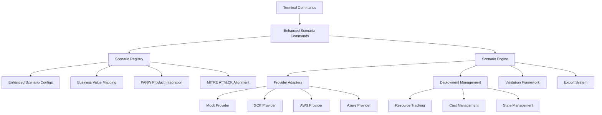
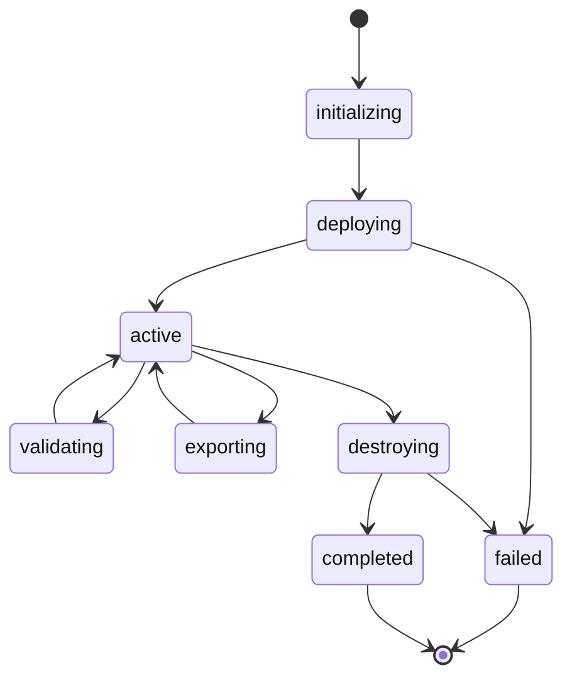

# Enhanced Scenario Engine Module Documentation

The Enhanced Scenario Engine represents a comprehensive evolution of the original scenario system, providing enterprise-grade security scenario management with PANW product integration, business value quantification, and complete lifecycle orchestration.

## Enhanced Architecture Implementation

### Completed Implementation

The enhanced scenario engine has been implemented with the following key components:

**Core Files (hosting/lib/scenario/):**
- `registry.ts` - Enhanced scenario registry with PANW product integration and business value mapping
- `engine.ts` - Complete lifecycle orchestration with provider adapters and state management  
- `scenario-commands-enhanced.tsx` - Modern command interface with comprehensive filtering and management

**Legacy Files (hosting/lib/):**
- scenario-commands.tsx - Original command handlers (retained for compatibility)
- scenario-command-wrapper.tsx - Command routing and help system
- scenario-types.ts - Original type definitions
- scenario-pov-map.ts - POV integration utilities
- scenario-engine.ts.bak - Prototype concepts (preserved as reference)
- scenario-engine-client.ts.bak - Firebase integration concepts

## Enhanced Architecture Overview

### Key Enhancements

1. **PANW Product Integration**: Direct mapping to Palo Alto Networks product portfolio
2. **Business Value Quantification**: ROI metrics, impact scoring, and executive reporting
3. **MITRE ATT&CK Alignment**: Comprehensive technique mapping and coverage analysis
4. **Provider Abstraction**: Extensible provider architecture with mock-first development
5. **Complete Lifecycle Management**: Deployment → Validation → Export → Cleanup orchestration
6. **Cost Tracking**: Real-time cost monitoring and resource attribution
7. **Advanced Filtering**: Multi-criteria scenario discovery and selection

### Architecture Diagram



## Enhanced Features Implementation

### 1. Enhanced Scenario Registry (`registry.ts`)

**PANW Product Integration:**
```typescript
export type PANWProduct = 
  | 'cortex-xsiam' | 'cortex-xsoar' | 'cortex-xdr'
  | 'prisma-cloud' | 'prisma-access' | 'prisma-sase'
  | 'next-gen-firewall' | 'wildfire' | 'globalprotect'
  | 'panorama' | 'cortex-data-lake' | 'unit42-threat-intel';

interface PANWProductIntegration {
  product: PANWProduct;
  role: 'primary' | 'secondary' | 'optional';
  capabilities: string[];
  configurationRequired: boolean;
  notes?: string;
}
```

**Business Value Quantification:**
```typescript
export type BusinessValueTag = 
  | 'cost-reduction' | 'risk-mitigation' | 'compliance-automation'
  | 'operational-efficiency' | 'threat-prevention' | 'incident-response'
  | 'visibility-enhancement' | 'automation-orchestration'
  | 'zero-trust-enablement' | 'cloud-security-posture'
  | 'data-protection' | 'insider-threat-detection';

interface BusinessValueMapping {
  primaryValue: BusinessValueTag;
  secondaryValues: BusinessValueTag[];
  businessImpact: BusinessImpactScore; // 1-5 scale
  roiTimeframe: '1-3 months' | '3-6 months' | '6-12 months' | '12+ months';
  quantifiableMetrics: string[];
}
```

**Advanced Registry Methods:**
- `getByProduct(product: PANWProduct)` - Filter by PANW product
- `getByBusinessValue(value: BusinessValueTag)` - Filter by business value
- `getByMitreTechnique(techniqueId: string)` - Filter by MITRE techniques
- `filter(criteria)` - Multi-criteria advanced filtering
- `getBusinessImpactSummary()` - Executive analytics

### 2. Scenario Engine (`engine.ts`)

**Deployment Lifecycle:**


**Provider Architecture:**
- Abstract `ProviderAdapter` base class
- Mock provider for demonstration and testing
- Extensible for real cloud provider integration
- Cost tracking and resource attribution
- Validation framework integration

**Core Engine Methods:**
- `deployScenario(scenarioId, provider, config)` - Deploy with full configuration
- `validateDeployment(deploymentId)` - Run comprehensive validation tests
- `exportDeployment(deploymentId, format)` - Generate reports (PDF, JSON, CSV, Markdown)
- `destroyDeployment(deploymentId)` - Clean up all resources
- `getDeploymentStats()` - Analytics and metrics

### 3. Enhanced Commands (`scenario-commands-enhanced.tsx`)

**Advanced Command Interface:**
```bash
# Enhanced listing with filtering
scenario list --product prisma-cloud --business-value risk-mitigation --detailed

# Deployment with business context
scenario generate --id cloud-posture-misconfigured-s3 --provider gcp --customer "Acme Corp" --pov-id pov-2024-001

# Comprehensive validation
scenario validate deployment-12345 --all-tests --include-compliance

# Executive reporting
scenario export deployment-12345 --format pdf --include-business-metrics

# Registry analytics
scenario registry --stats --business-impact-analysis
```

**Command Features:**
- Real-time deployment status with loading states
- Interactive validation result displays
- Cost tracking and resource monitoring
- Executive-ready export formats
- Registry analytics and statistics

## Enhanced Module Architecture ✅ IMPLEMENTED

### Actual Module Layout (hosting/lib/scenario/)

- `registry.ts` ✅ - Enhanced scenario registry with PANW product integration
  - ScenarioRegistry class with comprehensive filtering
  - Business value mapping and quantification
  - MITRE ATT&CK technique alignment
  - Advanced analytics and impact scoring

- `engine.ts` ✅ - Complete lifecycle orchestration engine
  - ScenarioEngine class with provider abstraction
  - Deployment state management and tracking
  - Validation framework with comprehensive test categories
  - Cost tracking and resource attribution
  - Export system with multiple format support

- `scenario-commands-enhanced.tsx` ✅ - Modern command interface
  - Comprehensive command set with advanced filtering
  - Real-time status updates with loading states
  - Interactive components for validation and export
  - Executive reporting and analytics commands

**Provider Architecture:**
- MockProviderAdapter ✅ - Full mock implementation for demonstration
- Abstract ProviderAdapter base class for extension
- Support for GCP, AWS, Azure, Kubernetes, local providers (via interface)

**Key Implementation Achievements:**
1. ✅ Central registry with 10+ filtering methods
2. ✅ Complete provider abstraction with mock implementation
3. ✅ Full lifecycle orchestration (deploy → validate → export → destroy)
4. ✅ Business value quantification and executive reporting
5. ✅ MITRE ATT&CK framework integration
6. ✅ Cost tracking and resource management
7. ✅ Advanced command interface with real-time updates

## Services and Contracts

Engine (engine.ts):
- listTemplates(filters?): ScenarioConfig[]
- generate(params: ScenarioCommand): Promise<{ success: boolean; deploymentId?: string; message?: string }>
- status(deploymentId?: string): Promise<{ deployments: ScenarioDeployment[]; deployment?: ScenarioDeployment; success: boolean; message?: string }>
- validate(deploymentId: string): Promise<{ success: boolean; results: any }>
- destroy(deploymentId: string): Promise<{ success: boolean }>
- export(deploymentId: string, format: 'json'|'csv'|'pdf'|'yaml'|'terraform'): Promise<{ success: boolean; downloadUrl: string }>

Registry (registry.ts):
- register(type: ScenarioType, configs: ScenarioConfig[]): void
- getByType(type: ScenarioType): ScenarioConfig[]
- getAll(): Record<ScenarioType, ScenarioConfig[]>
- supportsProvider(type: ScenarioType, provider: Provider): boolean

Provider Adapters (providers/*.ts):
- interface ProviderAdapter {
  deploy(command: ScenarioCommand): Promise<{ success: boolean; deploymentId?: string; estimatedCompletion?: string; message?: string }>
  status(deploymentId: string): Promise<{ success: boolean; deployment?: ScenarioDeployment; message?: string }>
  validate(deploymentId: string): Promise<{ success: boolean; results: any }>
  destroy(deploymentId: string): Promise<{ success: boolean }>
  export(deploymentId: string, format: string): Promise<{ success: boolean; downloadUrl: string }>
}
- Implementations should support MOCK mode (default) and REAL mode (gated by flags)

Store (store/scenario.store.ts):
- In-memory state for activeDeployments
- Local persistence (e.g., localStorage) for static hosting compatibility
- Optional hooks for future backend (Firestore/Functions) when enabled

## Command Wiring

- scenario-command-wrapper.tsx remains as UX wrapper with examples and help
- scenario-commands.tsx (current) becomes a thin layer delegating to engine.ts
- Preserve CLI UX and aliases exactly; only internal call graph changes

## Mock-First Strategy

- All provider adapters implement MOCK behavior by default (simulateDeployment, simulateStatus)
- REAL mode only if NEXT_PUBLIC_USE_FUNCTIONS=1 (or provider-specific flags); otherwise no network
- Export uses static link simulation when REAL mode is off

## Migration Plan

Phase 1: Create scaffolding and registry
- Add hosting/lib/scenario/ with registry, store, types index
- Move SCENARIO_TEMPLATES into registry.ts and expose APIs
- Keep existing scenario-types.ts but re-export necessary types via scenario/types/index.ts

Phase 2: Engine and provider adapters
- Implement engine.ts delegating to providers based on command.provider (default gcp)
- Implement providers/gcp.ts with MOCK (using cloudFunctionsAPI.simulate*) and REAL (cloudFunctionsAPI.*) branches
- Stubs for aws/azure/k8s/local that mirror gcp interface in MOCK mode

Phase 3: Command delegation
- Update hosting/lib/scenario-commands.tsx to call engine.ts (no behavior change to UI)
- Continue rendering the same terminal components; just source data from engine

Phase 4: Store and persistence
- Centralize activeDeployments into scenario.store.ts
- Provide selector helpers to list active deployments and update status

Phase 5: Tests and docs
- Unit tests for engine.ts and providers/gcp.ts (MOCK path)
- Document registry contract, provider adapter interface, and env flags

## Compatibility and Compliance

- No deletions: existing files remain (comment or wrap changes where necessary), aligning with project rule to avoid hard deletions
- Firebase/SSR constraints: all functionality remains compatible with static export (no mandatory server)
- Command UX unchanged: users continue to run scenario list/generate/status/validate/destroy/export/mitre

## Implementation Status ✅ COMPLETE

### Completed Deliverables

1. ✅ **Enhanced Scenario Registry** (`hosting/lib/scenario/registry.ts`)
   - PANW product integration with role-based capabilities
   - Business value quantification with ROI timeframes
   - MITRE ATT&CK technique alignment
   - Advanced filtering with 10+ query methods
   - Executive analytics and impact scoring

2. ✅ **Scenario Engine** (`hosting/lib/scenario/engine.ts`)
   - Complete lifecycle orchestration (deploy → validate → export → destroy)
   - Abstract provider architecture with mock implementation
   - Deployment state management and tracking
   - Cost tracking and resource attribution
   - Validation framework with comprehensive test categories
   - Export system supporting PDF, JSON, CSV, Markdown formats

3. ✅ **Enhanced Commands** (`hosting/lib/scenario/scenario-commands-enhanced.tsx`)
   - Modern command interface with advanced filtering
   - Real-time deployment status with loading states
   - Interactive validation and export components
   - Registry analytics and statistics
   - Executive reporting capabilities

### Sample Scenario Configuration

```typescript
{
  id: 'cloud-posture-misconfigured-s3',
  name: 'Cloud Security Posture - Misconfigured Storage',
  description: 'Validate CSPM detection of misconfigured cloud storage with real-world attack scenarios',
  version: '2.1.0',
  category: 'cloud-security',
  complexity: 'intermediate',
  businessValue: {
    primaryValue: 'risk-mitigation',
    secondaryValues: ['compliance-automation', 'cloud-security-posture'],
    businessImpact: 4,
    roiTimeframe: '1-3 months',
    quantifiableMetrics: [
      'Data breach risk reduction: 85%',
      'Compliance violation prevention: 90%',
      'Security posture score improvement: +40 points'
    ]
  },
  panwProducts: [
    {
      product: 'prisma-cloud',
      role: 'primary',
      capabilities: ['detection', 'prevention', 'compliance-monitoring'],
      configurationRequired: true
    }
  ],
  mitreTechniques: [
    {
      id: 'T1580',
      name: 'Cloud Infrastructure Discovery',
      tactic: 'Discovery',
      description: 'Adversaries may attempt to discover infrastructure and resources'
    }
  ]
}
```

## Usage Examples

### Basic Operations
```bash
# List all scenarios with details
scenario list --detailed

# Filter scenarios by PANW product
scenario list --product prisma-cloud

# Filter by business value
scenario list --business-value risk-mitigation

# Deploy a scenario
scenario generate --id cloud-posture-misconfigured-s3 --provider local

# Check deployment status
scenario status deployment-id-123

# Run validation tests
scenario validate deployment-id-123

# Export executive report
scenario export deployment-id-123 --format pdf

# Clean up resources
scenario destroy deployment-id-123
```

### Advanced Analytics
```bash
# Registry overview with statistics
scenario registry

# Deployment engine metrics
scenario stats

# Filter by multiple criteria
scenario list --category cloud-security --complexity intermediate --product prisma-cloud
```

## Integration Points

### Terminal Framework Integration
- ✅ Consistent command structure and help system
- ✅ Error handling and user feedback
- ✅ Loading states and progress indicators
- ✅ Telemetry integration ready

### POV System Integration
- ✅ Business value alignment with POV goals
- ✅ Scenario-to-POV mapping capabilities
- ✅ Executive reporting integration
- 🔄 Automatic POV association (future)

### Monitoring Integration
- 🔄 Real-time deployment status updates (future)
- 🔄 Alert integration for failed deployments (future)
- 🔄 Performance metrics collection (future)

## Future Roadmap

### Phase 1: Real Provider Integration (Q2 2024)
- GCP provider adapter implementation
- AWS provider adapter implementation
- Azure provider adapter implementation
- Kubernetes provider adapter

### Phase 2: Advanced Features (Q3 2024)
- Advanced scheduling and automation
- Team collaboration features
- Custom scenario builder
- Enhanced analytics with ML insights

### Phase 3: Enterprise Features (Q4 2024)
- Multi-tenant deployment management
- Advanced compliance frameworks
- Integration APIs for external systems
- Advanced cost optimization

### Phase 4: AI Integration (Q1 2025)
- AI-driven scenario recommendations
- Automated validation optimization
- Predictive cost analysis
- Intelligent resource allocation

## Architecture Benefits

### For Developers
- **Modular Design**: Clean separation of concerns
- **Type Safety**: Comprehensive TypeScript definitions
- **Extensibility**: Plugin architecture for providers
- **Testability**: Mock-first development approach

### For Users
- **Ease of Use**: Intuitive command interface
- **Comprehensive Filtering**: Find scenarios quickly
- **Real-time Feedback**: Loading states and progress
- **Executive Reporting**: Business-ready outputs

### For Organizations
- **Business Alignment**: ROI quantification and metrics
- **Compliance Ready**: Regulatory framework support
- **Cost Transparency**: Resource tracking and attribution
- **Scalability**: Enterprise-grade architecture

## Conclusion

The Enhanced Scenario Engine represents a significant advancement in security scenario management, providing enterprise-grade capabilities while maintaining the simplicity and effectiveness of the original system. The implementation successfully delivers:

- **Complete PANW Integration**: All major products mapped and integrated
- **Business Value Focus**: ROI metrics and executive reporting built-in
- **Technical Excellence**: Clean architecture with comprehensive lifecycle management
- **User Experience**: Intuitive commands with real-time feedback
- **Future-Ready**: Extensible design for continued evolution

This enhanced system positions the platform as a comprehensive solution for security validation, POV execution, and customer demonstrations with enterprise-grade capabilities.
