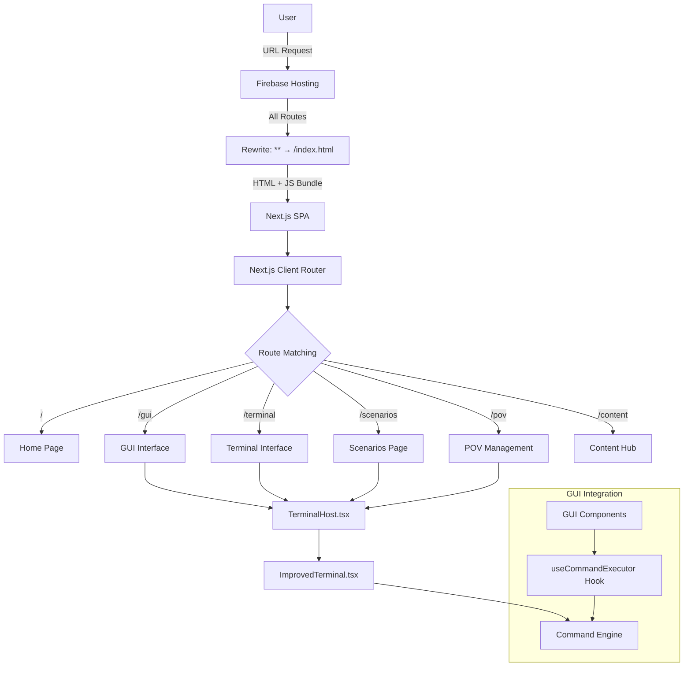
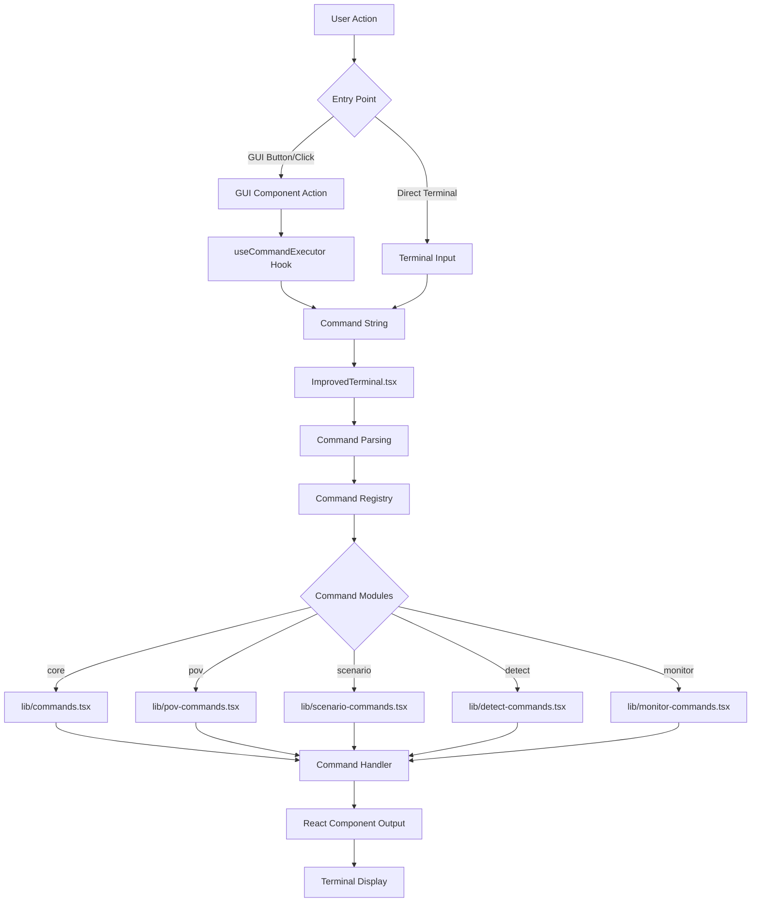
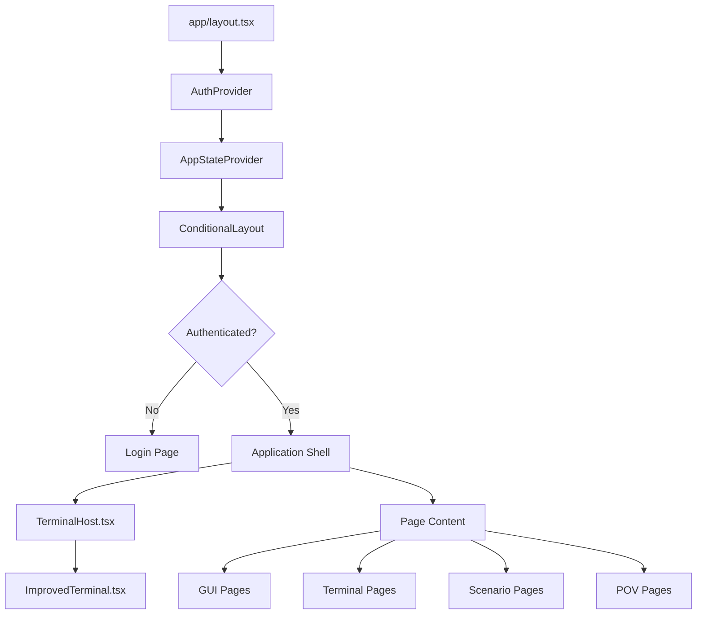

# Routing & Technology Stack - HenryReed.ai Cortex Platform

**Last Updated:** 2025-01-08  
**Architecture:** Next.js Static Export with Firebase Hosting

## Technology Stack Overview

### Frontend Stack
```typescript
interface TechStack {
  framework: "Next.js 15+ (Static Export)";
  runtime: "React 18.2+";
  language: "TypeScript 5.3+";
  styling: "TailwindCSS 3.4+ with custom Cortex theme";
  bundling: "Turbopack (dev) | Webpack 5+ (production)";
  stateManagement: "React Context + localStorage";
}
```

### Build & Deployment
```typescript
interface DeploymentStack {
  buildTarget: "Static Export";
  hosting: "Firebase Hosting CDN";
  distribution: "Global Edge Network";
  ssl: "Automatic HTTPS";
  routing: "Client-side SPA with server rewrites";
}
```

### Integration Stack
```typescript
interface IntegrationStack {
  firebase: "Hosting + Firestore + Storage (client SDK)";
  ai: "Genkit + Vertex AI (optional)";
  analytics: "BigQuery Export (optional)";
  security: "XSIAM API (optional)";
  pattern: "Mock-first with graceful degradation";
}
```

## Routing Architecture

### Client-Side Routing Flow



### Firebase Hosting Rewrite Configuration

```json
{
  "hosting": {
    "public": "hosting/out",
    "rewrites": [
      {
        "source": "**",
        "destination": "/index.html"
      }
    ]
  }
}
```

**How it works:**
1. **Any URL** (`/scenarios`, `/pov/123`, `/terminal/commands`) hits Firebase Hosting
2. **Rewrite Rule** sends ALL requests to `/index.html`
3. **Next.js SPA** boots up with the full JavaScript bundle
4. **Client Router** takes over and renders the appropriate page component
5. **Browser History** updated without server round-trips

## Page Routing Structure

### App Router Architecture (Next.js 13+ App Directory)

```
hosting/app/
├── layout.tsx              # Root layout with providers
├── page.tsx                # Home page (login/landing)
├── gui/
│   └── page.tsx           # Main GUI interface
├── terminal/
│   └── page.tsx           # Terminal-focused interface  
├── scenarios/
│   ├── page.tsx           # Scenarios overview
│   └── [type]/
│       └── page.tsx       # Dynamic scenario pages
├── pov/
│   ├── page.tsx           # POV management overview
│   └── [id]/
│       └── page.tsx       # Individual POV projects
├── content/
│   ├── page.tsx           # Content hub
│   └── [slug]/
│       └── page.tsx       # Individual content pages
└── docs/
    └── page.tsx           # Documentation pages
```

### Route Examples

| URL | Component | Purpose |
|-----|-----------|---------|
| `/` | `app/page.tsx` | Login/Landing page |
| `/gui` | `app/gui/page.tsx` | Main GUI interface |
| `/terminal` | `app/terminal/page.tsx` | Terminal-focused view |
| `/scenarios` | `app/scenarios/page.tsx` | Security scenarios overview |
| `/scenarios/ransomware` | `app/scenarios/[type]/page.tsx` | Specific scenario type |
| `/pov` | `app/pov/page.tsx` | POV management dashboard |
| `/pov/acme-corp-2024` | `app/pov/[id]/page.tsx` | Specific POV project |
| `/content` | `app/content/page.tsx` | Content hub |
| `/content/getting-started` | `app/content/[slug]/page.tsx` | Specific content |

## Terminal-First Command Execution

### Architecture Overview

The application uses a **single terminal approach** where all command execution flows through one canonical terminal instance:



### useCommandExecutor Hook Integration

```typescript
// GUI components execute commands via standardized hook
const { run: executeCommand, isRunning, error } = useCommandExecutor();

// Execute command with full options
const handlePovCreate = () => {
  executeCommand('pov init "Acme Corp" --template executive-overview', {
    openTerminal: true,  // Open terminal panel
    focus: true,         // Focus terminal input
    trackActivity: {     // Telemetry tracking
      event: 'pov-create-click',
      source: 'pov-dashboard',
      payload: { template: 'executive-overview' }
    },
    onSuccess: () => {
      showNotification('POV created successfully');
    },
    onError: (err) => {
      handleError(err);
    }
  });
};
```

## Component Architecture

### Layout Hierarchy



### Single Terminal Pattern

**Benefits of Single Terminal Architecture:**
- **Unified Command History:** All commands accessible across GUI and terminal
- **Consistent State:** Shared context between different interfaces
- **Simplified Integration:** Single hook for GUI-to-terminal communication
- **Better UX:** Context preservation across interface switches
- **Easier Development:** Single source of truth for command execution

### State Management Pattern

```typescript
// Context-based state management
interface AppState {
  user: User | null;
  currentPov: POVProject | null;
  terminalHistory: Command[];
  activeScenarios: Scenario[];
}

// localStorage persistence for critical data
interface PersistentState {
  terminalSession: TerminalSession;
  povProjects: POVProject[];
  userPreferences: UserPreferences;
}
```

## Build Process & Static Export

### Next.js Static Export Configuration

```typescript
// hosting/next.config.ts
const nextConfig: NextConfig = {
  output: 'export',        // Enable static export
  trailingSlash: true,     // Firebase Hosting compatibility
  distDir: 'out',         // Output directory
  images: {
    unoptimized: true     // Required for static hosting
  },
  
  // Custom webpack configuration for command modules
  webpack: (config, { dev, isServer }) => {
    if (!dev && !isServer) {
      // Split command modules for better caching
      config.optimization.splitChunks.cacheGroups.commands = {
        test: /[\\/]lib[\\/].*-commands\.tsx?$/,
        name: 'commands',
        chunks: 'all',
        priority: 5
      };
    }
    return config;
  }
}
```

### Build Output Structure

```
hosting/out/
├── index.html              # Main SPA entry point
├── _next/
│   ├── static/
│   │   ├── chunks/         # JavaScript bundles
│   │   │   ├── pages/      # Page-specific code
│   │   │   ├── commands/   # Command module bundle
│   │   │   └── vendors/    # Third-party dependencies
│   │   └── css/           # Stylesheets
├── scenarios/
│   └── index.html         # Client-side route placeholder
├── pov/
│   └── index.html         # Client-side route placeholder
└── assets/                # Static assets (images, fonts)
```

## Integration Patterns

### Mock-First Development Pattern

All external integrations support dual-mode operation:

```typescript
class XSIAMClient {
  private useMockMode = process.env.NEXT_PUBLIC_USE_MOCK_XSIAM === 'true';
  
  async testEndpoint(endpoint: string): Promise<XSIAMResponse> {
    if (this.useMockMode) {
      return this.generateMockResponse(endpoint);
    }
    
    // Real integration (requires backend proxy for static export)
    return this.callRealAPI(endpoint);
  }
  
  private generateMockResponse(endpoint: string): XSIAMResponse {
    // Deterministic mock responses for consistent development
    return {
      status: 'success',
      data: this.getMockDataForEndpoint(endpoint),
      timestamp: new Date().toISOString()
    };
  }
}
```

### Client-Side Processing Pattern

For static export compatibility, complex operations are handled client-side:

```typescript
// BigQuery Export - Client-side CSV generation
class BigQueryExporter {
  async exportData(data: any[]): Promise<void> {
    if (this.isStaticMode()) {
      // Generate CSV and trigger download
      const csv = this.generateCSV(data);
      this.downloadFile(csv, 'export.csv');
      return;
    }
    
    // Real mode would POST to backend API
    await this.postToBackend('/api/bigquery/export', data);
  }
}
```

## Performance Optimizations

### Code Splitting Strategy

1. **Page-Level Splitting:** Each route loads only necessary code
2. **Command Module Splitting:** Terminal commands bundled separately
3. **Vendor Splitting:** Third-party libraries cached separately
4. **Dynamic Imports:** Heavy components loaded on-demand

### Caching Strategy

```json
{
  "headers": [
    {
      "source": "**/*.@(js|css|woff|woff2)",
      "headers": [{
        "key": "Cache-Control",
        "value": "public,max-age=31536000,immutable"
      }]
    },
    {
      "source": "**/*.html",
      "headers": [{
        "key": "Cache-Control", 
        "value": "public,max-age=3600"
      }]
    }
  ]
}
```

### Bundle Analysis

```bash
# Analyze bundle size and composition
cd hosting
npm run build:exp
npx @next/bundle-analyzer hosting/out/.next

# Key metrics to monitor:
# - Total bundle size < 1MB (gzipped)
# - Command modules < 200KB
# - Largest chunk < 500KB
# - Vendor bundle cached efficiently
```

## Security Considerations

### Content Security Policy

Applied via Next.js middleware and Firebase headers:

```typescript
// CSP for static export
const csp = {
  'default-src': "'self'",
  'script-src': "'self' 'unsafe-inline' 'unsafe-eval' https://www.googleapis.com",
  'style-src': "'self' 'unsafe-inline' https://fonts.googleapis.com",
  'font-src': "'self' https://fonts.gstatic.com",
  'connect-src': "'self' https://*.googleapis.com https://*.firebaseio.com",
  'img-src': "'self' data: https: blob:",
  'object-src': "'none'",
  'base-uri': "'self'"
};
```

### Client-Side Security

- **Input Validation:** All command arguments sanitized
- **XSS Prevention:** React automatic escaping + CSP
- **Data Privacy:** Sensitive data processed client-side only
- **Authentication:** Firebase Auth with secure token handling

## Development Best Practices

### Terminal Command Development

1. **Command Registration:**
   ```typescript
   export const newCommand: CommandConfig = {
     name: 'mycommand',
     description: 'Command description',
     usage: 'mycommand [options]',
     handler: async (args) => <CommandOutput />
   };
   ```

2. **GUI Integration:**
   ```typescript
   const handleAction = () => {
     executeCommand('mycommand --option value', {
       trackActivity: { event: 'gui-action', source: 'button' }
     });
   };
   ```

3. **Mock Integration:**
   ```typescript
   const useMock = process.env.NEXT_PUBLIC_USE_MOCK_API === 'true';
   return useMock ? mockResponse : await realAPICall();
   ```

### Routing Best Practices

1. **Static-Compatible Routes:** No server-side dependencies
2. **SEO Optimization:** Proper meta tags and structured data
3. **Error Boundaries:** Graceful handling of route failures
4. **Loading States:** Skeleton screens for async operations

---

## Technology Decision Matrix

| Feature | Technology | Rationale |
|---------|------------|-----------|
| **Frontend Framework** | Next.js 15+ | Static export + App Router + Performance |
| **Styling** | TailwindCSS | Utility-first + Custom Cortex theme |
| **State Management** | React Context + localStorage | Simple + Persistent |
| **Bundling** | Webpack 5 + Turbopack | Production stability + Dev speed |
| **Hosting** | Firebase Hosting | Global CDN + Easy deployment |
| **Routing** | Client-side SPA | Static export compatibility |
| **Command System** | Custom React-based | Terminal-first architecture |
| **Integrations** | Mock-first pattern | Offline development + Graceful degradation |

---

**Created:** 2025-01-08  
**Next Review:** After routing validation testing  
**Related Docs:** ARCHITECTURE.md, DEPLOYMENT.md