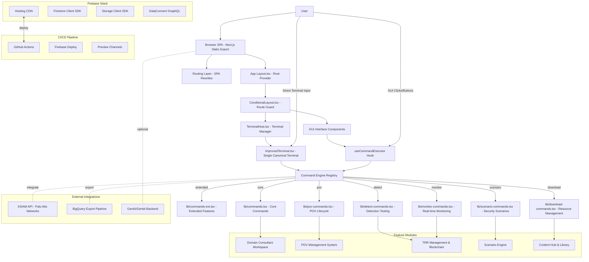
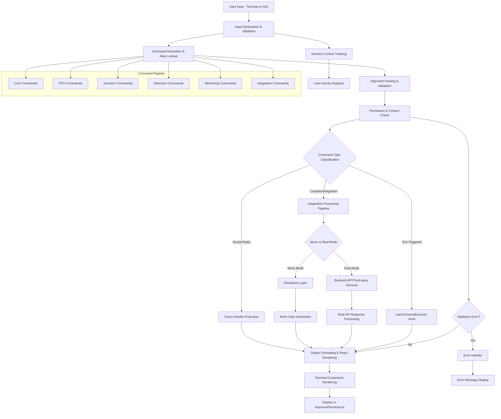
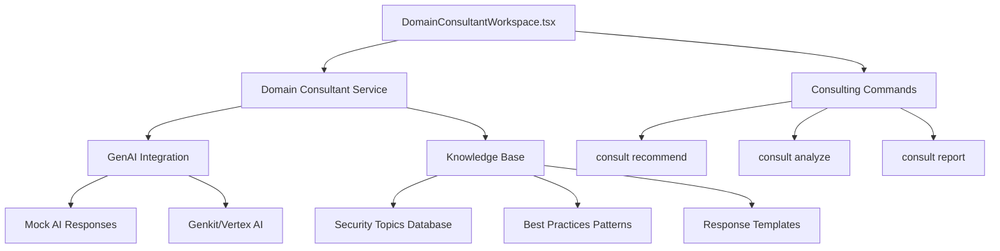
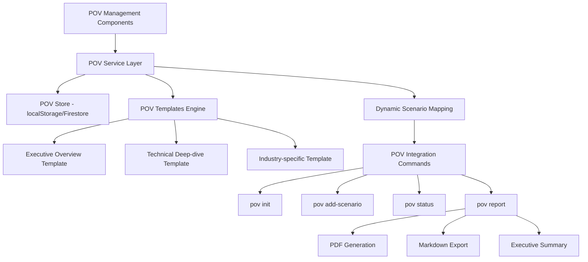
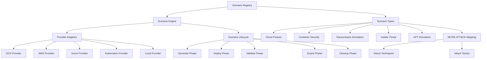
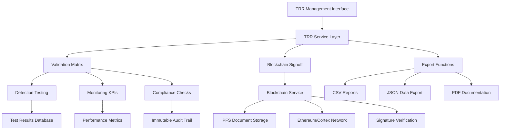
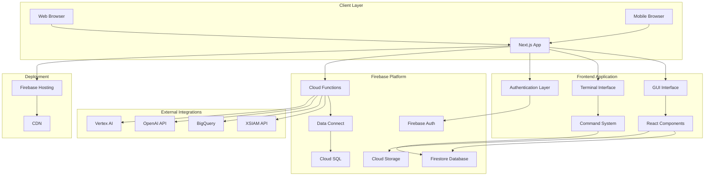
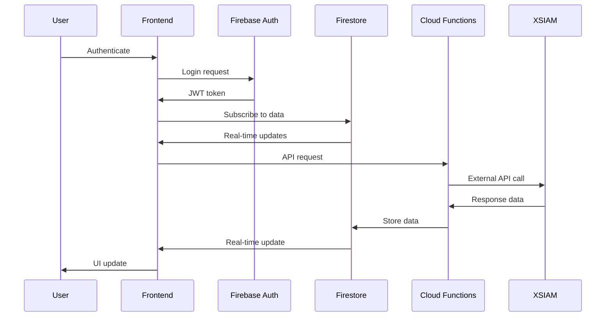
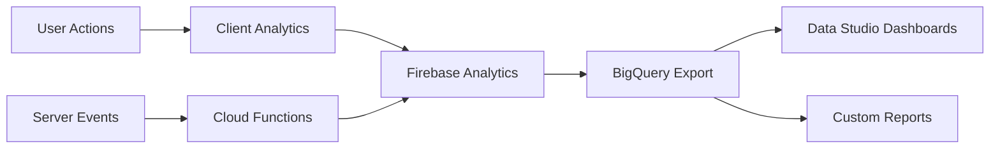

# Architecture Documentation - HenryReed.ai Cortex Domain Consultant Platform

**Date:** 2025-01-08  
**Version:** v2.6 Refactor  
**Purpose:** Complete architectural blueprint for scalable refactoring

## Executive Overview

The HenryReed.ai platform represents a sophisticated cybersecurity domain consultant system that uniquely combines terminal-first interfaces with modern GUI components. Built around security scenario management, POV (Proof of Value) demonstrations, and TRR (Technical Requirements Review) processes, it serves as a comprehensive platform for cybersecurity professionals and customer engagements.

## System Architecture

### Global System Architecture



### Terminal-First Command Flow Architecture



### Deployment and Routing Architecture

```mermaid
graph LR
    DEV[Developer] -->|git push| GH[GitHub Repository]
    GH --> CI[GitHub Actions CI/CD]
    
    CI -->|Build Process| BUILD[Next.js Build Pipeline]
    BUILD -->|Static Export| OUT[hosting/out Directory]
    
    OUT -->|firebase deploy --only hosting| CDN[Firebase Hosting CDN]
    CDN -->|Global Edge| EDGE[Edge Locations Worldwide]
    
    USER[End User] -->|HTTPS Request| EDGE
    EDGE -->|Route Match| REWRITE[Firebase Rewrites]
    REWRITE -->|** -> /index.html| SPA[Single Page Application]
    
    SPA --> ROUTER[Next.js Client Router]
    ROUTER --> PAGES[App Pages & Components]
    
    subgraph "Routing Strategy"
        STATIC[Static Routes: /, /gui, /terminal]
        DYNAMIC[Dynamic Routes: /pov/[id], /scenarios/[type]]
        CATCH_ALL[Catch-All: [...slug]]
    end
    
    ROUTER --> STATIC
    ROUTER --> DYNAMIC
    ROUTER --> CATCH_ALL
    
    subgraph "Preview Strategy"
        PR[Pull Request] --> PREVIEW_CH[Firebase Preview Channel]
        PREVIEW_CH --> STAGING[Staging Environment]
        STAGING -->|Approval| PROD[Production Deployment]
    end
```

## Feature Module Architecture

### Domain Consultant Module



### POV Management System



### Scenario Engine Architecture



### TRR Management with Blockchain



## Technology Stack Details

### Frontend Stack
```typescript
// Core Technologies
- React 18.2+ with Hooks and Context API
- Next.js 15+ with Static Export (output: 'export')
- TypeScript 5.3+ (strict mode to be re-enabled)
- TailwindCSS 3.4+ with custom Cortex theme

// State Management
- React Context API for app-wide state
- localStorage for persistent terminal/POV data
- Optional Firestore for cloud sync

// Build & Bundling
- Experimental Webpack features (feature-flagged)
- Turbopack for development (--turbo flag)
- Static site generation for CDN deployment
```

### Backend & Integration Stack
```typescript
// Firebase Services
- Firebase Hosting (CDN + rewrites)
- Firestore (client SDK, optional)
- Firebase Storage (client SDK, optional)
- Firebase Functions (Node.js 20, Genkit integration)
- Firebase DataConnect (GraphQL schema)

// External Integrations
- XSIAM API (Palo Alto Networks security platform)
- BigQuery Export (Google Cloud analytics)
- Genkit/Vertex AI (Google AI services)

// Mock/Real Mode Pattern
- All integrations support mock mode for offline development
- Feature flags control mock vs real behavior
- Graceful degradation when backends unavailable
```

### Command System Architecture
```typescript
interface CommandConfig {
  name: string;
  description: string;
  usage: string;
  aliases?: string[];
  category?: 'pov' | 'trr' | 'scenario' | 'consultant' | 'system';
  handler: (args: string[]) => React.ReactNode | Promise<React.ReactNode>;
}

// Command Registration Pattern
export const commandConfigs: CommandConfig[] = [
  // Core commands, POV commands, scenario commands, etc.
];

// GUI Integration via Hook
const { run: executeCommand, isRunning } = useCommandExecutor();
executeCommand('pov init "Customer Name"', {
  trackActivity: { event: 'pov-init-click', source: 'gui' }
});
```

## Security and Performance Architecture

### Security Patterns
- **Content Security Policy:** Comprehensive CSP headers
- **Authentication:** Firebase Auth with role-based access
- **Data Privacy:** Client-side processing where possible
- **Audit Trails:** Blockchain-based immutable records for TRR
- **Input Validation:** Command argument sanitization

### Performance Optimizations
- **Code Splitting:** Webpack chunks for command modules
- **Static Export:** Zero server-side runtime dependencies  
- **CDN Distribution:** Global Firebase Hosting CDN
- **Lazy Loading:** Component-level dynamic imports
- **Caching Strategy:** Optimized cache headers for assets

### Scalability Patterns
- **Plugin Architecture:** Modular scenario and provider system
- **Mock-First Development:** Offline-capable development workflow
- **Progressive Enhancement:** Graceful degradation of integrations
- **Stateless Design:** Client-side state management with optional sync

## Integration Architecture

### XSIAM Integration Pattern
```typescript
// Dual-mode integration pattern
class XSIAMClient {
  private mockMode = process.env.NEXT_PUBLIC_USE_MOCK_XSIAM === 'true';
  
  async testEndpoint(endpoint: string): Promise<XSIAMResponse> {
    if (this.mockMode) {
      return this.generateMockResponse(endpoint);
    }
    return this.callRealXSIAMAPI(endpoint);
  }
  
  private generateMockResponse(endpoint: string): XSIAMResponse {
    // Deterministic mock responses for consistent testing
  }
}
```

### BigQuery Export Architecture
```typescript
class BigQueryExporter {
  async exportData(dataset: string, table: string, data: any[]): Promise<ExportResult> {
    if (this.isStaticMode()) {
      // Client-side CSV download
      return this.downloadAsCSV(data);
    }
    // Real mode: POST to Cloud Function/Run
    return this.postToBackend('/api/bigquery/export', { dataset, table, data });
  }
}
```

## Deployment Architecture

### Firebase Hosting Configuration
```json
{
  "hosting": {
    "public": "hosting/out",
    "rewrites": [{ "source": "**", "destination": "/index.html" }],
    "headers": [
      {
        "source": "**/*.@(js|css|woff2|png|jpg)",
        "headers": [{ 
          "key": "Cache-Control", 
          "value": "public,max-age=31536000,immutable" 
        }]
      }
    ]
  }
}
```

### Build Pipeline
```bash
# Development
cd hosting && npm run dev  # Turbopack development server

# Production Build
cd hosting && npm run build  # Next.js build + static export

# Deployment
./deploy.sh  # Root deployment script
# OR
firebase deploy --only hosting
```

## Future Architecture Considerations

### Phase 1: Foundation (Current)
- ✅ Single terminal architecture
- ✅ Command system with GUI integration  
- ✅ Mock-first integration pattern
- 🔄 Firebase hosting-only deployment

### Phase 2: Modularity (Next)
- 📋 Plugin-based scenario system
- 📋 Unified state management
- 📋 Comprehensive test coverage
- 📋 TypeScript strict mode

### Phase 3: Scale (Future)
- 📋 Multi-tenant architecture
- 📋 Real-time collaboration features
- 📋 Advanced analytics pipeline
- 📋 Enterprise SSO integration

## Reference Documentation

- **WARP.md** - Terminal architecture and development workflows
- **CODEINDEX.md** - Complete file inventory and module mapping
- **INITIAL-AUDIT.md** - Current state analysis and technical debt
- **MODULE-*.md** - Individual feature module documentation (planned)

---

*This architecture document represents the current state and refactoring blueprint for the HenryReed.ai Cortex Domain Consultant Platform. For implementation details, refer to the specific module documentation and code index.*

**Last Updated:** 2025-01-08  
**Next Review:** After Phase 1 completion

# Cortex DC Portal - Architecture Documentation

## 🏗️ System Architecture Overview

The Cortex DC Portal is built on a modern, scalable architecture using Firebase as the backend platform and Next.js as the frontend framework. The system is designed for high performance, security, and maintainability while providing both GUI and terminal interfaces for different user workflows.

---

## 📊 Architecture Diagram



---

## 🎯 Core Components

### 1. Frontend Architecture

#### Next.js Application Structure
```
hosting/
├── app/                    # Next.js 14 App Router
│   ├── globals.css        # Global styles
│   ├── layout.tsx         # Root layout
│   ├── page.tsx          # Landing page
│   ├── gui/              # GUI interface routes
│   ├── docs/             # Documentation routes
│   └── api/              # API routes (minimal, most logic in Cloud Functions)
├── components/            # React components
│   ├── ui/               # Reusable UI components
│   ├── terminal/         # Terminal-specific components
│   ├── dashboard/        # Dashboard components
│   └── forms/            # Form components
├── lib/                  # Utility libraries
│   ├── firebase-config.ts # Firebase configuration
│   ├── auth/             # Authentication utilities
│   ├── data/             # Data access layer
│   └── commands/         # Terminal command system
└── contexts/             # React contexts for state management
    ├── AuthContext.tsx   # Authentication state
    └── AppStateContext.tsx # Application state
```

#### Component Hierarchy
```
App
├── AuthProvider
│   ├── AppStateProvider
│   │   ├── AppHeader (navigation)
│   │   ├── BreadcrumbNavigation
│   │   ├── CortexGUIInterface (main dashboard)
│   │   │   ├── TerminalInterface
│   │   │   ├── DashboardTabs
│   │   │   └── UserContextHeader
│   │   └── NotificationSystem
│   └── Router (Next.js App Router)
```

### 2. Backend Architecture

#### Firebase Services Integration

**Authentication (Firebase Auth)**
- Email/password authentication
- Role-based access control (RBAC)
- Custom claims for user roles
- Session management with JWT tokens

**Database (Firestore)**
- Document-based NoSQL database
- Real-time synchronization
- Offline support
- Comprehensive security rules

**Storage (Cloud Storage)**
- File uploads and downloads
- Secure access with authentication
- Automatic file processing
- CDN distribution

**Functions (Cloud Functions)**
- Server-side business logic
- API integrations
- Background processing
- Scheduled tasks

**Data Connect (PostgreSQL)**
- Structured data for complex queries
- ACID compliance for critical data
- Integration with existing systems
- Advanced analytics support

### 3. State Management

#### Context-Based State Management
```typescript
// Authentication Context
interface AuthContextType {
  user: User | null;
  isLoading: boolean;
  login: (email: string, password: string) => Promise<void>;
  logout: () => Promise<void>;
  hasRole: (role: string) => boolean;
}

// Application State Context
interface AppStateContextType {
  currentView: string;
  userPreferences: UserPreferences;
  notifications: Notification[];
  isManagementMode: boolean;
  toggleManagementMode: () => void;
}
```

#### State Persistence
- Local storage for user preferences
- Session storage for temporary state
- Firestore for synchronized state
- IndexedDB for offline capabilities

---

## 🔒 Security Architecture

### Authentication & Authorization

#### Multi-Layer Security Model
1. **Frontend Authentication**
   - Firebase Auth SDK integration
   - Route protection with auth guards
   - Role-based component rendering

2. **Backend Authorization**
   - Firestore security rules
   - Cloud Function authentication
   - Custom claims validation

3. **API Security**
   - HTTPS-only communication
   - CORS configuration
   - Rate limiting and DDoS protection

#### Role-Based Access Control (RBAC)
```typescript
interface UserRoles {
  admin: boolean;           // Full system access
  manager: boolean;         // Management dashboard access  
  consultant: boolean;      // Standard consultant access
  readonly: boolean;        // Read-only access
}

interface Permissions {
  canCreateTRR: boolean;
  canEditScenarios: boolean;
  canViewAnalytics: boolean;
  canManageUsers: boolean;
  canExportData: boolean;
}
```

### Data Protection

#### Encryption
- Data in transit: TLS 1.3
- Data at rest: Firebase encryption
- Client-side: Sensitive data masking

#### Privacy Compliance
- GDPR compliance features
- Data retention policies
- User consent management
- Audit logging

---

## 🚀 Performance Architecture

### Frontend Optimization

#### Next.js Performance Features
- Static Site Generation (SSG)
- Incremental Static Regeneration (ISR)
- Image optimization
- Code splitting and lazy loading

#### Caching Strategy
```typescript
// Cache hierarchy
Browser Cache (24h)
  ↓
CDN Cache (1h for HTML, 1y for assets)
  ↓
Firebase Hosting
  ↓
Application Cache (React Query)
  ↓
Firestore Cache
```

### Backend Optimization

#### Database Performance
- Firestore indexes for query optimization
- Connection pooling for Cloud SQL
- Read replicas for analytics queries
- Query optimization and monitoring

#### Function Performance
- Cold start optimization
- Connection reuse
- Memory optimization
- Regional deployment

---

## 🔌 Integration Architecture

### External API Integrations

#### XSIAM Integration
```typescript
interface XSIAMConnector {
  authenticate(): Promise<AuthToken>;
  fetchIncidents(filters: IncidentFilters): Promise<Incident[]>;
  createPlaybook(scenario: Scenario): Promise<Playbook>;
  executeAction(action: SecurityAction): Promise<ActionResult>;
}
```

#### AI Service Integration
```typescript
interface AIService {
  generateScenario(parameters: ScenarioParams): Promise<Scenario>;
  analyzeThreat(data: ThreatData): Promise<ThreatAnalysis>;
  recommendActions(context: SecurityContext): Promise<Recommendation[]>;
}
```

### Data Flow Architecture

#### Real-time Data Flow


---

## 📱 Terminal Interface Architecture

### Command System Design

#### Command Architecture
```typescript
interface CommandConfig {
  name: string;
  description: string;
  usage: string;
  aliases?: string[];
  category: CommandCategory;
  permissions?: Permission[];
  handler: CommandHandler;
}

type CommandHandler = (args: string[], context: CommandContext) => Promise<CommandResult>;
```

#### Command Categories
- **Basic**: Navigation, help, system information
- **POV**: POV management, scenario creation
- **Analysis**: Data analysis, reporting
- **Management**: User management, system administration
- **AI**: AI-powered commands and insights

#### Terminal Features
- Command history and autocomplete
- Real-time command suggestions
- Multi-line command support
- Command chaining and pipes
- Output formatting and filtering

---

## 🌐 Deployment Architecture

### Firebase Hosting Configuration

#### Static Site Generation
```typescript
// next.config.ts
const nextConfig: NextConfig = {
  output: 'export',
  trailingSlash: true,
  distDir: 'out',
  images: { unoptimized: true },
  env: {
    CUSTOM_KEY: process.env.CUSTOM_KEY,
  },
}
```

#### Hosting Rules
```json
{
  "hosting": {
    "public": "hosting/out",
    "rewrites": [
      {"source": "/api/**", "function": "api"},
      {"source": "**", "destination": "/index.html"}
    ],
    "headers": [
      {
        "source": "**/*.@(js|css)",
        "headers": [
          {"key": "Cache-Control", "value": "public, max-age=31536000"}
        ]
      }
    ]
  }
}
```

### Multi-Environment Setup

#### Environment Configuration
```
environments/
├── development/
│   ├── firebase.json
│   └── .env.development
├── staging/
│   ├── firebase.json
│   └── .env.staging
└── production/
    ├── firebase.json
    └── .env.production
```

---

## 📊 Monitoring & Analytics Architecture

### Performance Monitoring

#### Client-Side Monitoring
- Web Vitals tracking
- Error boundary reporting
- User interaction analytics
- Performance metrics collection

#### Server-Side Monitoring
- Cloud Function metrics
- Database query performance
- API response times
- Error rate monitoring

### Business Intelligence

#### Analytics Pipeline


---

## 🔄 Scalability Considerations

### Horizontal Scaling

#### Database Scaling
- Firestore auto-scaling
- Cloud SQL read replicas
- Data partitioning strategies
- Connection pooling

#### Application Scaling
- CDN distribution
- Multi-region deployment
- Load balancing
- Auto-scaling functions

### Performance Optimization

#### Frontend Optimization
- Bundle size optimization
- Tree shaking
- Lazy loading
- Service worker caching

#### Backend Optimization
- Query optimization
- Index management
- Connection reuse
- Memory management

---

## 🛡️ Disaster Recovery

### Backup Strategy

#### Data Backup
- Firestore automated backups
- Cloud SQL point-in-time recovery
- Storage redundancy
- Cross-region replication

#### Application Recovery
- Version control with Git
- Automated deployment pipelines
- Configuration management
- Infrastructure as Code

### Monitoring & Alerting

#### Alert Configuration
- Error rate thresholds
- Performance degradation
- Security incident detection
- Resource utilization monitoring

---

This architecture documentation provides a comprehensive overview of the Cortex DC Portal's technical foundation. For implementation details, refer to the specific component documentation in the respective sections.