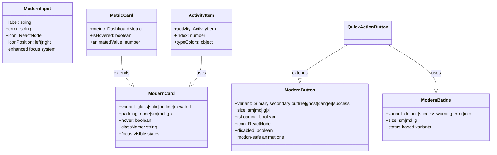

# UI Architecture & Component System

## Overview

This document outlines the architectural hierarchy and relationships within the Cortex Domain Consultant Platform's UI system, featuring a modern token-based design system with comprehensive component relationships.

## 🏗️ Component Hierarchy

### Main Dashboard Architecture


### Design Token Flow


### Component Inheritance & Composition



## 🎨 Design System Layers

### UI Layer Stack

```mermaid
graph TB
    subgraph "Visual Hierarchy"
        A[Surface Layer] --> B[Glass Layer] 
        B --> C[Content Layer]
        C --> D[Focus Ring]
    end
    
    subgraph "Surface Tokens"
        E[cortex-canvas<br/>#000000]
        F[cortex-surface<br/>#141414]
        G[cortex-elevated<br/>#1A1A1A]
    end
    
    subgraph "Glass Effects"
        H[ui-glass<br/>blur(10px)]
        I[ui-glass-panel<br/>blur(16px)]
        J[ui-glass-elevated<br/>blur(20px)]
    end
    
    subgraph "Focus System"
        K[focus-ring<br/>ring-brand]
        L[focus-brand<br/>outline style]
    end
    
    A --> E
    B --> H
    C --> F
    D --> K
    
    style A fill:#000000,stroke:#303030,color:#f5f5f5
    style B fill:#141414,stroke:#303030,color:#f5f5f5
    style C fill:#1a1a1a,stroke:#303030,color:#f5f5f5
    style D fill:#00c0e8,stroke:#fa582d,color:#141414
```

### Token Mapping System


## 🔄 State Management Flow

### Component State Flow

```mermaid
stateDiagram-v2
    [*] --> Default
    Default --> Hover : mouse enter
    Default --> Focus : keyboard navigation
    Default --> Active : click/tap
    Default --> Loading : async action
    Default --> Disabled : prop change
    
    Hover --> Default : mouse leave
    Hover --> Active : click during hover
    
    Focus --> Default : blur
    Focus --> Active : enter/space key
    
    Active --> Default : release
    Active --> Loading : submit action
    
    Loading --> Default : success
    Loading --> Error : failure
    
    Error --> Default : reset
    Error --> Loading : retry
    
    Disabled --> Default : enable
    
    note right of Focus : Uses focus-visible ring
    note right of Loading : Shows spinner/animation
    note right of Error : Status color feedback
```

### Animation State Machine

```mermaid
stateDiagram-v2
    [*] --> MotionCheck
    
    MotionCheck --> Reduced : prefers-reduced-motion
    MotionCheck --> Full : motion allowed
    
    Reduced --> StaticHover : hover
    Reduced --> StaticFocus : focus
    
    Full --> AnimatedHover : hover
    Full --> AnimatedFocus : focus
    Full --> AnimatedEnter : component mount
    
    StaticHover --> Reduced : mouse leave
    StaticFocus --> Reduced : blur
    
    AnimatedHover --> AnimatedActive : click
    AnimatedHover --> Full : mouse leave
    
    AnimatedFocus --> AnimatedActive : activate
    AnimatedFocus --> Full : blur
    
    AnimatedEnter --> Full : complete
    AnimatedActive --> Full : release
    
    note right of AnimatedHover : transform: scale(1.02)
    note right of AnimatedEnter : animate-fade-in-modern
    note right of StaticHover : No transform
```

## 🧩 Component Composition Patterns

### Card-Based Layouts


### Form Component Pattern


## 📱 Responsive Architecture

### Breakpoint System


## 🔧 Development Patterns

### Component Development Flow


### Token Integration Pattern


## 🎯 Performance Considerations

### Component Loading Strategy


## 📋 Architecture Checklist

### Component Design Requirements
- [ ] Uses design tokens for all colors
- [ ] Implements proper focus states
- [ ] Supports motion preferences
- [ ] Follows accessibility guidelines
- [ ] Has TypeScript interfaces
- [ ] Includes proper documentation
- [ ] Tests all variants and states
- [ ] Optimizes for performance

### Token Integration Requirements
- [ ] All colors use CSS variables
- [ ] Opacity modifiers supported
- [ ] Legacy compatibility maintained
- [ ] Semantic naming conventions
- [ ] Proper contrast ratios
- [ ] Dark mode optimized
- [ ] High contrast support

### Animation Requirements
- [ ] Respects `prefers-reduced-motion`
- [ ] Uses `motion-safe:` prefixes
- [ ] Smooth transitions (200-300ms)
- [ ] Brand timing functions
- [ ] GPU-accelerated properties
- [ ] No layout thrashing

---

**Last Updated**: October 2025  
**Version**: 2.0 (Modern Architecture)  
**Maintained by**: henryreed.ai Development Team

*This architecture document serves as the blueprint for component development and system integration within the Cortex platform.*