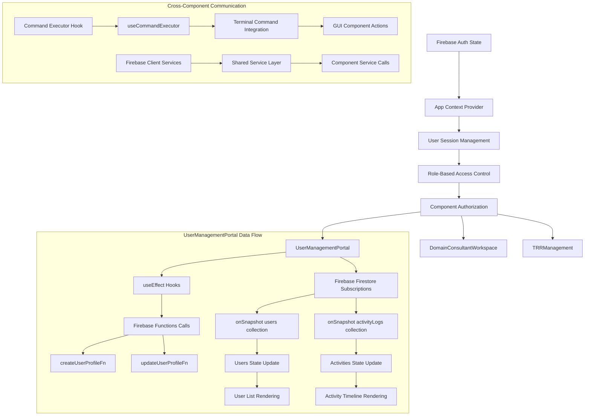
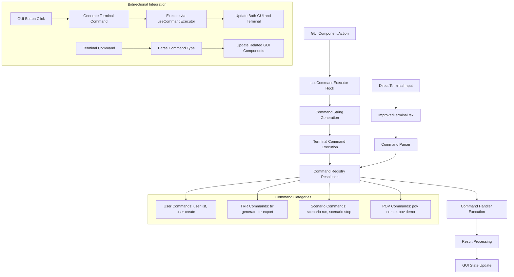
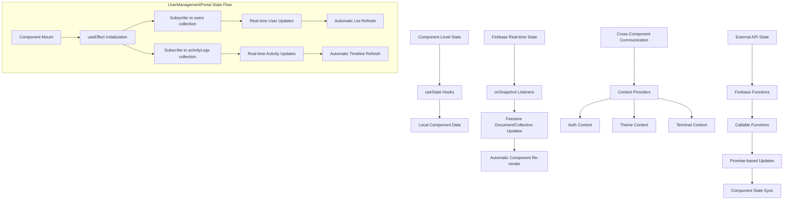
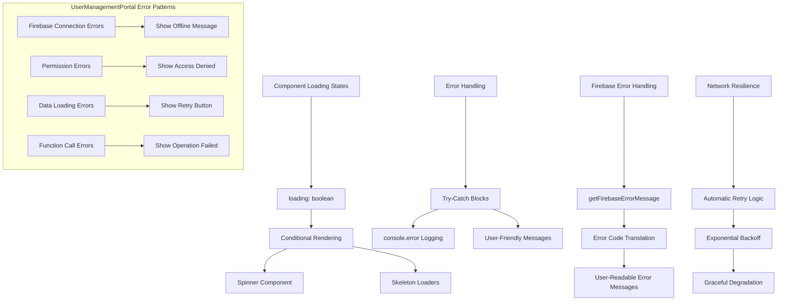

# Component Relationship Architecture

## React Component Hierarchy

This document outlines the component relationships and data flow patterns in the HenryReed.ai application, with special focus on the UserManagementPortal and other critical UI components.

```mermaid
graph TD
    A[App Root - layout.tsx] --> B[ConditionalLayout.tsx]
    B --> C[TerminalHost.tsx]
    B --> D[GUI Interface Components]
    
    C --> E[ImprovedTerminal.tsx]
    E --> F[Command Executor Engine]
    
    D --> G[AppHeader.tsx]
    D --> H[AppShell.tsx]
    D --> I[Main Content Components]
    
    I --> J[UserManagementPortal.tsx]
    I --> K[DomainConsultantWorkspace.tsx]
    I --> L[TRRManagement.tsx]
    I --> M[EnhancedContentCreator.tsx]
    I --> N[XSIAMIntegrationPanel.tsx]
    
    subgraph "User Management Hierarchy"
        J --> O[UserList Component]
        J --> P[RoleEditor Component]
        J --> Q[InviteUserForm Component]
        J --> R[UserTimelineView.tsx]
        J --> S[ManagementDashboard.tsx]
    end
    
    subgraph "Terminal Components"
        E --> T[UnifiedTerminal.tsx]
        E --> U[CleanTerminalPopout.tsx]
        T --> V[TerminalIntegrationSettings.tsx]
    end
    
    subgraph "Content Management"
        M --> W[ContentCreatorManager.tsx]
        M --> X[EnhancedManualCreationGUI.tsx]
        M --> Y[ManualCreationGUI.tsx]
    end
    
    subgraph "Scenario & TRR Components"
        L --> Z[ProductionTRRManagement.tsx]
        L --> AA[TRRProgressChart.tsx]
        L --> BB[EnhancedScenarioCreator.tsx]
        L --> CC[SDWWorkflow.tsx]
    end
```



## Component Data Flow Architecture



## UserManagementPortal Component Breakdown

```mermaid
graph TD
    A[UserManagementPortal.tsx] --> B[Component State Management]
    B --> C[users: UserProfile[]]
    B --> D[activities: ActivityLog[]]
    B --> E[loading: boolean]
    B --> F[filters: FilterState]
    B --> G[selectedUser: UserProfile | null]
    
    A --> H[Firebase Integration]
    H --> I[functions import from ../src/lib/firebase]
    H --> J[db import from ../src/lib/firebase]
    H --> K[Firebase Functions]
    K --> L[createUserProfileFn]
    K --> M[updateUserProfileFn]
    
    A --> N[Event Handlers]
    N --> O[handleCreateUser]
    N --> P[handleUpdateUser]
    N --> Q[Search/Filter Handlers]
    
    A --> R[UI Rendering Components]
    R --> S[Header Section]
    R --> T[Stats Cards Grid]
    R --> U[Search & Filter Controls]
    R --> V[User List Table]
    R --> W[Activity Timeline]
    
    S --> X[Create User Button]
    X --> Y[UserPlus Icon]
    
    V --> Z[Status Badges]
    Z --> AA[getStatusBadge Function]
    V --> BB[Role Badges]
    BB --> CC[getRoleBadge Function]
    
    W --> DD[Activity Items]
    DD --> EE[Timestamp Formatting]
    DD --> FF[Action Icons]
```

## Shared Service Layer Architecture

```mermaid
graph TD
    A[hosting/src/lib/firebase.ts] --> B[Firebase App Initialization]
    B --> C[getApps().length ? getApp() : initializeApp()]
    
    A --> D[Service Exports]
    D --> E[auth: Auth]
    D --> F[db: Firestore]
    D --> G[functions: Functions]
    D --> H[storage: FirebaseStorage]
    
    I[Component Imports] --> J[UserManagementPortal]
    I --> K[user-management-service.ts]
    I --> L[auth-service.ts]
    I --> M[Other Service Files]
    
    J --> N[Firebase Functions Integration]
    N --> O[httpsCallable(functions, 'createUserProfile')]
    N --> P[httpsCallable(functions, 'updateUserProfile')]
    
    J --> Q[Firestore Integration]
    Q --> R[collection(db, 'users')]
    Q --> S[collection(db, 'activityLogs')]
    Q --> T[onSnapshot Subscriptions]
    
    subgraph "Service Dependencies Fixed"
        U[OLD: ../lib/firebase/client] --> V[FIXED: ../src/lib/firebase]
        W[Import Error Resolution] --> X[Unified Firebase Client]
        X --> Y[Single Source of Truth]
    end
```

## Terminal-GUI Integration Pattern



## State Management Patterns



## Error Handling and Loading States



This component architecture ensures maintainable, scalable code with clear separation of concerns and robust error handling throughout the application.