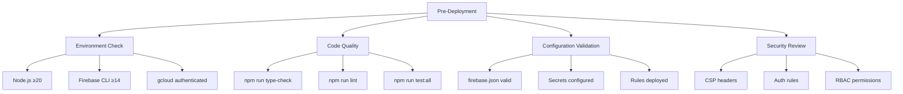
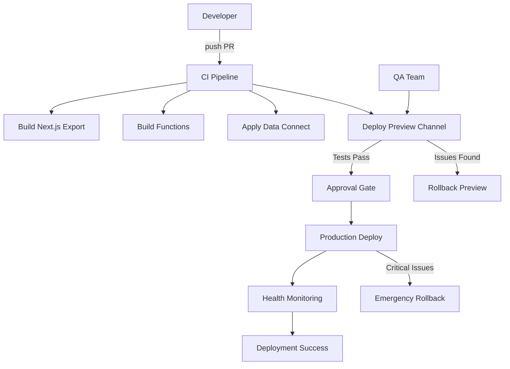
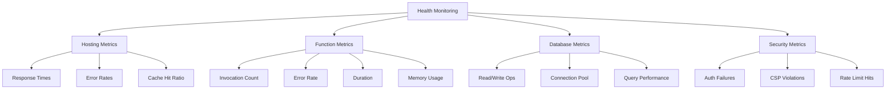

# Deployment Runbook - henryreed.ai

## 🚀 Quick Deployment Commands

### **One-Click Production Deployment**
```bash
# From project root
firebase deploy --only functions,hosting,firestore:rules,storage:rules
```

### **Preview Channel Deployment**
```bash
# From hosting directory
cd hosting && npm run deploy:preview
```

### **Local Development**
```bash
# From project root
firebase emulators:start
```

## 📋 Pre-Deployment Checklist



## 🔄 Deployment Workflow

### **Standard Deployment Process**



## 🏗️ Build & Deploy Scripts

### **Enhanced Deploy Script**
```bash
#!/usr/bin/env bash
# deploy.sh - Production deployment with health checks
set -euo pipefail

PROJECT=$(firebase use --json | jq -r '.active')
echo "🚀 Deploying to Firebase Project: $PROJECT"
echo "📊 Environment: Node $(node -v) | Firebase $(firebase --version)"

# Pre-deployment validation
echo "🔍 Running pre-deployment checks..."
npm --prefix hosting run type-check
npm --prefix hosting run lint || echo "⚠️  Lint warnings found"

# Build all components
echo "🏗️  Building hosting application..."
npm --prefix hosting ci --silent
npm --prefix hosting run build

echo "🔧 Building functions..."
npm --prefix functions ci --silent && npm --prefix functions run build
npm --prefix henryreedai ci --silent && npm --prefix henryreedai run build

# Apply Data Connect if available
if firebase dataconnect:apply --help >/dev/null 2>&1; then
    echo "🗃️  Applying Data Connect configuration..."
    (cd dataconnect && firebase dataconnect:apply --project "$PROJECT" --non-interactive --force)
else
    echo "ℹ️  Data Connect CLI not available, skipping..."
fi

# Deploy to Firebase
echo "🚀 Deploying to Firebase..."
firebase deploy --only functions,hosting,firestore:rules,storage:rules

# Post-deployment health checks
echo "🏥 Running post-deployment health checks..."
sleep 5
curl -f -s -I "https://henryreedai.web.app" > /dev/null && echo "✅ Hosting health check passed" || echo "❌ Hosting health check failed"

echo "✅ Deployment complete!"
echo "🌐 Production URL: https://henryreedai.web.app"
```

### **Preview Deployment Script**
```bash
#!/usr/bin/env bash
# deploy-preview.sh - Preview channel deployment
set -euo pipefail

CHANNEL=${1:-preview}
PROJECT=$(firebase use --json | jq -r '.active')

echo "🔍 Deploying to preview channel: $CHANNEL"

# Build hosting
cd hosting
npm ci --silent
npm run build

# Deploy to preview channel
cd ..
firebase hosting:channel:deploy "$CHANNEL" --project "$PROJECT"

echo "✅ Preview deployment complete!"
echo "🔗 Preview URL will be displayed above"
```

## 🎯 Environment-Specific Deployments

### **Development Environment**
```bash
# Local development with hot reload
cd hosting
npm run dev

# Local emulator suite
firebase emulators:start
```

### **Staging Environment** 
```bash
# Deploy to staging preview channel
firebase hosting:channel:deploy staging

# Deploy staging functions (if separate codebase)
firebase deploy --only functions:default,functions:genkit --project staging-project
```

### **Production Environment**
```bash
# Full production deployment
./deploy.sh

# Or selective deployment
firebase deploy --only hosting  # Static files only
firebase deploy --only functions # Functions only
firebase deploy --only firestore:rules,storage:rules # Rules only
```

## 🧪 Testing & Validation

### **Smoke Tests**

```bash
#!/usr/bin/env bash
# smoke-tests.sh - Post-deployment validation
set -euo pipefail

BASE_URL="https://henryreedai.web.app"
PREVIEW_URL=${1:-$BASE_URL}

echo "🧪 Running smoke tests against: $PREVIEW_URL"

# Test 1: Basic connectivity
echo "🌐 Testing basic connectivity..."
curl -f -s -I "$PREVIEW_URL" > /dev/null && echo "✅ Site accessible" || (echo "❌ Site not accessible" && exit 1)

# Test 2: Key routes
echo "🛣️  Testing key routes..."
for route in "/" "/gui" "/terminal" "/docs"; do
    curl -f -s -I "$PREVIEW_URL$route" > /dev/null && echo "✅ Route $route works" || echo "❌ Route $route failed"
done

# Test 3: Security headers
echo "🔒 Checking security headers..."
HEADERS=$(curl -s -I "$PREVIEW_URL")
echo "$HEADERS" | grep -q "X-Frame-Options" && echo "✅ X-Frame-Options header present" || echo "❌ X-Frame-Options missing"
echo "$HEADERS" | grep -q "Content-Security-Policy" && echo "✅ CSP header present" || echo "❌ CSP header missing"
echo "$HEADERS" | grep -q "Strict-Transport-Security" && echo "✅ HSTS header present" || echo "❌ HSTS header missing"

# Test 4: Caching headers
echo "📦 Checking cache headers..."
STATIC_HEADERS=$(curl -s -I "$PREVIEW_URL/_next/static/css/app.css" 2>/dev/null || echo "Static asset not found")
echo "$STATIC_HEADERS" | grep -q "max-age=31536000" && echo "✅ Static assets cached properly" || echo "⚠️  Static asset caching not optimal"

echo "✅ Smoke tests completed!"
```

### **Integration Tests**
```bash
# Run Playwright E2E tests
cd hosting
npm run test:e2e

# Run smoke tests with specific scenarios
npm run test:smoke
```

## 🔄 Rollback Procedures

### **Hosting Rollback**
```bash
# Option 1: Firebase built-in rollback (last deployment)
firebase hosting:rollback

# Option 2: Deploy previous Git commit
git checkout <previous-commit-hash>
firebase deploy --only hosting

# Option 3: Deploy from specific release tag
git checkout tags/v1.2.3
firebase deploy --only hosting
```

### **Functions Rollback**
```bash
# Deploy specific function version
firebase functions:delete functionName
git checkout <working-commit>
firebase deploy --only functions:codebase

# Or redeploy entire functions codebase
firebase deploy --only functions:default,functions:genkit
```

### **Rules Rollback**
```bash
# Revert rules to previous version
git checkout <previous-commit> -- firestore.rules storage.rules
firebase deploy --only firestore:rules,storage:rules
```

### **Data Connect Rollback**
```bash
# Revert schema changes
git checkout <previous-commit> -- dataconnect/
cd dataconnect
firebase dataconnect:apply --project <project> --non-interactive --force
```

## 🏥 Health Monitoring & Alerting

### **Real-time Health Checks**
```bash
# Continuous health monitoring
watch -n 30 'curl -f -s -I https://henryreedai.web.app > /dev/null && echo "$(date): ✅ Site healthy" || echo "$(date): ❌ Site down"'

# Function health checks
firebase functions:log --follow

# Hosting analytics
firebase hosting:channel:list
```

### **Key Metrics to Monitor**



## 🚨 Incident Response

### **Critical Issue Response**
1. **Immediate Actions**
   ```bash
   # Emergency rollback
   firebase hosting:rollback
   
   # Check status
   curl -I https://henryreedai.web.app
   
   # Monitor logs
   firebase functions:log --follow
   ```

2. **Communication**
   - Notify stakeholders via designated channels
   - Update status page if applicable
   - Document timeline and actions taken

3. **Investigation**
   ```bash
   # Check recent deployments
   firebase hosting:releases:list
   
   # Review function logs
   firebase functions:log --since=1h
   
   # Analyze performance metrics
   gcloud monitoring metrics list
   ```

### **Post-Incident Review**
- Document root cause analysis
- Implement preventive measures
- Update runbook based on lessons learned
- Schedule follow-up testing

## 📊 Performance Optimization

### **Core Web Vitals Targets**
- **LCP (Largest Contentful Paint)**: < 2.5s
- **FID (First Input Delay)**: < 100ms  
- **CLS (Cumulative Layout Shift)**: < 0.1

### **Monitoring Tools**
```bash
# Lighthouse CI
npm install -g @lhci/cli
lhci collect --url https://henryreedai.web.app

# Web Vitals measurement
npx web-vitals-cli https://henryreedai.web.app
```

## 🔧 Configuration Management

### **Environment Variables**
```bash
# Production secrets
firebase functions:secrets:set OPENAI_API_KEY
firebase functions:secrets:set DATACONNECT_DATABASE_URL
firebase functions:secrets:set APP_ENVIRONMENT=production

# List configured secrets
firebase functions:secrets:list
```

### **Feature Flags**
- Managed via Firebase Remote Config
- Real-time updates without deployment
- A/B testing capability
- Gradual feature rollouts

## 📚 Additional Resources

- **Firebase Console**: [console.firebase.google.com](https://console.firebase.google.com)
- **GCP Console**: [console.cloud.google.com](https://console.cloud.google.com)  
- **Monitoring Dashboards**: Cloud Monitoring
- **Error Tracking**: Cloud Error Reporting
- **Performance**: Firebase Performance Monitoring

---

*This runbook should be kept updated with any changes to deployment procedures, infrastructure, or monitoring requirements.*