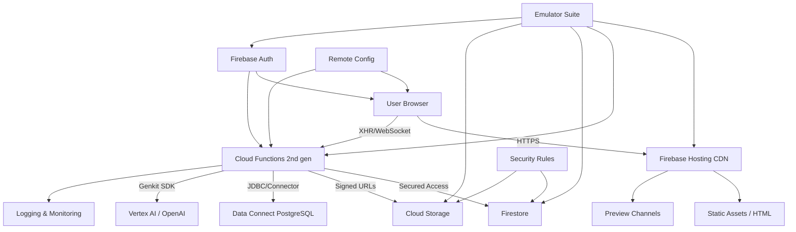
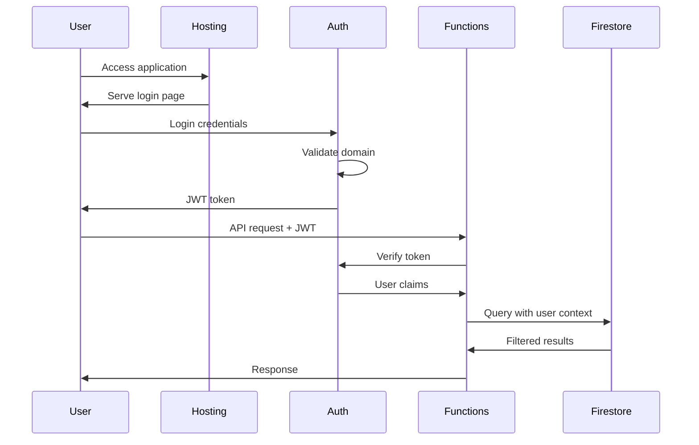
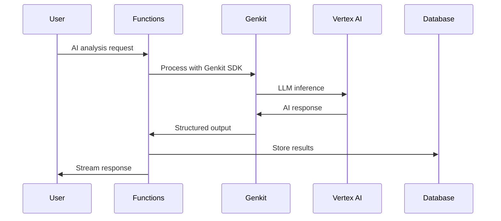
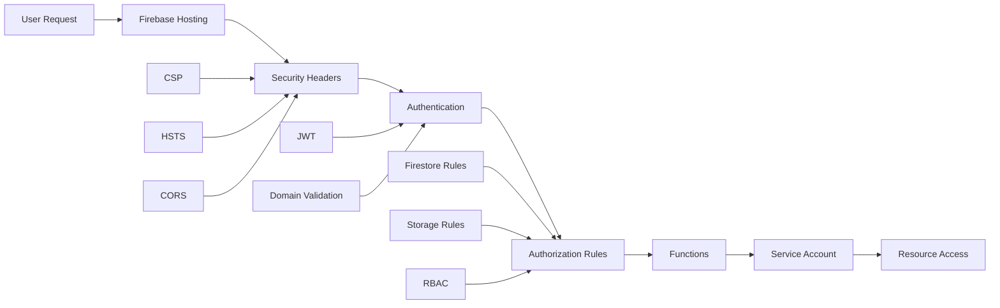
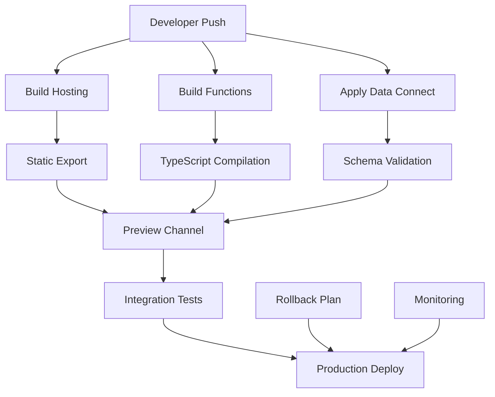

# Firebase Architecture - henryreed.ai

## 🏗️ Overview

The henryreed.ai application is built on a comprehensive Firebase/GCP architecture that leverages Next.js 15 static export with multi-codebase Cloud Functions, advanced AI capabilities through Genkit, and PostgreSQL Data Connect for enhanced data relationships.

## 🔥 Services Map & Data Flow

## 🎯 Core Services Architecture

### **Firebase Hosting (Global CDN)**
- **Purpose**: Static site delivery with global CDN
- **Configuration**: `firebase.json` - rewrites, caching headers, security policies
- **Features**:
  - Global CDN with edge caching
  - Automatic HTTPS with managed certificates
  - HTTP/2 and Brotli compression support
  - Preview channels for testing
  - Custom domain support

### **Multi-Codebase Cloud Functions**
- **Default Functions** (`functions/`) - Node.js 20
  - TRR management and analytics
  - Export functionality (PDF, DOCX, CSV)
  - Rate limiting and structured error handling
  
- **Genkit AI Functions** (`henryreedai/`) - Node.js 20
  - Advanced AI capabilities using Google's Genkit
  - POV analysis and risk assessment
  - TRR recommendations and competitive analysis
  - Chat assistant with domain expertise

### **Firebase Firestore**
- **Purpose**: Real-time document database
- **Configuration**: Role-based security rules
- **Features**:
  - Real-time synchronization
  - Optimized indexes (`firestore.indexes.json`)
  - Domain-restricted access (@henryreed.ai, @paloaltonetworks.com)

### **Firebase Storage**
- **Purpose**: File uploads and document storage  
- **Configuration**: Secure bucket policies with user isolation
- **Features**:
  - User-specific file paths (`/users/{userId}/`)
  - File type and size validation
  - Signed URLs for secure access

### **Firebase Data Connect (PostgreSQL)**
- **Purpose**: Advanced data relationships and queries
- **Configuration**: GraphQL schema with audit trails
- **Features**:
  - Firebase Auth integration (`auth.uid`)
  - Complex relationships between POV, TRR, and Scenario data
  - JDBC connectivity for functions

### **Firebase Authentication**
- **Purpose**: User management and RBAC
- **Configuration**: Email/password + future OKTA SSO
- **Features**:
  - Domain validation
  - Role-based access control (admin, manager, user)
  - Session management

### **Firebase Remote Config**
- **Purpose**: Feature flags and user settings
- **Configuration**: Role-based feature enablement
- **Features**:
  - A/B testing capabilities
  - Environment-specific configurations
  - Real-time config updates

## 📊 Data Flow Patterns

### **Authentication Flow**

### **AI Processing Flow**

## 🔐 Security Architecture

### **Multi-Layer Security**

### **Security Headers Configuration**
- **Content Security Policy (CSP)**: Prevents XSS attacks
- **Strict Transport Security (HSTS)**: Enforces HTTPS
- **X-Frame-Options**: Prevents clickjacking
- **Referrer Policy**: Controls referrer information
- **Permissions Policy**: Restricts browser APIs

## 🚀 Deployment Architecture

### **Build & Deploy Pipeline**

## 📈 Performance Optimizations

### **Caching Strategy**
- **Static Assets**: 1 year cache with immutable headers
- **HTML Files**: 5-minute cache with must-revalidate
- **API Responses**: Configurable TTL based on content type
- **CDN**: Global edge locations for optimal performance

### **Next.js Optimizations**
- **Static Export**: Pre-built pages for optimal CDN caching
- **Code Splitting**: Vendor, common, and command chunks
- **Tree Shaking**: Eliminated unused code
- **Turbopack**: Fast development builds
- **Image Optimization**: Unoptimized for static export compatibility

## 🔧 Local Development

### **Emulator Suite Configuration**
- **Auth Emulator**: Port 9099
- **Functions Emulator**: Port 5001  
- **Firestore Emulator**: Port 8080
- **Hosting Emulator**: Port 5005
- **Storage Emulator**: Port 9199
- **UI Dashboard**: Port 4000

## 📊 Monitoring & Observability

### **Logging Strategy**
- **Functions**: Structured logging with Winston
- **Client-side**: Error boundaries with context
- **Performance**: Core Web Vitals tracking
- **Security**: Audit trails for sensitive operations

### **Health Checks**
- **Application**: Route availability and response times
- **Database**: Connection pooling and query performance  
- **AI Services**: Model availability and latency
- **CDN**: Cache hit rates and geographic distribution

## 🎛️ Configuration Management

### **Environment Variables**
- **Frontend**: `NEXT_PUBLIC_*` for client-side config
- **Functions**: Firebase Secrets Manager for sensitive data
- **Build**: Cross-environment compatibility

### **Feature Flags**
- **AI Insights**: Gradual rollout capability
- **Experimental Features**: Safe testing in production
- **User Segmentation**: Role-based feature access

## 🔄 Backup & Recovery

### **Data Persistence**
- **Firestore**: Automated backups with point-in-time recovery
- **PostgreSQL**: Daily snapshots with 30-day retention
- **Storage**: Cross-region replication
- **Code**: Git-based versioning with deployment history

### **Disaster Recovery**
- **RTO**: 15 minutes for critical services
- **RPO**: 1 hour for data loss tolerance
- **Failover**: Multi-region deployment capability
- **Testing**: Monthly recovery drills

---

*This architecture supports the henryreed.ai platform with enterprise-grade scalability, security, and performance while maintaining developer productivity and operational excellence.*