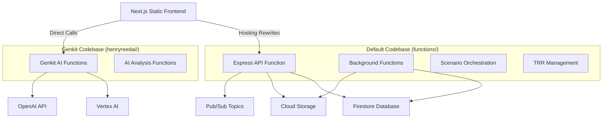

# Firebase Functions Resolution and Architecture Optimization

## Issues Resolved

### 1. Firestore Index Requirements
**Problem**: The `cleanupOldExecutions` function was failing due to missing composite indexes.
**Solution**: Added required indexes to `firestore.indexes.json` for `scenarioExecutions` collection.

```json
{
  "collectionGroup": "scenarioExecutions",
  "fields": [
    { "fieldPath": "status", "order": "ASCENDING" },
    { "fieldPath": "endTime", "order": "ASCENDING" },
    { "fieldPath": "__name__", "order": "ASCENDING" }
  ]
}
```

### 2. Node Version Consistency
**Problem**: Mixed Node versions (18 vs 20) across codebases causing runtime inconsistencies.
**Solution**: Standardized all functions to Node 20 runtime.

- `functions/package.json`: Node 20
- `henryreedai/package.json`: Node 20
- All functions now deploy as v2 with Node 20

### 3. Function Duplication
**Problem**: Duplicate function exports between default and genkit codebases creating conflicts.
**Solution**: 
- Removed duplicate exports from `functions/src/index.ts`
- Deleted duplicate AI function files from `functions/src/ai/`
- Clear separation: 
  - `functions/` (default): Business logic, scenario orchestration
  - `henryreedai/` (genkit): AI-specific functions only

### 4. v1 to v2 Migration
**Problem**: Mix of v1 and v2 functions causing deployment and performance issues.
**Solution**: 
- Deleted all existing v1 functions
- Redeployed all functions as v2
- Consistent configuration across all functions

### 5. CORS and Hosting Integration
**Problem**: Frontend needed to call functions through hosting domain for better security and caching.
**Solution**: Added function rewrites to `firebase.json`:

```json
"rewrites": [
  { "source": "/api/**", "function": "api" },
  { "source": "/health", "function": "api" },
  { "source": "/genkit/**", "function": {
    "functionId": "healthCheck",
    "region": "us-central1"
  }},
  { "source": "**", "destination": "/index.html" }
]
```

## Current Architecture

### Multi-Codebase Structure


### Function Inventory
**Default Codebase (`functions/`):**
- `api` - Main Express HTTP API (v2, Node 20)
- `aiTrrSuggest` - TRR AI suggestions (v2, Node 20)
- `generateThreatActorScenarioFunction` - Scenario generation (v2, Node 20)
- `executeScenarioFunction` - Scenario execution (v2, Node 20)
- `controlScenarioExecutionFunction` - Execution control (v2, Node 20)
- `generateDetectionQueriesFunction` - Detection queries (v2, Node 20)
- `processScenarioExecution` - Background execution (v2, Node 20)
- `monitorExecutionStatusChanges` - Status monitoring (v2, Node 20)
- `cleanupOldExecutions` - Scheduled cleanup (v2, Node 20)

**Genkit Codebase (`henryreedai/`):**
- `healthCheck` - Health endpoint (v2, Node 20)
- `menuSuggestion` - Menu AI suggestions (v2, Node 20)
- `aiPovAnalysis` - POV analysis (v2, Node 20)
- `aiTrrRecommendations` - TRR recommendations (v2, Node 20)
- `aiDetectionGeneration` - Detection generation (v2, Node 20)
- `aiScenarioOptimization` - Scenario optimization (v2, Node 20)
- `aiChatAssistant` - Chat AI assistant (v2, Node 20)
- `aiCompetitiveAnalysis` - Competitive analysis (v2, Node 20)
- `aiRiskAssessment` - Risk assessment (v2, Node 20)

## Performance Improvements

### Cold Start Optimization
- All functions upgraded to v2 for better cold start performance
- Consistent Node 20 runtime across all functions
- Proper memory allocation per function type

### Security Enhancements
- Express API includes proper CORS configuration
- Helmet security middleware enabled
- Rate limiting implemented
- Hosting rewrites allow secure function access

### Development Workflow
- Clear separation of concerns between codebases
- No duplicate function exports
- Consistent build and deployment processes

## Testing Verification

### Function Endpoints
- ✅ `https://us-central1-henryreedai.cloudfunctions.net/api/health`
- ✅ `https://henryreedai.web.app/health` (via hosting rewrite)
- ✅ All AI functions accessible via `genkit:` prefix

### Health Checks
```bash
# Direct function call
curl -s https://us-central1-henryreedai.cloudfunctions.net/api/health

# Via hosting rewrite  
curl -s https://henryreedai.web.app/health

# Response
{"status":"healthy","timestamp":"2025-10-09T16:22:25.629Z","version":"1.0.0"}
```

## Next Steps for Continuous Improvement

1. **Monitoring Setup**: Implement comprehensive logging and alerting
2. **Performance Optimization**: Fine-tune memory and timeout settings based on usage
3. **Security Hardening**: Implement additional auth middleware as needed
4. **Testing Suite**: Expand automated testing for all function endpoints
5. **Documentation**: Keep function documentation updated as features evolve

## Deployment Commands

### Full Deployment
```bash
firebase deploy
```

### Functions Only
```bash
firebase deploy --only functions
```

### Specific Function
```bash
firebase deploy --only functions:api
firebase deploy --only functions:genkit:aiPovAnalysis
```

### Build and Test
```bash
# Build both codebases
cd functions && npm run build
cd ../henryreedai && npm run build

# Test locally
firebase emulators:start --only functions,firestore,hosting
```

This resolution ensures a robust, scalable, and maintainable Firebase Functions architecture that supports continuous improvement and deployment.