# Web Components Architecture - henryreed.ai

## 🧩 Overview

The henryreed.ai application features a sophisticated component architecture built with Next.js 15 App Router, React 18, TypeScript, and Tailwind CSS. This document provides comprehensive mapping of the component hierarchy, routing structure, and data flow patterns.

## 🏗️ Next.js Application Structure

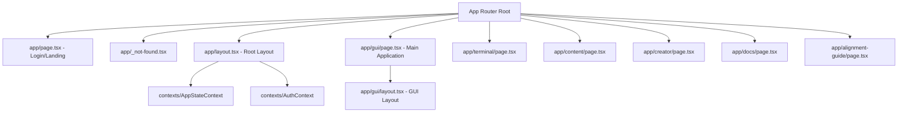

## 🎨 Component Hierarchy & Relationships

### **Core Application Components**

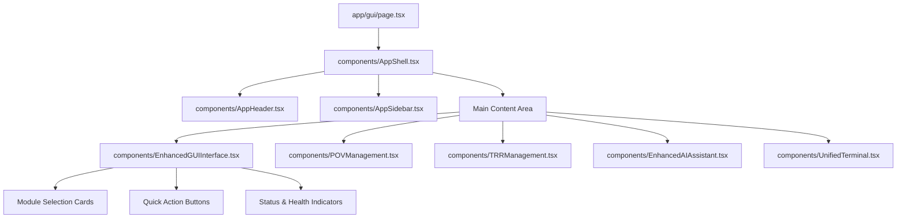

### **POV Management Module**

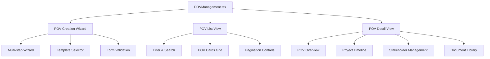

### **TRR Management Module**

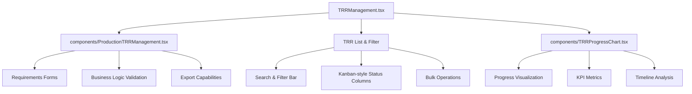

### **AI Assistant Module**

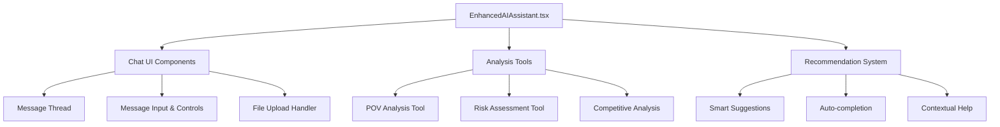

### **Terminal & Command System**

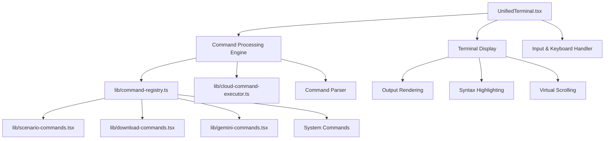

### **Content Management System**

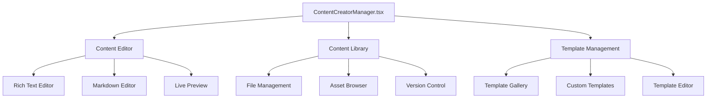

## 🔄 Data Flow & State Management

### **Global State Architecture**

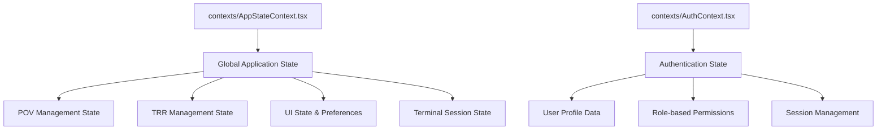

### **Component Communication Patterns**

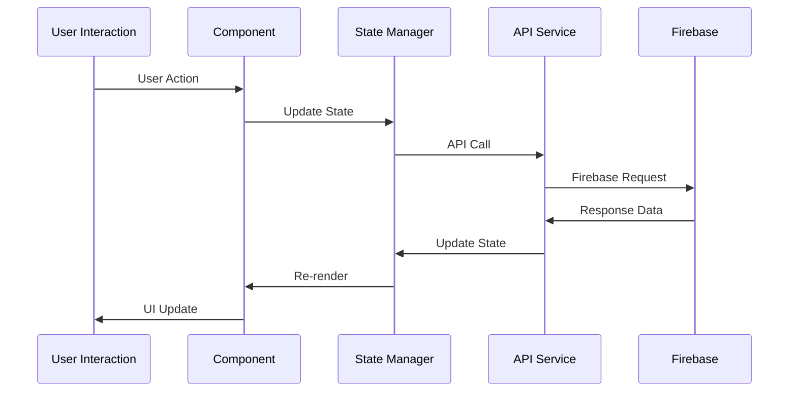

## 🎯 Specialized Components

### **Scenario Management**

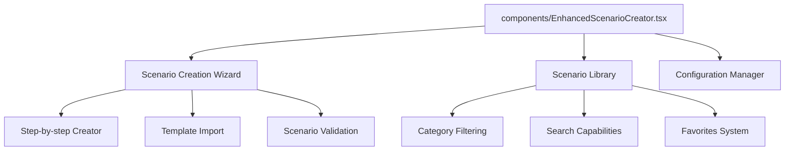

### **Dashboard & Monitoring**

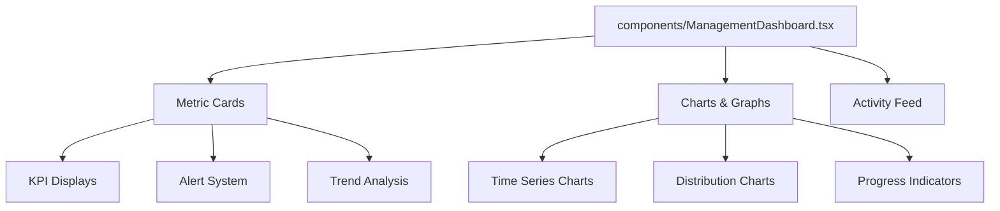

### **XSIAM Integration Components**

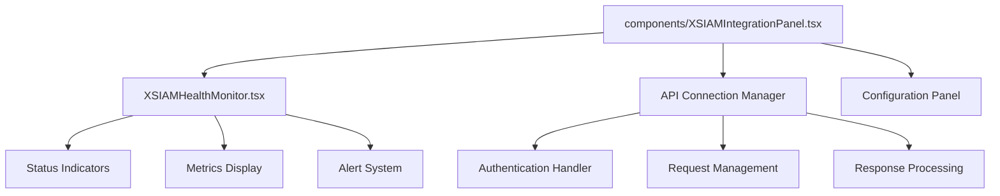

## 🎨 UI/UX Component Library

### **Cortex Design System**

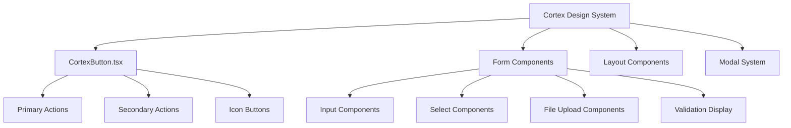

### **Terminal UI Components**

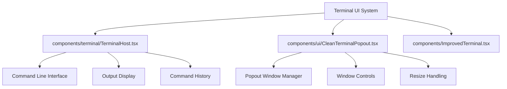

## 📱 Responsive Design Architecture

### **Breakpoint Strategy**

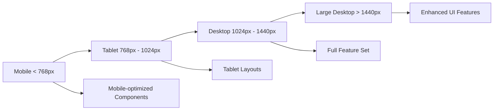

### **Component Adaptivity**

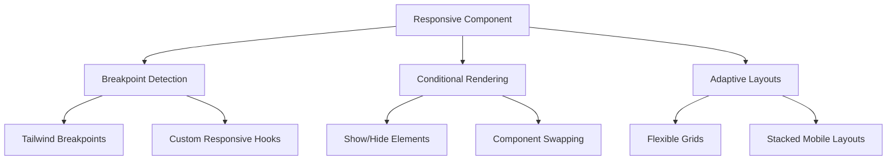

## 🔧 Development Tools & Utilities

### **Custom Hooks & Utilities**

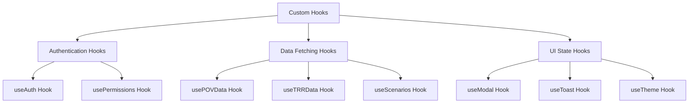

### **Service Layer Architecture**

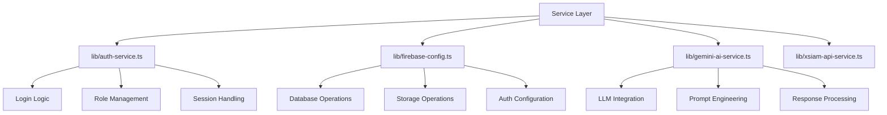

## 📊 Performance Optimization Strategies

### **Component Optimization**

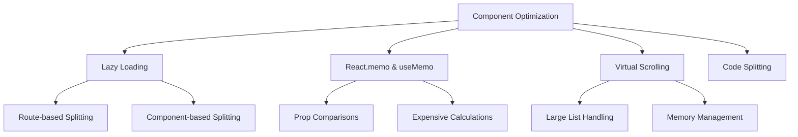

### **Bundle Optimization**

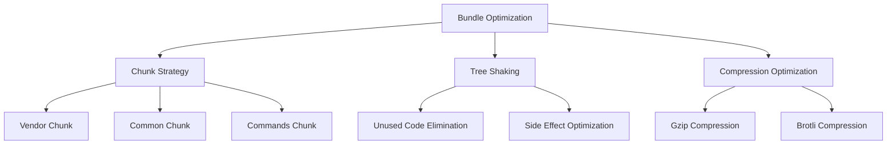

---

*This component architecture provides a scalable, maintainable, and performant foundation for the henryreed.ai platform while ensuring excellent developer experience and user interface quality.*