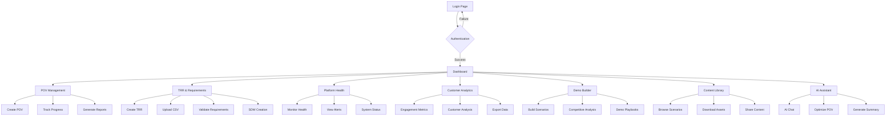
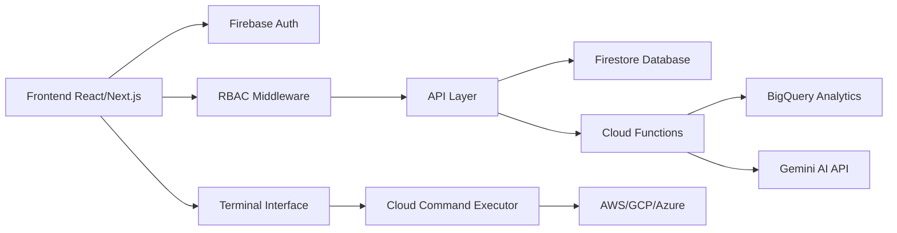
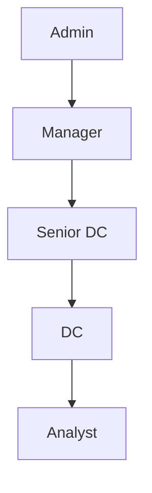

# Cortex Domain Consultant Portal

> **Professional POV Management & Customer Engagement Platform**  
> *Powered by Palo Alto Networks Cortex Platform*

[](https://nextjs.org/)
[](https://www.typescriptlang.org/)
[](https://firebase.google.com/)
[](https://tailwindcss.com/)

---

## 📋 Table of Contents

- [Overview](#-overview)
- [Features](#-features)
- [User Workflows & Architecture](#-user-workflows--architecture)  
- [Installation & Setup](#-installation--setup)
- [Deployment Options](#-deployment-options)
- [User Roles & Permissions](#-user-roles--permissions)
- [Technology Stack](#-technology-stack)
- [API Documentation](#-api-documentation)
- [Contributing](#-contributing)
- [Security](#-security)
- [Troubleshooting](#-troubleshooting)

---

## 🎯 Overview

The **Cortex Domain Consultant Portal** is a professional-grade web application designed specifically for Palo Alto Networks Domain Consultants to manage Proof of Value (POV) engagements, customer demonstrations, and technical sales activities. Built with modern web technologies and optimized for both desktop and mobile experiences.

### Key Differentiators
- **Professional Branding**: Palo Alto Networks official branding with Cortex green theme
- **Role-Based Access Control (RBAC)**: Secure, granular permissions system
- **Dual Interface**: Both GUI and Terminal interfaces with feature parity
- **Real-time Integration**: Cloud environment connectivity for live demonstrations
- **AI-Powered Assistance**: Gemini AI integration for customer engagement optimization

---

## ✨ Features

### 🎯 Core Modules

#### 1. **Dashboard** 
*Central engagement hub with customizable analytics*
- **Real-time Metrics**: Live POV progress, customer engagement stats
- **Customizable Widgets**: Drag-and-drop dashboard configuration
- **Quick Actions**: One-click access to common workflows
- **Activity Feed**: Recent actions and system updates
- **Executive Reporting**: PDF/Excel export capabilities

#### 2. **POV Management**
*Complete Proof of Value lifecycle management*
- **Project Planning**: Template-based POV initialization
- **Milestone Tracking**: Progress monitoring with visual timelines
- **Customer Engagement**: Interaction logging and follow-up management
- **Competitive Analysis**: Positioning against Splunk, CrowdStrike, Microsoft
- **Success Metrics**: ROI calculations and business value demonstrations

#### 3. **TRR & Requirements**
*Technical Requirements Review and documentation*
- **Interactive Forms**: Dynamic TRR creation with validation
- **CSV Import/Export**: Bulk operations for requirement management
- **Blockchain Signoff**: Secure TRR approval with immutable records
- **Solution Design Workbook (SDW)**: Integrated technical documentation
- **Workflow Automation**: Status tracking and notification systems

#### 4. **Platform Health**
*Demo environment monitoring and system status*
- **Cortex Platform Monitoring**: Real-time health checks
- **Demo Environment Management**: Environment provisioning and teardown
- **Performance Analytics**: System performance metrics and alerting
- **Integration Status**: Third-party service connectivity monitoring

#### 5. **AI Assistant**
*AI-powered customer engagement optimization*
- **Gemini Integration**: Google's advanced AI for conversation analysis
- **POV Optimization**: AI-driven recommendations for engagement improvement
- **Predictive Analytics**: Timeline and risk assessment
- **Executive Summaries**: Auto-generated reports for stakeholder communication

#### 6. **Customer Analytics**
*Advanced data analysis and engagement metrics*
- **Engagement Heatmaps**: Visual representation of customer interaction patterns
- **BigQuery Integration**: Advanced data export and analysis
- **Custom Reports**: Tailored analytics for specific customer needs
- **Trend Analysis**: Historical data patterns and forecasting

#### 7. **Demo Builder**
*Custom demonstration scenario creation*
- **Scenario Templates**: Pre-built security demonstration workflows
- **MITRE ATT&CK Mapping**: Threat technique visualization
- **Competitive Positioning**: Side-by-side comparisons with competitors
- **Interactive Playbooks**: Guided demonstration scripts

#### 8. **Content Library**
*Pre-built engagement materials and resources*
- **Security Scenarios**: 25+ detection and response scenarios
- **Competitive Battlecards**: Positioning guides for major competitors
- **Technical Documentation**: Implementation guides and best practices
- **Demo Assets**: Videos, presentations, and interactive content

#### 9. **DC Management** *(Admin/Manager Only)*
*Team oversight and administrative functions*
- **User Management**: Role assignment and permission management
- **Team Analytics**: Performance metrics and engagement statistics  
- **Resource Allocation**: Project assignment and workload balancing
- **Training Materials**: Onboarding and skills development resources

---

## 🔄 User Workflows & Architecture

### Primary User Journey Map



### Role-Based Access Matrix

| Feature | Admin | Manager | Senior DC | DC | Analyst |
|---------|-------|---------|-----------|-------|----------|
| Dashboard | Full | Full | Personal | Personal | Personal |
| POV Management | All POVs | All POVs | Assigned | Assigned | Assigned |
| TRR & Requirements | All TRRs | All TRRs | Own TRRs | Own TRRs | Own TRRs |
| Platform Health | Full | View | View | View | View |
| Customer Analytics | All Data | All Data | Assigned | Assigned | Assigned |
| Demo Builder | Full | Full | Full | Full | View |
| Content Library | Full | Full | Full | Full | View |
| AI Assistant | Full | Full | Full | Full | Basic |
| DC Management | Full | Team Only | - | - | - |
| Terminal Access | Full | Full | Limited | Limited | - |

### Data Flow Architecture



---

## 🚀 Installation & Setup

### Prerequisites

- **Node.js** 18.0+ 
- **npm** or **yarn** package manager
- **Firebase Project** (for authentication and database)
- **Google Cloud Project** (for AI features)

### Quick Start

1. **Clone the repository**
```bash
git clone https://github.com/your-org/cortex-dc-portal.git
cd cortex-dc-portal/hosting
```

2. **Install dependencies**
```bash
npm install
# or
yarn install
```

3. **Environment Configuration**
Create `.env.local` file with required environment variables:

```env
# Firebase Configuration
NEXT_PUBLIC_FIREBASE_API_KEY=your-api-key
NEXT_PUBLIC_FIREBASE_AUTH_DOMAIN=your-project.firebaseapp.com
NEXT_PUBLIC_FIREBASE_PROJECT_ID=your-project-id
NEXT_PUBLIC_FIREBASE_STORAGE_BUCKET=your-project.appspot.com
NEXT_PUBLIC_FIREBASE_MESSAGING_SENDER_ID=123456789
NEXT_PUBLIC_FIREBASE_APP_ID=1:123456789:web:abcdef

# Authentication Mode (development)
NEXT_PUBLIC_AUTH_PROVIDER=firebase
NEXT_PUBLIC_DEV_USERNAME=cortex
NEXT_PUBLIC_DEV_PASSWORD=xsiam

# AI Integration
NEXT_PUBLIC_GEMINI_API_KEY=your-gemini-api-key

# App Configuration
NEXT_PUBLIC_APP_VERSION=2.5.0
NODE_ENV=development
```

4. **Development Server**
```bash
npm run dev
# or  
yarn dev
```

5. **Production Build**
```bash
npm run build
npm run start
# or
yarn build
yarn start
```

### Development Login

For development environment:
- **Username**: `cortex`
- **Password**: `xsiam`

---

## 🌐 Deployment Options

### 1. Firebase Hosting (Recommended)

**Automatic Deployment**
```bash
# Install Firebase CLI
npm install -g firebase-tools

# Login and initialize
firebase login
firebase init hosting

# Deploy
npm run build
firebase deploy
```

**Configuration**
```json
{
  "hosting": {
    "public": "out",
    "ignore": ["firebase.json", "**/.*", "**/node_modules/**"],
    "rewrites": [
      {
        "source": "**",
        "destination": "/index.html"
      }
    ],
    "headers": [
      {
        "source": "**",
        "headers": [
          {
            "key": "X-Content-Type-Options",
            "value": "nosniff"
          },
          {
            "key": "X-Frame-Options", 
            "value": "DENY"
          }
        ]
      }
    ]
  }
}
```

### 2. Vercel Deployment

**One-Click Deploy**
[](https://vercel.com/new/clone?repository-url=https://github.com/your-org/cortex-dc-portal)

**Manual Deployment**
```bash
# Install Vercel CLI
npm install -g vercel

# Deploy
vercel --prod
```

### 3. AWS Amplify

**Connect Repository**
1. Go to AWS Amplify Console
2. Connect your GitHub repository
3. Configure build settings:

```yaml
version: 1
frontend:
  phases:
    preBuild:
      commands:
        - cd hosting && npm ci
    build:
      commands:
        - cd hosting && npm run build
  artifacts:
    baseDirectory: hosting/out
    files:
      - '**/*'
  cache:
    paths:
      - hosting/node_modules/**/*
```

### 4. Docker Deployment

**Dockerfile**
```dockerfile
FROM node:18-alpine AS builder

WORKDIR /app
COPY hosting/package*.json ./
RUN npm ci --only=production

COPY hosting/ ./
RUN npm run build

FROM nginx:alpine
COPY --from=builder /app/out /usr/share/nginx/html
COPY nginx.conf /etc/nginx/nginx.conf

EXPOSE 80
CMD ["nginx", "-g", "daemon off;"]
```

**Docker Compose**
```yaml
version: '3.8'
services:
  cortex-portal:
    build: .
    ports:
      - "3000:80"
    environment:
      - NODE_ENV=production
    restart: unless-stopped
```

### 5. Self-Hosted (Ubuntu/CentOS)

**Prerequisites Installation**
```bash
# Install Node.js 18
curl -fsSL https://deb.nodesource.com/setup_18.x | sudo -E bash -
sudo apt-get install -y nodejs

# Install PM2 for process management
sudo npm install -g pm2
```

**Application Setup**
```bash
# Clone and build
git clone https://github.com/your-org/cortex-dc-portal.git
cd cortex-dc-portal/hosting
npm install
npm run build

# Start with PM2
pm2 start ecosystem.config.js
pm2 save
pm2 startup
```

---

## 👥 User Roles & Permissions

### Role Hierarchy



### Detailed Permission Matrix

| Permission | Admin | Manager | Senior DC | DC | Analyst |
|-----------|-------|---------|-----------|-----|----------|
| **Data Access** |
| View All Users | ✅ | ❌ | ❌ | ❌ | ❌ |
| View All POVs | ✅ | ✅ | ❌ | ❌ | ❌ |
| View All TRRs | ✅ | ✅ | ❌ | ❌ | ❌ |
| Modify System Settings | ✅ | ❌ | ❌ | ❌ | ❌ |
| **Actions** |
| Create POV | ✅ | ✅ | ✅ | ✅ | ❌ |
| Delete POV | ✅ | ✅ | ❌ | ❌ | ❌ |
| Create TRR | ✅ | ✅ | ✅ | ✅ | ❌ |
| Deploy Scenarios | ✅ | ✅ | ✅ | ✅ | ❌ |
| Terminal Access | ✅ | ✅ | Limited | Limited | ❌ |
| **Management** |
| User Management | ✅ | Team Only | ❌ | ❌ | ❌ |
| Analytics Dashboard | ✅ | ✅ | Personal | Personal | Personal |
| Export Reports | ✅ | ✅ | Own Data | Own Data | Own Data |

---

## 🛠️ Technology Stack

### Frontend
- **Framework**: Next.js 15.4.1 (React 18+)
- **Language**: TypeScript 5.0+
- **Styling**: Tailwind CSS 3.0+ with custom Cortex green theme
- **State Management**: React Context API + Custom hooks
- **UI Components**: Headless UI + Custom components
- **Icons**: Heroicons + Custom SVG assets

### Backend & Services
- **Authentication**: Firebase Auth with custom RBAC
- **Database**: Firestore (NoSQL) + BigQuery (Analytics)
- **Cloud Functions**: Firebase Functions (Node.js)
- **Storage**: Firebase Storage + CDN
- **AI Integration**: Google Gemini AI API

### Development Tools
- **Build Tool**: Next.js built-in bundler
- **Linting**: ESLint + Prettier
- **Testing**: Jest + React Testing Library
- **Type Checking**: TypeScript strict mode
- **Version Control**: Git with conventional commits

### Infrastructure
- **Hosting**: Firebase Hosting (Primary)
- **CDN**: Firebase CDN + Cloudflare
- **Monitoring**: Firebase Performance + Analytics
- **Security**: Firebase Security Rules + CSP headers

---

## 📡 API Documentation

### Authentication Endpoints

```typescript
// Login
POST /api/auth/login
{
  "email": "consultant@company.com", 
  "password": "secure_password"
}

// Response
{
  "user": {
    "id": "user_id",
    "email": "consultant@company.com",
    "role": "senior_dc",
    "permissions": ["pov:read", "pov:create", "trr:read"]
  },
  "token": "jwt_token"
}
```

### POV Management API

```typescript
// Create POV
POST /api/pov/create
{
  "customer": "Enterprise Corp",
  "template": "enterprise",
  "timeline": 30,
  "objectives": ["Reduce MTTR", "Improve SOC efficiency"]
}

// List POVs
GET /api/pov/list?status=active&customer=Enterprise%20Corp

// Update POV
PUT /api/pov/{id}
{
  "status": "in_progress",
  "milestones": [
    {"name": "Initial Setup", "completed": true},
    {"name": "Demo Environment", "completed": false}
  ]
}
```

### TRR Management API

```typescript
// Create TRR
POST /api/trr/create
{
  "title": "Network Security Requirements",
  "category": "security",
  "requirements": [
    {
      "requirement": "Firewall configuration",
      "priority": "high",
      "status": "pending"
    }
  ]
}

// Bulk Import
POST /api/trr/import
{
  "file_url": "https://storage.googleapis.com/bucket/requirements.csv",
  "customer_id": "customer_123"
}
```

### AI Assistant API

```typescript
// Analyze POV
POST /api/ai/analyze
{
  "pov_id": "pov_123",
  "analysis_type": "optimization",
  "context": "customer_engagement"
}

// Generate Summary
POST /api/ai/summary
{
  "data": {
    "pov_progress": 75,
    "customer_satisfaction": 4.2,
    "timeline_status": "on_track"
  },
  "format": "executive"
}
```

---

## 🔒 Security

### Security Features

- **Authentication**: Multi-factor authentication support
- **Authorization**: Role-based access control (RBAC) 
- **Data Protection**: Encryption at rest and in transit
- **Session Management**: Secure JWT tokens with expiration
- **CSRF Protection**: Built-in Next.js CSRF protection
- **Content Security Policy**: Strict CSP headers
- **Input Validation**: Server-side validation for all inputs
- **Rate Limiting**: API rate limiting to prevent abuse

### Security Headers

```typescript
// next.config.js
const securityHeaders = [
  {
    key: 'X-DNS-Prefetch-Control',
    value: 'on'
  },
  {
    key: 'Strict-Transport-Security',
    value: 'max-age=63072000; includeSubDomains; preload'
  },
  {
    key: 'X-Frame-Options',
    value: 'SAMEORIGIN'
  },
  {
    key: 'X-Content-Type-Options', 
    value: 'nosniff'
  },
  {
    key: 'Referrer-Policy',
    value: 'strict-origin-when-cross-origin'
  }
];
```

### Firestore Security Rules

```javascript
rules_version = '2';
service cloud.firestore {
  match /databases/{database}/documents {
    // Users can only access their own data
    match /users/{userId} {
      allow read, write: if request.auth != null && request.auth.uid == userId;
    }
    
    // POVs are role-based access
    match /povs/{povId} {
      allow read: if request.auth != null && 
        (resource.data.assignedUsers.hasAny([request.auth.uid]) ||
         request.auth.token.role in ['admin', 'manager']);
      
      allow write: if request.auth != null &&
        request.auth.token.role in ['admin', 'manager', 'senior_dc', 'dc'];
    }
  }
}
```

---

## 🤝 Contributing

### Development Workflow

1. **Fork the repository** and clone to your local machine
2. **Create a feature branch** from `develop` branch
```bash
git checkout -b feature/your-feature-name
```
3. **Make your changes** following the coding standards
4. **Write/update tests** for your changes
5. **Run the test suite** to ensure everything passes
```bash
npm run test
npm run lint
```
6. **Create a pull request** with a clear description

### Code Standards

- **TypeScript**: Strict type checking enabled
- **ESLint**: Airbnb configuration with custom rules
- **Prettier**: Automatic code formatting
- **Conventional Commits**: Use conventional commit format
- **Testing**: Minimum 80% code coverage required

### Commit Message Format

```
type(scope): description

[optional body]

[optional footer]
```

**Types**: `feat`, `fix`, `docs`, `style`, `refactor`, `test`, `chore`

**Examples**:
```
feat(pov): add milestone tracking functionality
fix(auth): resolve login redirect issue
docs(readme): update deployment instructions
```

---

## 🔧 Troubleshooting

### Common Issues

#### Build Errors

**Error**: `Module not found: Can't resolve 'firebase/app'`
```bash
# Solution: Reinstall Firebase dependencies
npm uninstall firebase
npm install firebase@latest
```

**Error**: `Type errors in production build`
```bash
# Solution: Check TypeScript configuration
npm run type-check
npx tsc --noEmit
```

#### Authentication Issues

**Error**: `Firebase configuration not found`
- Verify `.env.local` file exists with correct Firebase config
- Ensure all required environment variables are set
- Check Firebase project settings match the config

**Error**: `RBAC permission denied`
- Verify user role in Firestore `users` collection
- Check Firebase security rules allow the operation
- Confirm user is assigned to the correct projects/customers

#### Performance Issues

**Slow dashboard loading**
- Check network tab for slow API calls
- Verify BigQuery queries are optimized
- Consider implementing data caching

**Memory leaks in terminal**
- Ensure WebSocket connections are properly closed
- Check for event listener cleanup in useEffect hooks
- Monitor component unmounting

### Debug Mode

Enable debug mode by adding to `.env.local`:
```env
NODE_ENV=development
DEBUG=cortex:*
NEXT_PUBLIC_DEBUG_MODE=true
```

### Getting Help

- **Documentation**: Check the `/docs` section in the app
- **Issues**: Create a GitHub issue with detailed description
- **Discussions**: Use GitHub Discussions for questions
- **Security**: Email security@yourcompany.com for security issues

---

## 📈 Analytics & Monitoring

### Performance Monitoring

- **Core Web Vitals**: Lighthouse CI integration
- **Real User Monitoring**: Firebase Performance
- **Error Tracking**: Sentry integration
- **Usage Analytics**: Firebase Analytics + Custom events

### Key Metrics Tracked

- **User Engagement**: Session duration, page views, feature usage
- **Business Metrics**: POV success rate, TRR completion time
- **Technical Metrics**: API response times, error rates, uptime
- **Security Metrics**: Failed login attempts, permission denials

---

## 🎯 Roadmap

### Q4 2024
- [ ] Enhanced mobile experience with native app features
- [ ] Advanced AI recommendations using customer conversation analysis
- [ ] Integration with Salesforce CRM for automatic opportunity tracking
- [ ] Real-time collaboration features for multi-consultant POVs

### Q1 2025
- [ ] Advanced analytics dashboard with predictive modeling
- [ ] Integration with Palo Alto Networks product APIs
- [ ] Multi-language support for global teams
- [ ] Advanced workflow automation with approval chains

### Q2 2025  
- [ ] Voice-to-text integration for demo session notes
- [ ] AR/VR demonstration capabilities
- [ ] Advanced threat intelligence integration
- [ ] Customer self-service portal integration

---

## 📝 License

This project is proprietary software owned by Palo Alto Networks. All rights reserved.

```
Copyright (c) 2024 Palo Alto Networks, Inc.
Developed by Domain Consultant Team
```

---

## 📞 Support

### Internal Support
- **Platform Team**: platform-team@paloaltonetworks.com
- **Domain Consultant Support**: dc-support@paloaltonetworks.com  
- **Technical Issues**: Create internal Jira ticket

### Emergency Contact
For critical production issues:
- **On-call Engineer**: +1-555-CORTEX-1
- **Slack Channel**: `#cortex-dc-portal-alerts`
- **PagerDuty**: Cortex DC Portal service

---

**Built with ❤️ by the Domain Consultant Team at Palo Alto Networks**

*Empowering Domain Consultants to deliver exceptional customer experiences through innovative technology and streamlined workflows.*
