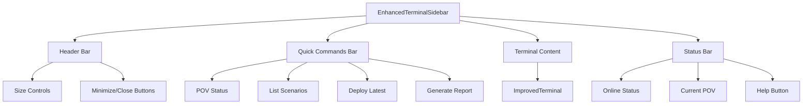
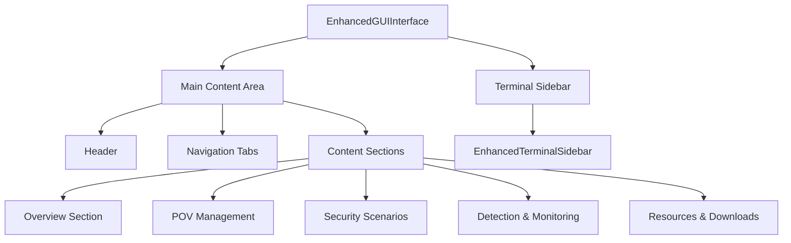

# Enhanced GUI Interface Architecture

## Overview

The Enhanced GUI Interface optimizes the terminal sidebar and enhances the GUI interface for the domain consultant platform. This document outlines the architecture, components, and integration patterns.

## Key Components

### 1. EnhancedTerminalSidebar.tsx

The enhanced terminal sidebar component with modern UI/UX:



**Features:**
- Multiple sidebar sizes (minimized, compact, standard, expanded)
- Quick command buttons for common operations
- Resizable interface with drag handles
- Modern Cortex branding and color scheme
- Integration with existing terminal infrastructure

### 2. EnhancedGUIInterface.tsx

The main GUI interface component with terminal sidebar integration:



**Sections:**
- **Overview**: Platform statistics and quick actions
- **POV Management**: Create and manage Proof of Value projects
- **Security Scenarios**: Deploy and manage security testing scenarios
- **Detection & Monitoring**: Monitor deployments and validate detection rules
- **Resources & Downloads**: Access documentation and downloadable resources

### 3. Component Integration

#### Terminal Command Execution

```typescript
const { run: executeCommand, isRunning } = useCommandExecutor();

const handleCommandExecution = async (command: string, sectionId: string, commandName: string) => {
  // Auto-expand terminal when command is executed
  if (!terminalExpanded) {
    setTerminalExpanded(true);
  }

  await executeCommand(command, {
    openTerminal: true,
    focus: true,
    trackActivity: {
      event: `gui-command-execute`,
      source: `enhanced-gui-${sectionId}`,
      payload: { command, commandName, sectionId }
    }
  });
};
```

#### Responsive Layout

```typescript
<div 
  className={cn(
    'flex-1 flex flex-col transition-all duration-300',
    terminalExpanded ? 'mr-96' : 'mr-12' // Adjust margin based on terminal state
  )}
>
```

## UI/UX Improvements

### 1. Consistent Branding
- Uses Palo Alto Networks Cortex color scheme
- Consistent spacing with Tailwind CSS utilities
- Modern gradient backgrounds and hover effects

### 2. Enhanced Accessibility
- Proper ARIA labels and roles
- Keyboard navigation support
- Focus management for terminal interactions

### 3. Responsive Design
- Fluid layout that adapts to terminal sidebar state
- Mobile-friendly navigation tabs
- Optimized touch targets for interactive elements

### 4. Loading States and Feedback
- Loading indicators for command execution
- Success/error notifications
- Real-time status updates

## Integration Patterns

### 1. Command-to-GUI Bridge
Commands executed via GUI buttons automatically:
- Open terminal sidebar if collapsed
- Focus terminal input
- Track telemetry for analytics
- Provide visual feedback

### 2. State Management
- Terminal expansion state persists per session
- POV status reflected across both interfaces
- Shared command history and context

### 3. Backwards Compatibility
Legacy interface wrapper maintains compatibility with existing components:
- POV Dashboard
- TRR Management
- AI Insights
- Manual Creation tools

## Quick Command Configuration

### Command Structure
```typescript
interface GUICommand {
  name: string;
  command: string;
  description: string;
  variant: 'primary' | 'secondary' | 'outline';
  icon?: string;
  disabled?: boolean;
}
```

### Quick Commands Bar
Pre-configured commands for common operations:
- POV Status (`pov status --current`)
- List Scenarios (`scenario list`)
- Deploy Latest (`scenario deploy --latest`)
- Generate Report (`pov report --executive`)

## Implementation Benefits

### 1. Improved Workflow Efficiency
- Reduced clicks to access common functions
- Contextual command suggestions
- Streamlined terminal access

### 2. Better User Experience
- Modern, consistent interface
- Clear visual hierarchy
- Responsive feedback

### 3. Enhanced Integration
- Seamless terminal-GUI transitions
- Shared state and context
- Unified command execution

### 4. Developer Experience
- Modular component architecture
- Clear separation of concerns
- Reusable UI patterns

## Configuration and Customization

### Terminal Sidebar Settings
- Default expanded state
- Size preferences (compact, standard, expanded)
- Quick command customization
- Theme and color overrides

### Section Configuration
- Add/remove GUI sections
- Customize command sets per section
- Configure telemetry tracking
- Modify layout and styling

## Future Enhancements

### Planned Features
1. **Context-aware Commands**: Smart command suggestions based on current POV state
2. **Command Templates**: Reusable command patterns with parameter substitution
3. **Advanced Telemetry**: Enhanced analytics for command usage patterns
4. **AI Integration**: Intelligent command recommendations and automation

### Performance Optimizations
1. **Lazy Loading**: Load terminal content only when sidebar is expanded
2. **Command Caching**: Cache frequently used commands and results
3. **Virtual Scrolling**: Optimize terminal output rendering for large datasets
4. **Memory Management**: Efficient cleanup of command history and state

This architecture provides a solid foundation for the enhanced domain consultant platform while maintaining backwards compatibility and enabling future extensibility.