# Firebase Deployment Fixes - October 8, 2025

## Issue Summary

The henryreed.ai application was experiencing critical build failures preventing Firebase hosting deployment due to:

1. **Missing imports and circular references** in enhanced scenario commands  
2. **Incorrect default vs named export imports**
3. **Async/await compatibility issues** in command handlers
4. **TypeScript compilation errors**

## Root Cause Analysis

### Primary Issues Identified:

1. **Import Resolution Errors in `scenario-commands-enhanced.tsx`:**
   - Missing functions imported from `./scenario/registry` that actually existed in `./scenario/engine`
   - Functions: `deployScenario`, `getActiveDeployments`, `scenarioEngine`, `validateDeployment`, `exportDeployment`, `destroyDeployment`

2. **Incorrect Import Style in `ScenarioManagementInterface.tsx`:**
   - Attempted named import `{ ImprovedTerminal }` when component exports as default
   - TypeScript error: `'\"./ImprovedTerminal\"' has no exported member named 'ImprovedTerminal'`

3. **Async Handler Circular Reference:**
   - Function `handler: async (args) => { ... }` in `ImprovedTerminal.tsx` caused TypeScript circular reference error
   - Multiple `await` calls in non-async context

## Solutions Implemented

### 1. Fixed Import Paths and Sources

**File:** `hosting/lib/scenario-commands-enhanced.tsx`

```typescript
// BEFORE (Incorrect)
import { 
  scenarioRegistry, 
  scenarioEngine,          // ❌ Not exported from registry
  getActiveDeployments,    // ❌ Not exported from registry
  deployScenario,          // ❌ Not exported from registry
  validateDeployment,      // ❌ Not exported from registry
  exportDeployment,        // ❌ Not exported from registry
  destroyDeployment,       // ❌ Not exported from registry
  filterScenarios,
  PANWProduct,
  BusinessValueTag,
  EnhancedScenarioConfig,
  ScenarioDeployment
} from './scenario/registry';
import { Provider, DeploymentState } from './scenario/engine';

// AFTER (Correct)
import { 
  scenarioRegistry, 
  filterScenarios,
  PANWProduct,
  BusinessValueTag,
  EnhancedScenarioConfig
} from './scenario/registry';
import { 
  Provider, 
  DeploymentState, 
  ScenarioDeployment,
  scenarioEngine,          // ✅ Properly imported from engine
  getActiveDeployments,    // ✅ Properly imported from engine  
  deployScenario,          // ✅ Properly imported from engine
  validateDeployment,      // ✅ Properly imported from engine
  exportDeployment,        // ✅ Properly imported from engine
  destroyDeployment        // ✅ Properly imported from engine
} from './scenario/engine';
```

### 2. Fixed Default Import Issue

**File:** `hosting/components/ScenarioManagementInterface.tsx`

```typescript
// BEFORE (Incorrect) 
import { ImprovedTerminal } from './ImprovedTerminal';  // ❌ Named import

// AFTER (Correct)
// HOTFIX: ImprovedTerminal exports as default, not named export
// import { ImprovedTerminal } from './ImprovedTerminal';
import ImprovedTerminal from './ImprovedTerminal';      // ✅ Default import
```

### 3. Resolved Async/Await Issues

**File:** `hosting/components/ImprovedTerminal.tsx`

```typescript
// BEFORE (Problematic)
handler: async (args) => {                           // ❌ Async causes circular ref
  // ... code ...
  return await scenarioCommands.list(subArgs);      // ❌ Await in wrong context
  return await scenarioCommands.generate([...]);    // ❌ Multiple await calls
  // ... more await calls
}

// AFTER (Fixed)
handler: (args) => {                                // ✅ Synchronous handler
  // ... code ...  
  return scenarioCommands.list(subArgs);           // ✅ Direct function calls
  return scenarioCommands.generate([...]);         // ✅ No await needed
  // ... consistent pattern
}
```

## Verification Results

### ✅ Build Success
```bash
$ cd hosting && npm run build
✓ Compiled successfully in 1000ms
✓ Linting and checking validity of types 
✓ Collecting page data    
✓ Generating static pages (10/10)
✓ Collecting build traces    
✓ Exporting (3/3)
✓ Finalizing page optimization 
```

### ✅ TypeScript Validation
```bash
$ npx tsc --noEmit --skipLibCheck
# No errors - clean compilation
```

### ✅ Firebase Deployment Success
```bash
$ firebase deploy --only hosting
✔ Deploy complete!
✔ hosting[henryreedai]: found 58 files in hosting/out
✔ hosting[henryreedai]: file upload complete
✔ hosting[henryreedai]: release complete
```

### ✅ Live Site Verification
```bash
$ curl -I https://henryreedai.web.app/
HTTP/2 200
last-modified: Wed, 08 Oct 2025 19:45:33 GMT  # ✅ Recent deployment timestamp
content-length: 13011                         # ✅ Content serving properly
```

## Architecture Confirmation

### Firebase Configuration
- ✅ `firebase.json` correctly configured for static hosting
- ✅ `hosting/out` directory properly populated with 58 files
- ✅ Next.js static export working (`output: 'export'`)
- ✅ SPA routing configured with `{ "source": "**", "destination": "/index.html" }`

### Build Pipeline

```mermaid
graph TD
    A[Source Code] --> B[TypeScript Check]
    B --> C[Next.js Build]
    C --> D[Static Export]
    D --> E[Firebase Deploy]
    E --> F[Live Site]
    
    B --> G[Import Resolution ✅]
    B --> H[Type Safety ✅]
    C --> I[Component Compilation ✅]
    D --> J[58 Static Files ✅]
    E --> K[henryreedai.web.app ✅]
```


## Future Considerations

### Code Quality
- The build generates warnings about console.log statements and React hooks dependencies
- These are non-blocking linting warnings, not compilation errors
- Consider addressing in future iterations for cleaner builds

### Enhanced Scenario Commands
- The scenario engine and registry are now properly connected
- All PANW product integration and business value features should work
- Consider adding integration tests for scenario deployment workflows

### Preventive Measures
- Add pre-commit hooks to run TypeScript checks
- Consider adding a GitHub Action for continuous deployment validation
- Document import patterns for consistency across the codebase

## Success Metrics Met

✅ **Primary Goal:** `firebase deploy` executes successfully  
✅ **Build Quality:** No TypeScript compilation errors  
✅ **Static Export:** 10 pages generated and exported  
✅ **File Count:** 58 files deployed to hosting  
✅ **Live Verification:** https://henryreedai.web.app/ serves recent build  
✅ **Performance:** Build completes in ~1000ms  

---

**Status:** 🟢 **RESOLVED**  
**Deployment:** 🚀 **LIVE**  
**Next Steps:** Monitor application functionality and consider backend service integration