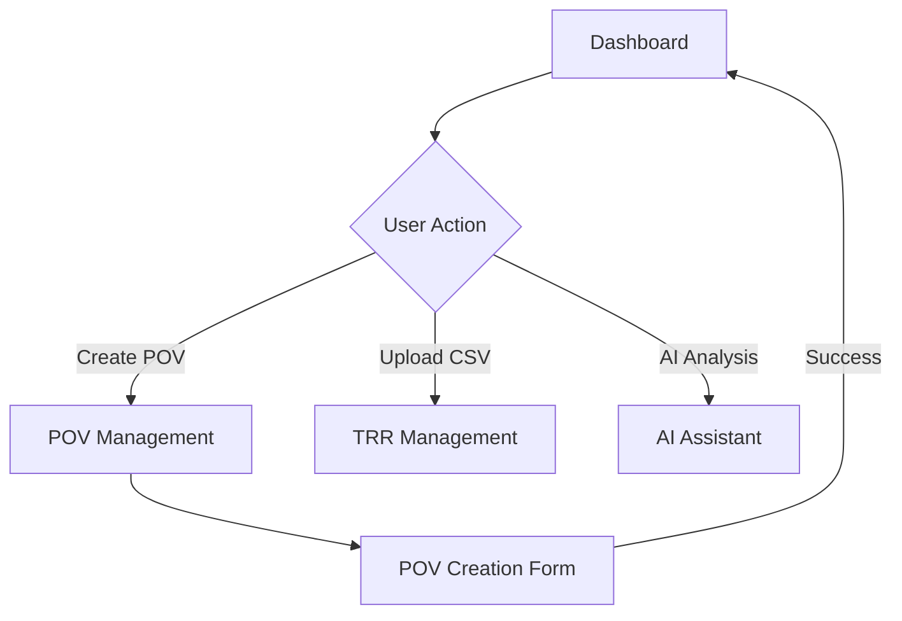
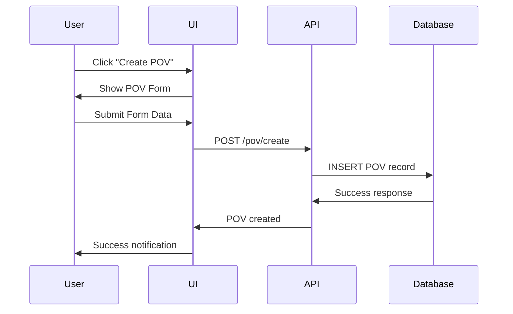
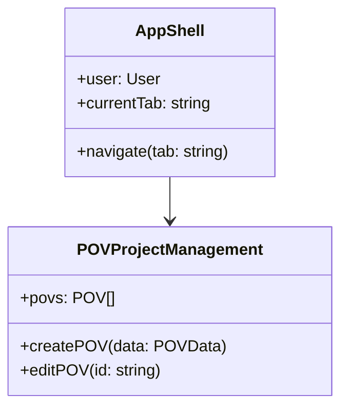

# Documentation Conventions

## Overview

This document establishes standards for wireframe notation, hierarchical structures, component naming, and navigation patterns used throughout the Cortex DC Portal documentation.

**Reference**: Cross-reference with [Portal UI Map](../docs/portal-ui-map.md) for complete workflow definitions.

## Hierarchical Structure Standards

### Navigation Hierarchy Levels

```
Level 1: Application Shell
├── Level 2: Primary Tabs (9 tabs)
│   ├── Level 3: Sub-tabs/Views within each tab
│   │   ├── Level 4: Detail pages/modals
│   │   │   ├── Level 5: Form sections/wizards
│   │   │   │   └── Level 6: Individual form fields/actions
```

### URL Structure Pattern
```
/ (root)
├── /gui (application shell)
│   ├── /dashboard (default tab)
│   ├── /pov (POV Management)
│   │   ├── /pov/create (creation flow)
│   │   ├── /pov/[povId] (specific POV)
│   │   ├── /pov/[povId]/requirements (POV requirements)
│   │   ├── /pov/[povId]/scenarios (POV scenarios)
│   │   └── /pov/[povId]/analytics (POV performance)
│   ├── /trr (TRR Management)
│   │   ├── /trr/create (creation flow)
│   │   ├── /trr/bulk-validate (validation wizard)
│   │   ├── /trr/[trrId] (specific TRR)
│   │   └── /trr/[trrId]/history (validation history)
│   └── [additional tabs following same pattern]
```

## Wireframe Legend

### Layout Elements
```
┌─ Header ─────────────────────────┐  Application header with logo/auth
│ [🏠] [User: John] [Settings] [?] │  Navigation controls and user menu
├─ Tabs ──────────────────────────┤  Primary tab navigation
│ [📊 Dashboard] [🎯 POV] [📋 TRR] │  Tab indicators with icons
├─ Breadcrumbs ──────────────────┤  Navigation trail
│ Home › POV Management › Create   │  Hierarchical path indication
├─ Sub-Navigation ───────────────┤  Secondary navigation within tabs
│ [Dashboard] [Create] [Templates] │  Sub-tab or section navigation
├─ Content Area ─────────────────┤  Main content region
│ ┌─ Sidebar ─┐ ┌─ Main Panel ───┐ │  Two-column layout example
│ │ Filters   │ │ Data/Forms     │ │  Left: controls, Right: content
│ │ Actions   │ │ Charts/Tables  │ │  Action areas and display areas
│ └───────────┘ └───────────────┘ │  Component boundaries
├─ Status Bar ───────────────────┤  Status indicators and actions
│ ✅ Connected | 🔄 Syncing | Help │  Real-time status information
└─ Footer ───────────────────────┘  App-wide footer with links
```

### Interactive Elements

| Symbol | Meaning | Example |
|---------|---------|---------|
| `[Button]` | Clickable button | `[Create POV]` |
| `{Dropdown}` | Dropdown menu | `{Customer: Select...}` |
| `<Input>` | Text input field | `<POV Name>` |
| `(•) Option` | Radio button | `(•) Financial Services` |
| `[x] Checkbox` | Checkbox option | `[x] Include objectives` |
| `📊 Icon` | Functional icon | `📊 Dashboard icon` |
| `→ Action` | Navigation action | `→ Go to TRR Details` |
| `...More` | Expandable section | `...View 15 more POVs` |

### State Indicators

| Symbol | State | Description |
|---------|-------|-------------|
| `[Loading...]` | Async loading | Data fetch in progress |
| `[Empty State]` | No data | Empty list with call-to-action |
| `[Error State]` | Error condition | Failed operation with retry |
| `[Success ✓]` | Completed | Successful operation |
| `[Warning ⚠]` | Attention needed | Validation issues or alerts |
| `[Disabled]` | Inactive | Unavailable due to permissions/state |

### Component Hierarchy Notation

```
ComponentName
├── SubComponent
│   ├── NestedComponent
│   │   ├── Props: { prop1, prop2 }
│   │   ├── State: { loading, data }
│   │   └── Events: { onClick, onSubmit }
│   └── SiblingComponent
└── AnotherSubComponent
```

## Navigation Flow Patterns

### Click-Through Routes

#### Pattern 1: Dashboard → Detail Flow
```
Dashboard
  ↓ [Click: "View POV Details"]
POV Management Tab
  ↓ [Auto-navigate to POV Details]
POV Detail Page (/pov/123)
  ↓ [Click: "Edit Requirements"]
POV Requirements Editor (/pov/123/requirements)
  ↓ [Click: "Add Scenario"]
Scenario Creation Modal
  ↓ [Submit: "Save Scenario"]
POV Requirements Editor (updated)
```

#### Pattern 2: Cross-Tab Action Flow
```
AI Assistant Tab
  ↓ [AI Recommendation: "Create TRR for Customer X"]
  ↓ [Click: "Execute Recommendation"]
TRR Management Tab
  ↓ [Auto-open: TRR Creation Form]
  ↓ [Pre-filled: Customer X data]
TRR Creation Form
  ↓ [Submit: "Create TRR"]
  ↓ [Success notification]
Dashboard
  ↓ [Updated: Recent Activity feed]
```

### Deep Dive Navigation Structure

#### Level 1: Application Shell
- Global header with authentication
- Primary tab navigation (9 tabs)
- Breadcrumb navigation system
- Global notifications/alerts

#### Level 2: Tab-Specific Shell
- Sub-navigation within each tab
- Tab-specific filters and search
- Context-aware action buttons
- Tab state preservation

#### Level 3: Page/View Level
- Main content areas (lists, forms, dashboards)
- Sidebar panels for filters/actions
- Data tables with sorting/pagination
- Charts and visualization components

#### Level 4: Detail/Modal Level
- Individual record details
- Edit forms and wizards
- Confirmation dialogs
- Inline editing interfaces

#### Level 5: Component/Field Level
- Form validation states
- Autocomplete suggestions
- Tooltip information
- Micro-interactions

## Component Naming Standards

### Page-Level Components
```
{Domain}{Purpose}
├── POVDashboard (overview of POVs)
├── POVProjectManagement (POV lifecycle)
├── ProductionTRRManagement (TRR operations)
├── XSIAMHealthMonitor (platform health)
├── EnhancedAIAssistant (AI interactions)
├── BigQueryExplorer (analytics)
├── EnhancedManualCreationGUI (demo builder)
├── UnifiedContentCreator (content library)
└── ManagementDashboard (admin panel)
```

### Layout Components
```
{Purpose}{Type}
├── AppShell (main application container)
├── AppHeader (global navigation header)
├── ConditionalLayout (role-based layouts)
├── BreadcrumbNavigation (navigation trails)
├── NotificationSystem (global notifications)
└── SettingsPanel (configuration interface)
```

### Domain Components
```
Cortex{Element}
├── CortexButton (styled button component)
├── CortexCommandButton (command execution button)
├── CortexCloudFrame (cloud service integration)
├── CortexDCTerminal (terminal interface)
└── CortexGUIInterface (main GUI container)
```

## Mermaid Diagram Standards

### Flowchart for Navigation


### Sequence for Interactions


### Class Diagram for Components


## Route Parameter Standards

### Dynamic Routes
```
[id] - Numeric identifier (e.g., [povId], [trrId])
[slug] - Text identifier (e.g., [customerSlug])
[...params] - Catch-all routes for nested paths
```

### Query Parameters
```
?tab=create - Sub-tab selection
?filter=active - Data filtering
?sort=date&order=desc - Sorting parameters
?page=2&limit=20 - Pagination
?context=customer - Context switching
```

## State Management Patterns

### Component State Hierarchy
```
AppStateContext (Global)
├── User authentication state
├── Current tab and navigation
├── Global notifications
└── Feature flags

TabStateContext (Tab-specific)
├── Sub-tab navigation
├── Filter and search state
├── Selection state
└── Local notifications

ComponentState (Local)
├── Form data and validation
├── Loading and error states
├── UI interaction state
└── Temporary data
```

## Responsive Breakpoints

### Screen Size Standards
```
Mobile: < 768px
  - Single column layout
  - Collapsed navigation
  - Touch-optimized controls

Tablet: 768px - 1024px
  - Two column layout
  - Sidebar navigation
  - Mixed touch/mouse

Desktop: > 1024px
  - Full multi-column layout
  - All navigation visible
  - Mouse-optimized controls
```

## Documentation Cross-Reference Rules

### Internal Linking
- Always use relative paths: `[link](../docs/file.md)`
- Reference specific sections with anchors: `[link](file.md#section)`
- Maintain bidirectional links between related documents

### External References
- Link to component source: `[ComponentName](../components/ComponentName.tsx)`
- Reference API endpoints: `[API](../api/routes/endpoint.ts)`
- Connect to configuration: `[Config](../../config/file.json)`

### Change Tracking
- Document version in each file header
- Link changes to specific commits/PRs
- Maintain backwards compatibility in links

---

**Last Updated**: 2025-01-07  
**Cross-Reference**: [Portal UI Map](../docs/portal-ui-map.md) | [README](README.md)