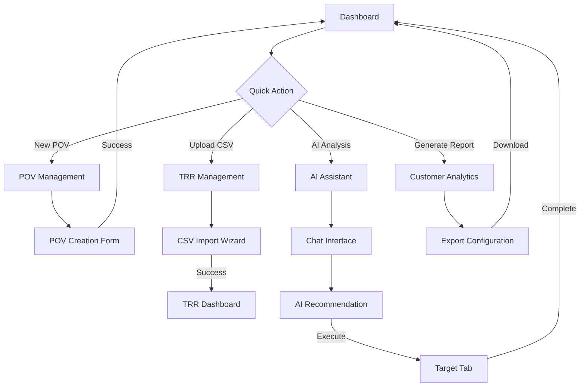

# Navigation Structure & Hierarchical Flow

## Overview

This document maps the complete navigation hierarchy for the Cortex DC Portal, showing the relationship between tabs, sub-pages, detailed views, and specific user interaction flows. Each level provides deeper functionality and context.

**Reference**: [Portal UI Map](../docs/portal-ui-map.md) | [Conventions](00-conventions.md)

## Application Shell Structure

### Global Layout Wireframe
```
┌─ Application Header ────────────────────────────────────────────────┐
│ [🏠 Cortex] [User: John Smith ▼] [🔔 3] [⚙️ Settings] [❓ Help] [🚪] │
├─ Primary Tab Navigation ──────────────────────────────────────────┤
│ [📊 Dashboard] [🎯 POV] [📋 TRR] [🔍 Health] [🤖 AI] [📈 Data] [🔧] [🚀] [⚙️] │
├─ Breadcrumb Trail ─────────────────────────────────────────────────┤
│ Home › POV Management › POV-2024-001 › Requirements                 │
├─ Tab Content Area ─────────────────────────────────────────────────┤
│ [Tab-specific content with sub-navigation and main content areas]   │
├─ Status Bar ───────────────────────────────────────────────────────┤
│ ✅ Connected to XSIAM | 🔄 Syncing (3 pending) | 💾 Last saved: 2m ago │
└─ Footer ──────────────────────────────────────────────────────────┘
│ © 2024 Cortex | Documentation | Privacy | Terms                   │
└─────────────────────────────────────────────────────────────────────┘
```

### Navigation Hierarchy Tree

```mermaid
flowchart TD
    A[Application Shell] --> B[📊 Dashboard]
    A --> C[🎯 POV Management]
    A --> D[📋 TRR & Requirements]
    A --> E[🔍 Platform Health]
    A --> F[🤖 AI Assistant]
    A --> G[📈 Customer Analytics]
    A --> H[🔧 Demo Builder]
    A --> I[🚀 Content Library]
    A --> J[⚙️ DC Management]
    
    C --> C1[POV Overview]
    C --> C2[Create POV]
    C --> C3[POV Templates]
    C --> C4[POV Analytics]
    
    C2 --> C2a[Template Selection]
    C2 --> C2b[Custom POV Form]
    C2a --> C2a1[Financial Services POV]
    C2a --> C2a2[Healthcare POV]
    C2a --> C2a3[Manufacturing POV]
    
    C1 --> C1a[Active POVs List]
    C1a --> C1a1[POV Details /pov/[id]]
    C1a1 --> C1a1a[Requirements /pov/[id]/requirements]
    C1a1 --> C1a1b[Scenarios /pov/[id]/scenarios]
    C1a1 --> C1a1c[Performance /pov/[id]/analytics]
    
    D --> D1[TRR Dashboard]
    D --> D2[Create TRR]
    D --> D3[Bulk Validate]
    D --> D4[Upload CSV]
    
    D1 --> D1a[Active TRRs]
    D1a --> D1a1[TRR Details /trr/[id]]
    D1a1 --> D1a1a[Validation History /trr/[id]/history]
    D1a1 --> D1a1b[Customer Review /trr/[id]/review]
    
    E --> E1[Setup/Connection]
    E --> E2[Health Dashboard]
    E --> E3[Analytics View]
    E --> E4[XQL Query Interface]
    
    F --> F1[Chat Interface]
    F --> F2[Insights Dashboard]
    F --> F3[Templates Library]
    F --> F4[Session History]
    
    F4 --> F4a[Session Details /ai/sessions/[id]]
    F1 --> F1a[Context Switching]
    F1a --> F1a1[Global Context]
    F1a --> F1a2[Customer Context /ai?customer=[id]]
    F1a --> F1a3[POV Context /ai?pov=[id]]
```

## Detailed Tab Hierarchies

### 1. 📊 Dashboard (`/gui` | `/gui/dashboard`)

#### Level 2: Dashboard Sections
```
Dashboard
├── Hero Section
│   ├── Welcome message with user name
│   ├── Success rate display (89% POV win rate)
│   └── Quick stats carousel
├── Metrics Grid (2x2)
│   ├── Active POVs (12 + 15% trend)
│   ├── Detection Scripts (47 + "New" badge)
│   ├── TRR Success (89% + 23 pending)
│   └── Cost Savings (54% vs competitors)
├── Activity Feed (Left Column)
│   ├── Recent activity list (live updates)
│   ├── Activity filters
│   └── [View All Activity] → /gui/dashboard?view=activity
└── Quick Actions (Right Column)
    ├── [New POV 🎯] → /gui/pov?action=create
    ├── [Upload CSV 📄] → /gui/trr?action=import
    ├── [Generate Report 📝] → /gui/data?action=report
    ├── [AI Analysis 🤖] → /gui/ai?action=analyze
    ├── [Detection Engine 🔧] → /gui/creator?mode=detection
    └── [Badass Blueprint 🧭] → Download PDF
```

#### Level 3: Activity Detail Views
```
Activity Item Click Flow:
Activity Feed Item → Detail Modal
├── Activity Type: "POV Completed"
├── Customer: "Acme Corp"
├── Timestamp: "2 hours ago"
├── Details: "POV-2024-001 successfully completed"
├── Actions:
│   ├── [View POV Details] → /gui/pov/POV-2024-001
│   ├── [Generate Report] → /gui/data?filter=POV-2024-001
│   └── [Create Follow-up] → /gui/pov?action=create&template=follow-up
└── [Close] or [Next Activity]
```

### 2. 🎯 POV Management (`/gui/pov`)

#### Level 2: POV Management Sub-Navigation
```
POV Management Tab
├── [Overview] (default) - /gui/pov
├── [Create POV] - /gui/pov?tab=create
├── [Templates] - /gui/pov?tab=templates
├── [Analytics] - /gui/pov?tab=analytics
└── [Archive] - /gui/pov?tab=archive
```

#### Level 3: POV Overview → Detail Pages
```
POV Overview
├── POV Portfolio Stats
│   ├── Total POVs: 47
│   ├── Active: 12
│   ├── In Progress: 8
│   └── Completed: 27
├── Active POVs Table
│   ├── POV Name | Customer | Status | Timeline | Actions
│   ├── [POV-2024-001] → /gui/pov/POV-2024-001
│   ├── [POV-2024-002] → /gui/pov/POV-2024-002
│   └── ...more POVs with pagination
└── Quick Actions
    ├── [Create New POV] → /gui/pov?tab=create
    ├── [Import POVs] → Upload CSV modal
    └── [Export List] → Download CSV
```

#### Level 4: Individual POV Detail Page (`/gui/pov/[povId]`)
```
POV Detail Page (/gui/pov/POV-2024-001)
├── Header Section
│   ├── POV Title: "Financial Services Security Assessment"
│   ├── Customer: "First National Bank"
│   ├── Status Badge: "In Progress" 
│   ├── Progress: 65% complete
│   └── Actions: [Edit] [Clone] [Archive] [Share]
├── Tab Navigation
│   ├── [Overview] - /gui/pov/POV-2024-001 (default)
│   ├── [Requirements] - /gui/pov/POV-2024-001/requirements
│   ├── [Scenarios] - /gui/pov/POV-2024-001/scenarios
│   ├── [Timeline] - /gui/pov/POV-2024-001/timeline
│   ├── [Team] - /gui/pov/POV-2024-001/team
│   └── [Analytics] - /gui/pov/POV-2024-001/analytics
├── Overview Tab Content
│   ├── POV Summary Card
│   ├── Key Objectives (4/6 complete)
│   ├── Success Criteria Checklist
│   ├── Recent Activity Timeline
│   └── Stakeholder Contact List
└── Action Panel
    ├── [Schedule Meeting] → Calendar integration
    ├── [Send Update] → Email composer
    ├── [Generate Report] → /gui/data?pov=POV-2024-001
    └── [AI Insights] → /gui/ai?context=pov&id=POV-2024-001
```

#### Level 5: POV Requirements Editor (`/gui/pov/[povId]/requirements`)
```
POV Requirements Page
├── Requirements Management Interface
│   ├── Left Panel: Requirement Categories
│   │   ├── [Security Controls] (12 requirements)
│   │   ├── [Compliance] (8 requirements)
│   │   ├── [Integration] (6 requirements)
│   │   └── [Performance] (4 requirements)
│   └── Right Panel: Requirement Details
│       ├── Requirement Editor (rich text)
│       ├── Priority Selection: {Critical | High | Medium | Low}
│       ├── Acceptance Criteria checklist
│       ├── Validation Status indicators
│       └── Comments/Notes section
├── Bulk Actions Toolbar
│   ├── [Add Requirement] → New requirement modal
│   ├── [Import from Template] → Template selector
│   ├── [Bulk Validate] → /gui/trr?source=pov&id=POV-2024-001
│   └── [Export to TRR] → Generate TRR modal
└── AI Assistance Panel
    ├── [AI Review] → Requirement analysis
    ├── [Suggest Missing] → Gap analysis
    └── [Optimize Language] → Clarity improvements
```

#### Level 6: Add Scenario Modal (within POV Requirements)
```
Add Scenario Modal
├── Modal Header
│   ├── Title: "Add Security Scenario"
│   └── [✕ Close]
├── Scenario Selection
│   ├── Template Gallery
│   │   ├── [Ransomware Detection] - Preview
│   │   ├── [Data Exfiltration] - Preview  
│   │   ├── [Insider Threat] - Preview
│   │   └── [Custom Scenario] - Blank form
│   └── Preview Panel (shows when template selected)
├── Customization Form (if template selected)
│   ├── <Scenario Name>
│   ├── {Priority Level}
│   ├── [x] Include in POV demo
│   ├── [x] Customer validation required
│   └── <Custom requirements textarea>
├── Modal Actions
│   ├── [← Back to Templates]
│   ├── [Preview Changes]
│   ├── [Save & Add Another]
│   └── [Save & Close]
└── Modal closes → Returns to Requirements page with new scenario added
```

### 3. 📋 TRR & Requirements (`/gui/trr`)

#### Level 2: TRR Management Sub-Navigation
```
TRR Management
├── [Dashboard] - /gui/trr (default)
├── [Create TRR] - /gui/trr?tab=create  
├── [Bulk Validate] - /gui/trr?tab=validate
├── [Upload CSV] - /gui/trr?tab=import
└── [Quality Reports] - /gui/trr?tab=reports
```

#### Level 3: TRR Dashboard → Detail Flow
```
TRR Dashboard
├── Statistics Cards
│   ├── Total TRRs: 156
│   ├── Pending Validation: 23 → Click → /gui/trr?filter=pending
│   ├── Completed: 133 → Click → /gui/trr?filter=completed
│   └── Success Rate: 94% → Click → /gui/trr?tab=reports
├── Active TRRs Table
│   ├── TRR ID | Customer | Status | Priority | Validation | Actions
│   ├── [TRR-2024-045] → /gui/trr/TRR-2024-045
│   └── Pagination controls
└── Quick Actions
    ├── [New TRR] → /gui/trr?tab=create
    ├── [Bulk Operations] → /gui/trr?tab=validate
    └── [Import CSV] → /gui/trr?tab=import
```

#### Level 4: Individual TRR Detail (`/gui/trr/[trrId]`)
```
TRR Detail Page (/gui/trr/TRR-2024-045)
├── TRR Header
│   ├── TRR ID: "TRR-2024-045"
│   ├── Customer: "Global Manufacturing Inc"
│   ├── Status: "Under Review" 
│   ├── Priority: "High"
│   └── Actions: [Edit] [Validate] [Export] [Clone]
├── Requirements Section
│   ├── Requirements List (expandable sections)
│   │   ├── [Security Requirements] (15 items)
│   │   │   ├── REQ-001: "Multi-factor authentication" ✅ Validated
│   │   │   ├── REQ-002: "Network segmentation" ⚠ Under Review  
│   │   │   └── ...more requirements
│   │   ├── [Compliance Requirements] (8 items)
│   │   └── [Technical Requirements] (12 items)
│   └── Requirements Summary
│       ├── Total: 35 requirements
│       ├── Validated: 28 (80%)
│       ├── Pending: 5 (14%)
│       └── Issues: 2 (6%)
├── Validation History
│   ├── Timeline of validation events
│   ├── [View Full History] → /gui/trr/TRR-2024-045/history
│   └── Latest validation: "2 days ago by Sarah Chen"
└── Related Items
    ├── Linked POV: [POV-2024-003] → /gui/pov/POV-2024-003
    ├── Customer Profile: [Global Manufacturing] → /gui/data?customer=global-mfg
    └── AI Insights: [Generate Analysis] → /gui/ai?context=trr&id=TRR-2024-045
```

#### Level 5: TRR Validation History (`/gui/trr/[trrId]/history`)
```
TRR Validation History Page
├── History Timeline (vertical)
│   ├── 2024-01-15 14:30 - Initial Creation
│   │   ├── Created by: John Smith
│   │   ├── Requirements: 35 total
│   │   └── Status: Draft
│   ├── 2024-01-16 09:15 - First Validation
│   │   ├── Validator: Sarah Chen  
│   │   ├── Results: 28 passed, 7 failed
│   │   ├── Issues: [View Details] → Expandable section
│   │   └── Status: Under Review
│   ├── 2024-01-17 16:45 - Revision Submitted
│   │   ├── Revised by: John Smith
│   │   ├── Changes: 5 requirements updated
│   │   └── Status: Pending Re-validation
│   └── 2024-01-18 11:20 - Final Validation (Current)
│       ├── Validator: Sarah Chen
│       ├── Results: 33 passed, 2 under review
│       └── Status: Under Review
├── Actions Panel
│   ├── [Export History] → Download PDF/CSV
│   ├── [Compare Versions] → Version diff view
│   └── [Add Comment] → Comment modal
└── [← Back to TRR Details]
```

### 4. 🔍 Platform Health (`/gui/xsiam`)

#### Level 2: Platform Health Views
```
Platform Health
├── [Setup] - /gui/xsiam (default for new connections)
├── [Health] - /gui/xsiam?tab=health  
├── [Analytics] - /gui/xsiam?tab=analytics
└── [Query] - /gui/xsiam?tab=query
```

#### Level 3: Health Dashboard Deep Dive
```
Health Tab (/gui/xsiam?tab=health)
├── Connection Status Card
│   ├── Tenant: "cortex-demo-env"
│   ├── Status: ✅ Connected
│   ├── Last Sync: "5 minutes ago"
│   └── [Disconnect] [Refresh Connection]
├── System Health Grid
│   ├── Data Ingestion Card
│   │   ├── Rate: "1.2M events/hour" 
│   │   ├── Status: ✅ Normal
│   │   └── [View Details] → Drill-down modal
│   ├── Query Performance Card  
│   │   ├── Avg Response: "0.3s"
│   │   ├── Status: ✅ Optimal
│   │   └── [View Details] → Performance charts modal
│   ├── Storage Utilization Card
│   │   ├── Used: "78% of 2TB"
│   │   ├── Status: ⚠ High Usage
│   │   └── [View Details] → Storage breakdown modal
│   └── Incident Count Card
│       ├── Active: "2 incidents"
│       ├── Status: ⚠ Attention Needed
│       └── [View Details] → /gui/xsiam?tab=health&view=incidents
└── Real-time Metrics Charts
    ├── Event Volume Timeline (last 24h)
    ├── Query Response Times
    └── System Resource Usage
```

#### Level 4: Incident Details View (`/gui/xsiam?tab=health&view=incidents`)
```
Incidents Detail View
├── Incidents List
│   ├── Incident #1
│   │   ├── Title: "High Query Latency in Analytics"
│   │   ├── Severity: ⚠ Medium
│   │   ├── Started: "2 hours ago"
│   │   ├── Affected: "Analytics queries >5s response time"
│   │   └── [Investigate] → Incident detail modal
│   └── Incident #2
│       ├── Title: "Data Ingestion Delay"
│       ├── Severity: 🔴 High  
│       ├── Started: "45 minutes ago"
│       ├── Affected: "New events delayed by 10-15 minutes"
│       └── [Investigate] → Incident detail modal
├── Incident Actions
│   ├── [Create Manual Incident] → Incident creation form
│   ├── [View Incident History] → Historical incidents table
│   └── [Export Report] → Download incident summary
└── [← Back to Health Overview]
```

#### Level 5: XQL Query Interface (`/gui/xsiam?tab=query`)
```
XQL Query Interface
├── Query Editor Section
│   ├── Query Input (with syntax highlighting)
│   │   ├── Autocomplete suggestions
│   │   ├── Syntax validation
│   │   └── Query history dropdown
│   ├── Query Controls
│   │   ├── [Execute Query] (or Ctrl+Enter)
│   │   ├── [Clear Query]
│   │   ├── [Format Query] 
│   │   └── [Save Query] → Named query modal
│   └── Query Templates
│       ├── "Security Events Last 24h"
│       ├── "Failed Login Attempts"
│       ├── "Network Traffic Analysis"
│       └── [Custom Query]
├── Results Section
│   ├── Results Table (virtualized for large datasets)
│   │   ├── Sortable columns
│   │   ├── Column filtering
│   │   └── Row expansion for JSON details
│   ├── Results Statistics
│   │   ├── "1,247 results in 0.34s"
│   │   ├── Data range coverage
│   │   └── Query performance metrics
│   └── Export Options
│       ├── [Export CSV] → Download results
│       ├── [Export JSON] → Download JSON
│       └── [Create Chart] → Visualization builder modal
└── Query History Sidebar
    ├── Recent Queries (last 10)
    ├── Saved Queries
    └── Shared Team Queries
```

### 5. 🤖 AI Assistant (`/gui/ai`)

#### Level 2: AI Assistant Views
```
AI Assistant
├── [Chat] - /gui/ai (default)
├── [Insights] - /gui/ai?tab=insights
├── [Templates] - /gui/ai?tab=templates  
└── [History] - /gui/ai?tab=history
```

#### Level 3: Chat Interface with Context Switching
```
Chat Interface (/gui/ai)
├── Context Control Bar
│   ├── Context Mode: {Global | Customer | POV | TRR}
│   ├── Selected Context: "POV-2024-001" (if POV context)
│   ├── [Change Context] → Context selector modal
│   └── [Clear Context] → Reset to Global
├── Conversation Area
│   ├── Message Thread (scrollable)
│   │   ├── System: "AI Assistant ready. Current context: POV-2024-001"
│   │   ├── User: "What's the current status of our security scenarios?"
│   │   ├── Assistant: "POV-2024-001 has 6 scenarios..." [with action buttons]
│   │   └── ...conversation continues
│   └── Suggested Prompts (when no active conversation)
│       ├── "Analyze POV performance trends"
│       ├── "Review pending TRR validations"
│       ├── "Generate customer risk assessment"
│       └── "Optimize scenario recommendations"
├── Input Section
│   ├── Message Input (with autocomplete)
│   ├── [Attach File] → File selector
│   ├── [Voice Input] → Voice recognition
│   └── [Send] or Enter key
└── AI Actions Panel (when assistant provides actions)
    ├── [Execute: Create TRR] → Navigate to TRR creation with context
    ├── [Navigate: POV Details] → /gui/pov/POV-2024-001
    ├── [Export: Analysis Report] → Generate and download PDF
    └── [Schedule: Follow-up Meeting] → Calendar integration
```

#### Level 4: AI Insights Dashboard (`/gui/ai?tab=insights`)
```
Insights Dashboard
├── Priority Insights (Top 3)
│   ├── Opportunity Insight
│   │   ├── Title: "High-value POV expansion opportunity"
│   │   ├── Confidence: 87%
│   │   ├── Impact: High
│   │   ├── Context: Customer "Acme Corp"
│   │   └── Actions: [View Details] [Apply Recommendation] [Dismiss]
│   ├── Risk Insight
│   │   ├── Title: "TRR validation delays increasing"
│   │   ├── Confidence: 94%
│   │   ├── Impact: Medium
│   │   ├── Context: TRR process
│   │   └── Actions: [View Analysis] [Create Action Plan] [Dismiss]
│   └── Optimization Insight
│       ├── Title: "Demo scenario performance below benchmark"
│       ├── Confidence: 78%
│       ├── Impact: Medium  
│       ├── Context: Demo Builder content
│       └── Actions: [Review Scenarios] [Optimize Content] [Dismiss]
├── Insight Filters
│   ├── Type: {All | Opportunity | Risk | Optimization | Next Action}
│   ├── Impact: {All | High | Medium | Low}
│   ├── Context: {All | Global | Customer | POV | TRR}
│   └── Time Range: {Today | This Week | This Month}
└── All Insights List (paginated)
    ├── Insight cards with detailed information
    ├── Action tracking (applied, dismissed, pending)
    └── Historical insight performance
```

#### Level 5: Session History (`/gui/ai?tab=history`)
```
Session History
├── Sessions List
│   ├── Session Filters
│   │   ├── Date Range: {Last 7 days | Last 30 days | Custom}
│   │   ├── Context: {All | Global | Customer | POV | TRR}
│   │   └── Search: <Search conversations>
│   └── Session Items
│       ├── Session: "2024-01-18 14:30 - POV Analysis"
│       │   ├── Duration: 23 minutes
│       │   ├── Messages: 15 exchanges
│       │   ├── Context: POV-2024-001
│       │   ├── Actions Taken: 3
│       │   └── [Open Session] → /gui/ai/sessions/sess-2024-0118-1430
│       └── ...more sessions
├── Session Analytics
│   ├── Total Sessions: 47 this month
│   ├── Avg Duration: 18 minutes
│   ├── Actions Executed: 156 total
│   └── Top Topics: POV Management (34%), TRR Validation (28%)
└── Export Options
    ├── [Export Selected Sessions] → Download conversation logs
    └── [Export Analytics] → Download usage report
```

#### Level 6: Individual Session Detail (`/gui/ai/sessions/[sessionId]`)
```
Session Detail Page
├── Session Metadata
│   ├── Session ID: "sess-2024-0118-1430"
│   ├── Started: "2024-01-18 14:30:22"
│   ├── Duration: "23 minutes 45 seconds"
│   ├── Context: "POV-2024-001 (Financial Services POV)"
│   └── Participants: "John Smith (User), AI Assistant"
├── Conversation Replay
│   ├── Full conversation thread (read-only)
│   ├── Timestamp for each message
│   ├── Actions taken highlighted
│   └── [Export Conversation] → Download as PDF/text
├── Session Outcomes
│   ├── Actions Executed: 3
│   │   ├── "Created TRR-2024-046" → [View TRR] → /gui/trr/TRR-2024-046
│   │   ├── "Scheduled customer meeting" → Calendar link
│   │   └── "Generated risk assessment" → [Download Report]
│   ├── Insights Generated: 2
│   ├── Recommendations Applied: 1
│   └── Follow-up Required: Yes
├── Related Sessions
│   ├── Previous session with same context
│   ├── Follow-up sessions
│   └── Related customer/POV sessions
└── [← Back to History] | [Continue Conversation] → Return to chat with context
```

## Cross-Tab Navigation Patterns

### Quick Action Flows from Dashboard


### Deep Link Patterns
```
Pattern 1: Direct Entity Access
/gui/pov/POV-2024-001 → Auto-navigate to POV tab, load specific POV

Pattern 2: Action Context Passing
/gui/ai?context=pov&id=POV-2024-001 → AI tab with POV context pre-loaded

Pattern 3: Cross-Tab Reference
From TRR detail → [View Related POV] → /gui/pov/POV-2024-003
(Opens POV tab, shows POV detail, maintains breadcrumb back to TRR)

Pattern 4: Workflow Continuation  
AI Assistant recommends action → User clicks "Create TRR" →
/gui/trr?tab=create&context=ai&source=recommendation&customer=acme
(Opens TRR tab, pre-fills customer data, shows AI recommendation context)
```

### State Preservation Rules
- **Tab State**: Each tab maintains its own state (filters, pagination, selected items)
- **Navigation Context**: Breadcrumbs show full navigation path
- **Cross-Tab Actions**: Actions from other tabs preserve originating context
- **Back Navigation**: "Back to [Source]" buttons maintain user workflow context
- **Deep Links**: URLs preserve full application state for bookmarking/sharing

---

**Last Updated**: 2025-01-07  
**Cross-References**: [Portal UI Map](../docs/portal-ui-map.md) | [Component Architecture](02-component-architecture.md)