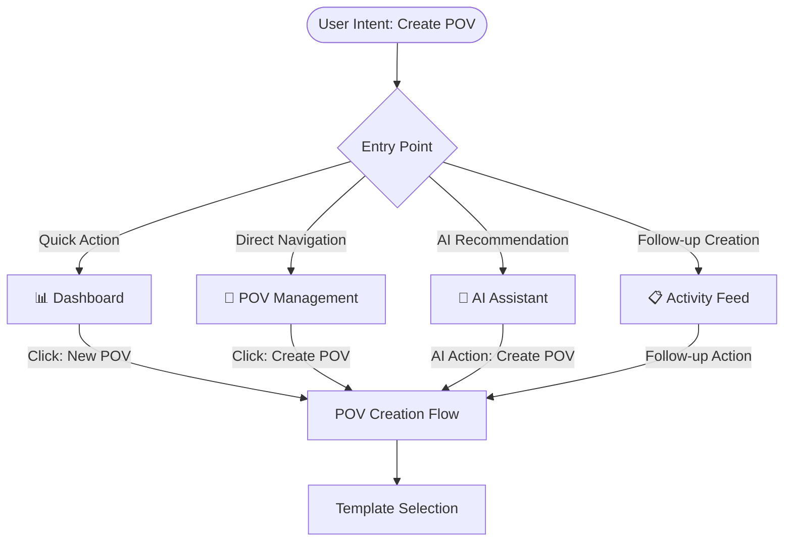

# New POV Creation Workflow

## Overview

This workflow maps the complete user journey from initial POV creation intent through successful POV deployment, showing all navigation levels, decision points, sub-flows, and context-aware actions throughout the process.

**Primary Entry Points**: Dashboard Quick Action, POV Management Tab, AI Assistant Recommendation  
**Success Criteria**: POV created with complete metadata, scenarios configured, team assigned, and initial objectives defined  
**Reference**: [Portal UI Map - POV Creation](../../docs/portal-ui-map.md#new-pov-creation-workflow)

## Complete Workflow Hierarchy

### Level 1: Entry Point Selection



### Level 2: Template Selection & Configuration

#### 2.1 Template Selection Interface
```
POV Creation Page (/gui/pov?tab=create)
┌─ Header ───────────────────────────────────────────────────┐
│ POV Management › Create POV                                 │
│ [← Back to POV Overview] | Context: "From Dashboard"        │
├─ Template Gallery ────────────────────────────────────────┤
│ ┌─ Financial Services ─┐ ┌─ Healthcare ──┐ ┌─ Manufacturing ┐ │
│ │ 🏦 Financial POV     │ │ 🏥 Healthcare  │ │ 🏭 Manufacturing│ │
│ │ 45 days timeline     │ │ 30 days        │ │ 60 days        │ │
│ │ 4 security scenarios │ │ HIPAA focus    │ │ OT security    │ │
│ │ Compliance focus     │ │ Privacy reqs   │ │ Industrial     │ │
│ │ [Preview] [Use]      │ │ [Preview][Use] │ │ [Preview][Use] │ │
│ └─────────────────────┘ └───────────────┘ └────────────────┘ │
│ ┌─ Custom POV ────────┐ ┌─ Import Existing ┐                 │
│ │ 🎯 Custom POV       │ │ 📄 Import POV     │                 │
│ │ Blank template      │ │ From CSV/JSON     │                 │
│ │ Full customization  │ │ Clone existing    │                 │
│ │ [Start Custom]      │ │ [Import File]     │                 │
│ └────────────────────┘ └─────────────────┘                 │
├─ Recent Templates ─────────────────────────────────────────┤
│ • "Banking Security Assessment" (used 3x this month)        │
│ • "Retail Compliance POV" (high success rate: 95%)         │
│ • "Energy Sector Security" (custom template by team)       │
└────────────────────────────────────────────────────────────┘
```

#### 2.2 Template Selection Flow
```
Template Click Flow:
┌─ Financial Services Template ─────────────────────────────┐
│ Click [Preview] → Template Preview Modal                  │
│ ├── Modal Content:                                        │
│ │   ├── Template Overview: "Financial Services Security"  │
│ │   ├── Timeline: 45 days with 3 milestones              │
│ │   ├── Scenarios Included (4):                           │
│ │   │   ├── • Ransomware Detection & Response            │
│ │   │   ├── • Data Exfiltration Prevention               │
│ │   │   ├── • Insider Threat Monitoring                  │
│ │   │   └── • Compliance Reporting Automation            │
│ │   ├── Success Criteria (6 predefined)                  │
│ │   ├── Required Stakeholders: CISO, IT Director, Audit  │
│ │   └── Historical Performance: 89% success rate         │
│ ├── Modal Actions:                                        │
│ │   ├── [Use This Template] → Level 3: Form Configuration│
│ │   ├── [Customize Template] → Advanced template editor  │
│ │   ├── [View Similar POVs] → Historical POV examples    │
│ │   └── [Close] → Return to template gallery             │
│ └─ Click [Use] → Direct to Level 3: Form Configuration   │
└──────────────────────────────────────────────────────────┘
```

### Level 3: POV Configuration Form

#### 3.1 Basic POV Information
```
POV Configuration Form (Template: Financial Services)
┌─ Form Header ──────────────────────────────────────────────┐
│ Creating: Financial Services Security POV                   │
│ Template: Financial Services | Estimated Time: 45 days     │
│ [Save Draft] [Preview POV] [Create POV] [← Change Template]│
├─ Basic Information ───────────────────────────────────────┤
│ POV Name*: <Financial Services Security Assessment>        │
│ Customer*: {Select Customer ▼} → Customer Selection Modal  │
│            [+ Add New Customer] → Customer Creation Form   │
│ Industry:  [Financial Services] (auto-filled from template)│
│ Priority:  (•) High  ( ) Medium  ( ) Low                  │
│ Timeline:  <Start Date> to <End Date> (45 days suggested)  │
│ Budget:    <Budget Amount> {Currency ▼} [Optional]         │
├─ Objectives & Success Criteria ──────────────────────────┤
│ Primary Objectives (Pre-populated from template):          │
│ [x] Demonstrate advanced threat detection capabilities     │
│ [x] Show compliance automation and reporting              │
│ [x] Validate data protection and privacy controls         │
│ [x] Prove ROI through security incident reduction         │
│ [ ] Custom objective: <Add custom objective>              │
│                                                            │
│ Success Criteria:                                          │
│ • Detection accuracy >95% for known threats               │
│ • Compliance report generation <24 hours                  │
│ • Zero false positive rate for critical alerts            │
│ [+ Add Success Criterion]                                 │
└────────────────────────────────────────────────────────────┘
```

#### 3.2 Customer Selection Deep Dive
```
Customer Selection Modal (triggered from POV form):
┌─ Select Customer ──────────────────────────────────────────┐
│ <Search customers...> [🔍]                                 │
├─ Recent Customers ─────────────────────────────────────────┤
│ • First National Bank (2 active POVs)                     │
│ • Global Manufacturing Inc (1 completed POV)              │
│ • Healthcare Systems Corp (POV in planning)               │
├─ All Customers (A-Z) ─────────────────────────────────────┤
│ ┌─ Acme Financial ─┐ ┌─ Banking Corp ─┐ ┌─ Credit Union ─┐ │
│ │ Industry: Finance │ │ Industry: Bank │ │ Industry: Fin  │ │
│ │ Size: Enterprise  │ │ Size: Large    │ │ Size: Mid      │ │
│ │ POVs: 3 (2 won)   │ │ POVs: 1 (won)  │ │ POVs: 0 (new)  │ │
│ │ [Select]          │ │ [Select]       │ │ [Select]       │ │
│ └──────────────────┘ └───────────────┘ └───────────────┘ │
├─ Customer Actions ─────────────────────────────────────────┤
│ [+ Create New Customer] → Customer Creation Form           │
│ [Import Customers] → CSV import workflow                   │
│ [View Customer Details] → Customer profile page            │
└─ Modal Actions ───────────────────────────────────────────┤
│ [Select & Continue] [Cancel]                               │
└────────────────────────────────────────────────────────────┘

Customer Selection Result → Form Updates:
├── Customer: "First National Bank" selected
├── Industry: Auto-updated to match customer profile
├── Historical Context: "2 previous POVs, 100% win rate"
├── Stakeholder Suggestions: Auto-populated from CRM
├── Compliance Requirements: Auto-loaded based on industry
└── Budget Range: Suggested based on customer tier
```

### Level 4: Advanced Configuration

#### 4.1 Scenario Management
```
Scenario Configuration (Tab within POV form):
┌─ Scenario Planning ────────────────────────────────────────┐
│ [Basic Info] [Scenarios]* [Team] [Timeline] [Review]       │
├─ Template Scenarios ──────────────────────────────────────┤
│ ┌─ Ransomware Detection ────────────────────────────────┐   │
│ │ Status: ✅ Included | Complexity: High | Days: 15     │   │
│ │ Description: Advanced ransomware detection using ML   │   │
│ │ [Configure] [Remove] [Preview Demo]                   │   │
│ └──────────────────────────────────────────────────────┘   │
│ ┌─ Data Exfiltration Prevention ───────────────────────┐   │
│ │ Status: ✅ Included | Complexity: Medium | Days: 10   │   │
│ │ Description: DLP with behavioral analytics           │   │
│ │ [Configure] [Remove] [Preview Demo]                  │   │
│ └─────────────────────────────────────────────────────┘   │
│ ┌─ Insider Threat Monitoring ──────────────────────────┐   │
│ │ Status: ⚠ Needs Review | Complexity: High | Days: 20 │   │
│ │ Description: User behavior analytics for threats     │   │
│ │ [Configure] [Remove] [Preview Demo]                  │   │
│ └─────────────────────────────────────────────────────┘   │
├─ Add Additional Scenarios ────────────────────────────────┤
│ [+ Browse Scenario Library] → Content Library modal       │
│ [+ Create Custom Scenario] → Scenario builder             │
│ [+ AI Scenario Suggestions] → AI-recommended scenarios    │
└─ Scenario Summary ────────────────────────────────────────┤
│ Total Scenarios: 3 active | Estimated Duration: 45 days   │
│ Complexity Score: High | Resource Requirements: 2 FTE     │
│ [Optimize Timeline] → AI timeline optimization            │
└────────────────────────────────────────────────────────────┘
```

#### 4.2 Scenario Configuration Deep Dive
```
Configure Scenario Modal (Ransomware Detection):
┌─ Ransomware Detection Configuration ──────────────────────┐
│ Scenario: Advanced Ransomware Detection & Response        │
│ [Basic Setup] [Demo Data] [Success Criteria] [Resources]  │
├─ Basic Setup ─────────────────────────────────────────────┤
│ Scenario Name: <Ransomware Detection Demo>                │
│ Customer Environment:                                      │
│   Data Sources: {SIEM | Endpoints | Network | Email ▼}   │
│   Integration Points: <API endpoints, log sources>        │
│   Demo Dataset: ( ) Synthetic  (•) Customer-like         │
│ Timeline:                                                  │
│   Preparation: 5 days | Execution: 8 days | Review: 2 days│
│   Dependencies: [Platform setup, data ingestion ready]    │
├─ Success Criteria ────────────────────────────────────────┤
│ Technical Metrics:                                         │
│   • Detection accuracy >95% for known ransomware         │
│   • Mean time to detection <5 minutes                     │
│   • False positive rate <1%                              │
│ Business Metrics:                                          │
│   • Demonstrate cost savings >$100K annually             │
│   • Show compliance with regulation X, Y, Z              │
│   • Stakeholder satisfaction score >8/10                 │
├─ Resources & Dependencies ───────────────────────────────┤
│ Team Members Required:                                     │
│   • [John Smith] - Security Engineer (lead)              │
│   • [Sarah Chen] - Data Analyst (part-time)              │
│   • [TBD] - Customer Technical Contact                   │
│ Platform Requirements:                                     │
│   • XSIAM tenant with appropriate licenses               │
│   • Customer data access (read-only)                     │
│   • Demo environment provisioning                        │
└─ Modal Actions ───────────────────────────────────────────┤
│ [Save Configuration] [Cancel] [Preview Demo Script]       │
└────────────────────────────────────────────────────────────┘
```

### Level 5: Team & Resource Assignment

#### 5.1 Team Assembly
```
Team Assignment (Tab within POV form):
┌─ Team Configuration ───────────────────────────────────────┐
│ [Basic Info] [Scenarios] [Team]* [Timeline] [Review]       │
├─ Core Team Roles ─────────────────────────────────────────┤
│ POV Lead (Required):                                       │
│   {John Smith - Senior DC ▼} [Change] [View Profile]      │
│   Availability: ✅ Available | Workload: 60% allocated    │
│                                                            │
│ Technical Lead (Required):                                 │
│   {Select team member ▼} [Assign] [Request Assignment]    │
│   Candidates:                                              │
│   • Sarah Chen (Security Engineer) - Available            │
│   • Mike Rodriguez (Platform Expert) - 80% allocated      │
│   • Lisa Wang (Integration Specialist) - Available        │
│                                                            │
│ Customer Success Manager (Optional):                       │
│   {Auto-assigned: Jennifer Adams ▼} [Change] [Not Needed] │
├─ Scenario-Specific Assignments ──────────────────────────┤
│ Ransomware Detection:                                      │
│   Primary: [John Smith ▼] | Support: [Sarah Chen ▼]      │
│   Estimated Effort: 40 hours over 15 days                │
│                                                            │
│ Data Exfiltration Prevention:                              │
│   Primary: [Sarah Chen ▼] | Support: [Mike Rodriguez ▼]  │
│   Estimated Effort: 25 hours over 10 days                │
│                                                            │
│ Insider Threat Monitoring:                                 │
│   Primary: [TBD - Need Assignment] | Support: [TBD]       │
│   [Request Assignment] [Post to Team Channel]             │
├─ Customer Stakeholders ──────────────────────────────────┤
│ Primary Contact:                                           │
│   <Customer Contact Name> <email@customer.com>           │
│   Role: <CISO> | Availability: <Business hours EST>      │
│                                                            │
│ Technical Contacts:                                        │
│   [+ Add Contact] → Contact form with role selection      │
│   • Bob Johnson (IT Director) - Technical decisions       │
│   • Alice Miller (Security Analyst) - Day-to-day ops    │
│                                                            │
│ Executive Sponsor:                                         │
│   <Executive Name> <Role: CFO>                            │
│   Meeting Cadence: Weekly updates | Decision Authority    │
├─ Communication Plan ──────────────────────────────────────┤
│ Team Communication:                                        │
│   Primary Channel: {Slack: #pov-first-national ▼}        │
│   Meeting Cadence: {Daily standups ▼}                    │
│   Status Reports: {Weekly to stakeholders ▼}             │
│                                                            │
│ Customer Communication:                                    │
│   Kickoff Meeting: <Schedule date/time>                   │
│   Progress Reviews: Every Friday 2PM EST                  │
│   Final Presentation: <Schedule for end of POV>           │
└─ Resource Planning ───────────────────────────────────────┤
│ Total Effort: 120 hours across team | Budget: $15,000     │
│ Timeline Impact: No conflicts detected ✅                 │
│ [Check Availability] [Optimize Assignments] [Conflicts]   │
└────────────────────────────────────────────────────────────┘
```

### Level 6: Timeline & Milestone Planning

#### 6.1 Interactive Timeline Builder
```
Timeline Configuration (Tab within POV form):
┌─ POV Timeline & Milestones ────────────────────────────────┐
│ [Basic Info] [Scenarios] [Team] [Timeline]* [Review]       │
├─ Timeline Overview ────────────────────────────────────────┤
│ Duration: 45 days | Start: Jan 15, 2024 | End: Mar 1, 2024│
│ Working Days: 32 | Team Capacity: 120 hours available     │
│ [Auto-Generate] [Manual Planning] [Template Timeline]      │
├─ Timeline Visualization ──────────────────────────────────┤
│     Week 1    Week 2    Week 3    Week 4    Week 5    Week 6 │
│ ████████████████████████████████████████████████████████████ │
│ Jan 15-19  22-26   29-Feb2  5-9      12-16    19-23   26-Mar1│
│                                                              │
│ Phase 1: Setup & Preparation (Days 1-10)                    │
│ ├─ Environment Setup        [██████░░] 75% John           │
│ ├─ Data Source Integration  [████░░░░] 50% Sarah          │
│ ├─ Stakeholder Kickoff      [████████] 100% Jennifer       │
│ └─ Baseline Configuration   [██░░░░░░] 25% Mike            │
│                                                              │
│ Phase 2: Scenario Execution (Days 11-35)                    │
│ ├─ Ransomware Detection     [░░░░░░░░] 0% → Depends on P1  │
│ ├─ Data Exfiltration        [░░░░░░░░] 0% → Parallel exec  │
│ └─ Insider Threat          [░░░░░░░░] 0% → Final scenario │
│                                                              │
│ Phase 3: Review & Closure (Days 36-45)                      │
│ ├─ Results Analysis         [░░░░░░░░] 0% → All team       │
│ ├─ Final Presentation       [░░░░░░░░] 0% → John + Jennifer│
│ └─ Handover & Documentation [░░░░░░░░] 0% → Sarah          │
├─ Milestone Management ────────────────────────────────────┤
│ ✅ M1: POV Kickoff (Jan 15) - Completed                   │
│ 🔄 M2: Environment Ready (Jan 26) - In Progress            │
│    Dependencies: [Platform provisioning, data access]      │
│    Owner: John Smith | Risk Level: Low                     │
│                                                             │
│ ⏳ M3: First Scenario Demo (Feb 5) - Pending               │
│    Dependencies: [M2 completion, team availability]        │
│    Owner: Sarah Chen | Risk Level: Medium                  │
│    [Update Status] [Add Dependencies] [Assign Resources]   │
│                                                             │
│ ⏳ M4: Mid-POV Review (Feb 16) - Scheduled                 │
│    Customer Review Meeting with Executive Sponsor          │
│    [Schedule Meeting] [Prepare Materials] [Send Invites]   │
│                                                             │
│ ⏳ M5: Final Demo (Feb 28) - Planned                       │
│ ⏳ M6: POV Closure & Handover (Mar 1) - Planned            │
├─ Risk Assessment ─────────────────────────────────────────┤
│ Timeline Risks:                                             │
│ • 🔶 Customer data access delays (Medium impact)            │
│   Mitigation: Synthetic data backup plan                   │
│ • 🔶 Resource conflicts week of Feb 12 (Medium impact)     │
│   Mitigation: Adjust parallel execution to sequential      │
│ • 🟢 Technical complexity manageable (Low impact)          │
│                                                             │
│ [Add Risk] [Risk Mitigation Plan] [Escalation Matrix]      │
└─ Timeline Actions ────────────────────────────────────────┤
│ [Save Timeline] [Export Schedule] [Share with Team]        │
│ [AI Optimization] → Optimize timeline with AI suggestions  │
│ [Template Save] → Save as reusable template                │
└────────────────────────────────────────────────────────────┘
```

### Level 7: Final Review & Creation

#### 7.1 POV Review Summary
```
Final Review (Tab within POV form):
┌─ POV Creation Review ──────────────────────────────────────┐
│ [Basic Info] [Scenarios] [Team] [Timeline] [Review]*       │
├─ POV Summary ─────────────────────────────────────────────┤
│ POV Name: Financial Services Security Assessment           │
│ Customer: First National Bank                              │
│ Duration: 45 days (Jan 15 - Mar 1, 2024)                  │
│ Team: 4 internal, 3 customer stakeholders                 │
│ Budget: $15,000 | Expected Revenue: $125,000              │
├─ Scenario Overview ───────────────────────────────────────┤
│ 1. Ransomware Detection (15 days, John + Sarah)           │
│ 2. Data Exfiltration Prevention (10 days, Sarah + Mike)   │
│ 3. Insider Threat Monitoring (20 days, TBD assignment)    │
│ Total Effort: 120 hours | Complexity: High                │
├─ Success Criteria Checklist ─────────────────────────────┤
│ Technical Objectives:                                      │
│ ✅ All scenarios have success metrics defined              │
│ ✅ Demo environments identified and accessible             │
│ ✅ Integration points documented                           │
│                                                            │
│ Business Objectives:                                       │
│ ✅ ROI targets established ($100K+ savings annually)       │
│ ✅ Compliance requirements mapped                          │
│ ✅ Executive stakeholder alignment confirmed               │
│                                                            │
│ Resource & Timeline:                                       │
│ ⚠️  Team assignment incomplete (Insider Threat scenario)   │
│ ✅ Timeline validated against team availability             │
│ ✅ Budget approved and allocated                           │
├─ Pre-Creation Validations ───────────────────────────────┤
│ ✅ Customer contact information verified                   │
│ ✅ XSIAM platform resources available                     │
│ ✅ Legal/compliance approvals obtained                     │
│ ⚠️  Team member availability confirmed (pending 1 person)  │
│ ✅ Initial data access permissions requested               │
├─ Automated Checks ────────────────────────────────────────┤
│ ✅ No scheduling conflicts detected                        │
│ ✅ Budget within approved limits                           │
│ ✅ Customer not over-engaged (max 1 concurrent POV)       │
│ ⚠️  Resource utilization high (85% team capacity)          │
│ ✅ POV complexity appropriate for timeline                 │
└─ Creation Actions ────────────────────────────────────────┤
│ Validation Status: 2 warnings, ready to proceed           │
│                                                            │
│ [Address Warnings] → Fix outstanding issues               │
│ [Save as Draft] → Save and continue later                 │
│ [Create POV] → Final POV creation and team notifications  │
│ [Create & Clone] → Create this POV and start another      │
└────────────────────────────────────────────────────────────┘
```

#### 7.2 POV Creation Success Flow
```
POV Creation Completion:
├── [Create POV] Button Clicked
├── Validation Processing...
│   ├── ✅ All required fields completed
│   ├── ✅ Team assignments validated  
│   ├── ✅ Customer approval workflow initiated
│   └── ✅ Platform resources reserved
├── POV Created Successfully!
│   ├── POV ID: POV-2024-007
│   ├── Status: Planning
│   ├── URL: /gui/pov/POV-2024-007
│   └── Notifications sent to team members
├── Post-Creation Actions Modal:
│   ├── [View POV Dashboard] → /gui/pov/POV-2024-007
│   │   Opens POV detail page with full context
│   ├── [Schedule Kickoff Meeting] → Calendar integration
│   │   Pre-fills meeting with team and customer contacts
│   ├── [Set Up Team Workspace] → Creates Slack channel, shared docs
│   │   Automated workspace provisioning
│   ├── [Generate Project Plan] → Exports timeline to project tools
│   │   Integration with PM tools (Jira, Asana, etc.)
│   └── [Create Another POV] → Returns to POV creation form
│       Form resets but preserves team/customer preferences
├── Dashboard Update:
│   ├── Active POVs counter increases: 12 → 13
│   ├── Activity feed shows "POV-2024-007 Created"
│   ├── Team workload indicators updated
│   └── Revenue pipeline updated with POV value
└── Background Processes:
    ├── Customer notification email sent
    ├── Team calendar invitations created
    ├── Platform resources provisioned
    ├── Document templates generated
    └── Tracking/analytics events logged
```

## Navigation Context Preservation

### Cross-Tab Context Maintenance
```
Context Flow Throughout Workflow:
Initial Context → Preserved Throughout → Final Context

Dashboard Quick Action:
├── Starting Context: "Dashboard - New POV Quick Action"
├── Preserved Elements:
│   ├── Return breadcrumb: "Home › Dashboard › POV Management"
│   ├── Success return: Back to Dashboard with updated metrics
│   └── Context indicator: "Started from Dashboard"
├── Cross-Tab References:
│   ├── Team selection → Links to user profiles
│   ├── Customer selection → Links to customer analytics
│   ├── Scenario selection → Links to content library
│   └── AI suggestions → Links to AI assistant context
└── Completion Context:
    ├── Success notification on Dashboard
    ├── Updated metrics reflecting new POV
    └── Activity feed shows creation event

AI Assistant Context:
├── AI Recommendation: "Create POV for Customer X"
├── Context Passed: Customer pre-selected, scenarios suggested
├── Form Pre-Population: AI-suggested values throughout form
├── Continuous AI Assistance: Available throughout creation process
└── Completion: AI logs outcome and learns from decisions
```

### State Management Across Levels
```
Multi-Level State Preservation:
├── Form State (Persistent):
│   ├── Auto-save every 30 seconds
│   ├── Browser localStorage backup
│   ├── Navigation warning if unsaved changes
│   └── Recovery from unexpected session loss
├── Navigation State:
│   ├── Tab position maintained
│   ├── Breadcrumb trail accurate
│   ├── Deep link support for resuming
│   └── Back button context preservation  
├── User Context:
│   ├── Recent selections remembered
│   ├── Preference learning (templates, team assignments)
│   ├── Permission-based UI adaptation
│   └── Role-specific workflow customization
└── Integration State:
    ├── External system connections maintained
    ├── Real-time availability checking
    ├── Resource reservation during creation
    └── Rollback capability if creation fails
```

---

**Last Updated**: 2025-01-07  
**Flow Complexity**: 7 navigation levels, 15+ decision points  
**Cross-References**: [Dashboard](../03-page-layouts/dashboard.md) | [POV Management](../03-page-layouts/pov-management.md) | [Navigation Structure](../01-navigation-structure.md)