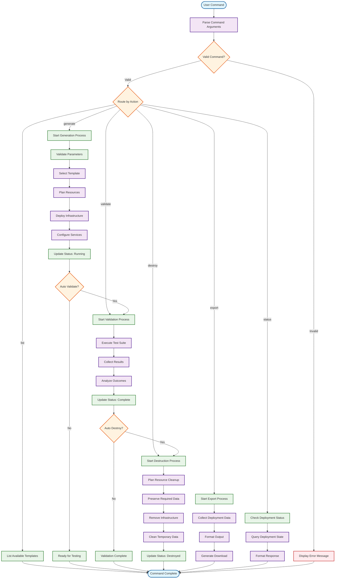
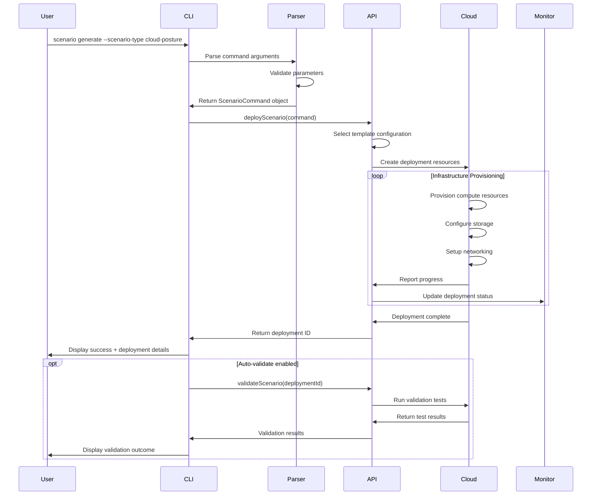
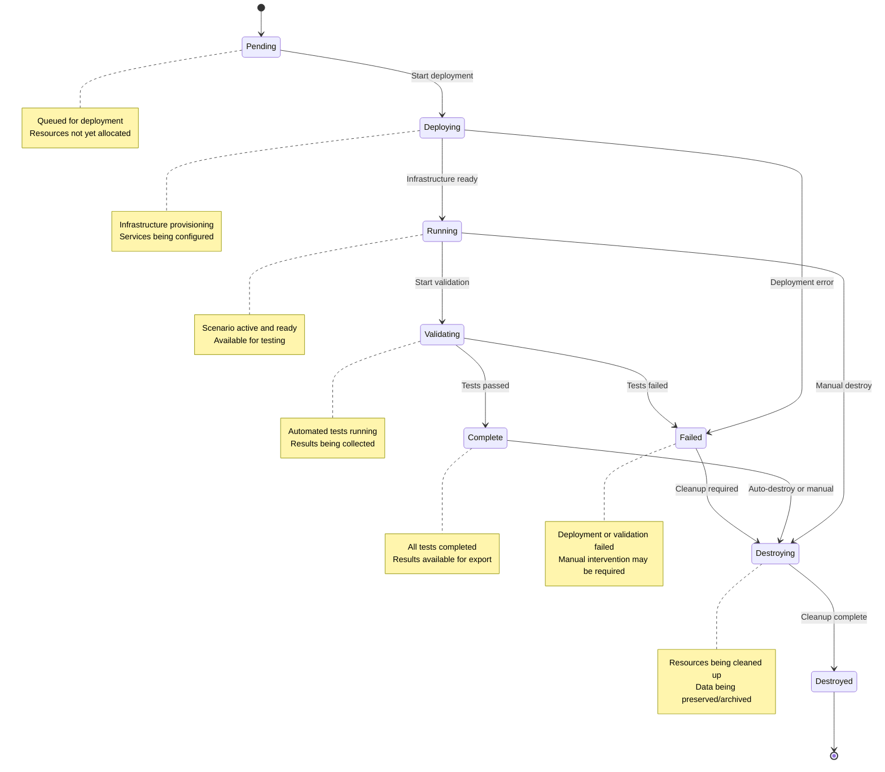
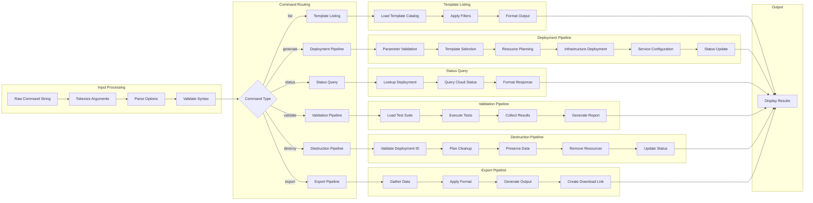
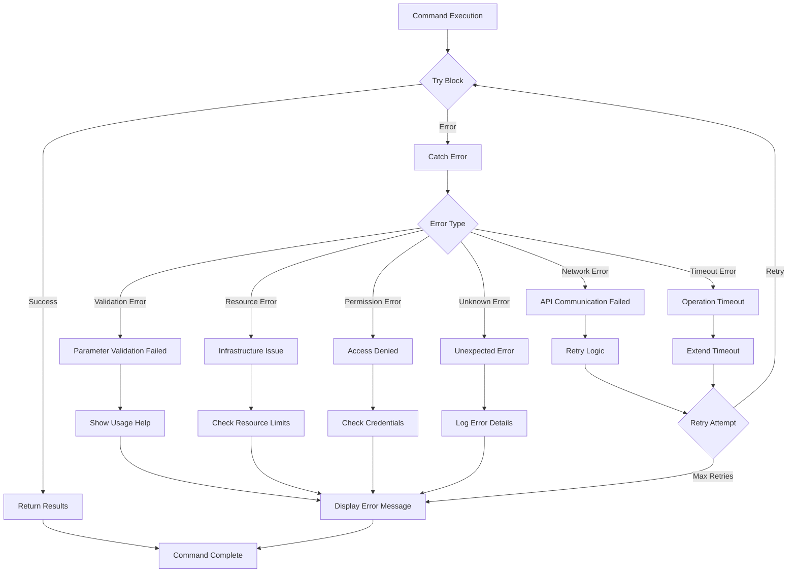
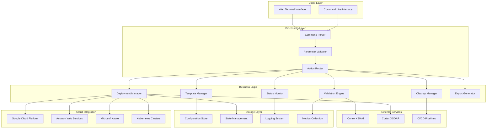

# Scenario Lifecycle Flowcharts

## Complete Scenario Management Flow

## Detailed Generation (Deploy) Process

## Status Monitoring Flow

## Command Processing Pipeline

## Error Handling Flow

## Resource Lifecycle Management

```mermaid
gantt
    title Scenario Resource Lifecycle
    dateFormat  HH:mm
    axisFormat %H:%M
    
    section Planning
    Parameter Validation    :milestone, m1, 00:00, 0m
    Template Selection      :active, plan1, after m1, 2m
    Resource Calculation    :active, plan2, after plan1, 1m
    
    section Deployment
    Infrastructure Start    :milestone, m2, after plan2, 0m
    Compute Provisioning    :active, deploy1, after m2, 5m
    Storage Configuration   :active, deploy2, after m2, 3m
    Network Setup          :active, deploy3, after deploy2, 2m
    Service Deployment     :active, deploy4, after deploy1, 4m
    
    section Testing
    Validation Start       :milestone, m3, after deploy4, 0m
    Security Tests         :active, test1, after m3, 8m
    Performance Tests      :active, test2, after m3, 6m
    Integration Tests      :active, test3, after test2, 4m
    
    section Cleanup
    Cleanup Start          :milestone, m4, after test1, 0m
    Data Preservation      :active, clean1, after m4, 2m
    Resource Removal       :active, clean2, after clean1, 5m
    Status Update          :active, clean3, after clean2, 1m
```

## Integration Architecture

These flowcharts provide comprehensive visual documentation of the scenario management system's lifecycle, showing how commands flow through the system, how resources are managed, and how different components interact with each other.
