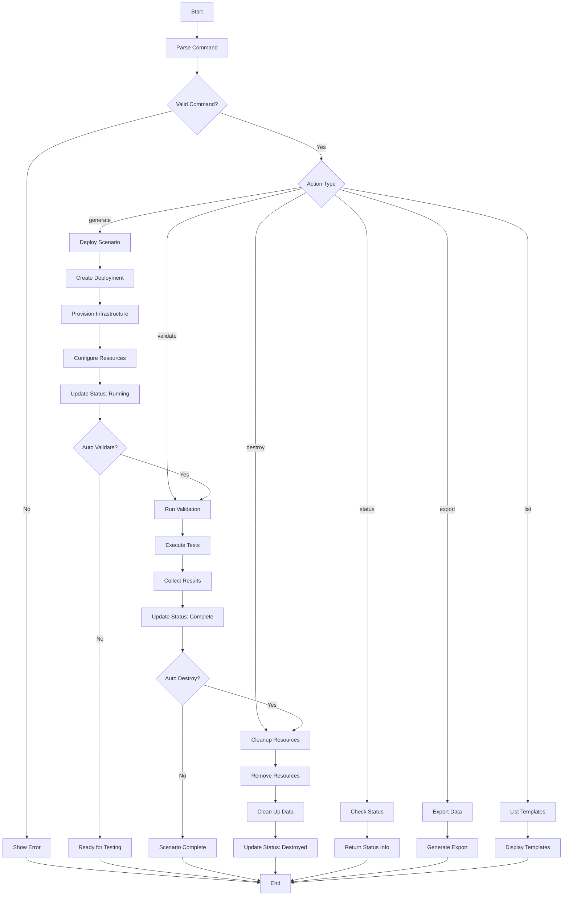

# Scenario Management System Documentation

## Overview

The Scenario Management System is a comprehensive security assessment and deployment platform built for POV-CLI. It enables the deployment, management, and validation of security scenarios across multiple cloud providers to test and demonstrate security controls.

## Table of Contents

1. [Core Enums](#core-enums)
2. [Primary Interfaces](#primary-interfaces)
3. [Scenario Templates](#scenario-templates)
4. [Command System](#command-system)
5. [Lifecycle Management](#lifecycle-management)
6. [API Integration](#api-integration)
7. [Usage Examples](#usage-examples)

---

## Core Enums

### ScenarioType

Defines the categories of security scenarios available for deployment:

```typescript
export type ScenarioType = 
  | 'cloud-posture'     // Cloud security posture management scenarios
  | 'container-vuln'    // Container vulnerability and security scenarios
  | 'code-vuln'         // Code vulnerability and SAST/DAST scenarios
  | 'insider-threat'    // Insider threat simulation scenarios
  | 'ransomware'        // Ransomware behavior simulation scenarios
  | 'waas-exploit'      // Web Application as a Service exploit scenarios
  | 'ai-threat'         // AI/LLM security threat scenarios
  | 'pipeline-breach'   // CI/CD pipeline security breach scenarios
  | 'custom';           // Custom user-defined scenarios
```

**Use Cases by Type:**
- **cloud-posture**: CSPM testing, misconfigurations, IAM issues
- **container-vuln**: Container image scanning, runtime protection
- **code-vuln**: Static/dynamic analysis testing, secure coding
- **insider-threat**: UEBA testing, lateral movement detection
- **ransomware**: EDR testing, behavioral analysis
- **waas-exploit**: WAF testing, application security
- **ai-threat**: AI security controls, prompt injection testing
- **pipeline-breach**: DevSecOps, supply chain security

### Provider

Specifies the cloud/infrastructure providers supported:

```typescript
export type Provider = 'aws' | 'gcp' | 'azure' | 'k8s' | 'local';
```

**Provider Capabilities:**
- **aws**: EC2, S3, Lambda, IAM, CloudTrail
- **gcp**: Cloud Functions, Cloud Storage, GKE, IAM
- **azure**: App Service, Blob Storage, AKS, Active Directory
- **k8s**: Kubernetes clusters, container orchestration
- **local**: Local development and testing scenarios

### Pipeline

Defines CI/CD pipeline integrations:

```typescript
export type Pipeline = 'ci' | 'gitlab' | 'github';
```

**Pipeline Integration Features:**
- **ci**: Generic CI/CD integration
- **gitlab**: GitLab CI/CD pipelines and security features
- **github**: GitHub Actions and security scanning

---

## Primary Interfaces

### ScenarioConfig

Core configuration interface for scenario definitions:

```typescript
export interface ScenarioConfig {
  id: string;                    // Unique identifier for the scenario
  name: string;                  // Human-readable scenario name
  type: ScenarioType;           // Category of the scenario
  description: string;           // Detailed description of what the scenario tests
  provider: Provider;           // Target cloud provider
  region?: string;              // Optional deployment region
  template?: string;            // Template name for infrastructure
  estimatedDuration: string;    // Expected completion time
  difficulty: 'beginner' | 'intermediate' | 'advanced' | 'expert';
  tags: string[];               // Categorization and searchability tags
  resources: {                  // Required infrastructure resources
    compute?: string;
    storage?: string;
    network?: string;
  };
}
```

**Key Fields Explained:**
- **id**: Must be unique across all scenario types (format: `{type-prefix}-{descriptive-name}`)
- **difficulty**: Indicates complexity and required expertise level
- **tags**: Used for filtering, searching, and categorization
- **resources**: Describes infrastructure components that will be provisioned

### ScenarioManifest

Complete deployment specification including metadata and configuration:

```typescript
export interface ScenarioManifest {
  metadata: {
    name: string;               // Scenario display name
    version: string;            // Semantic version (e.g., "1.2.0")
    author: string;             // Creator/maintainer information
    created: string;            // ISO 8601 creation timestamp
    description: string;        // Detailed scenario description
  };
  scenario: ScenarioConfig;     // Core scenario configuration
  deployment: {
    infrastructure: string[];   // List of infrastructure components to deploy
    dependencies: string[];     // External dependencies and requirements
    environment: Record<string, string>; // Environment variables and configuration
  };
  validation: {
    tests: string[];            // Validation test names/scripts
    expectedResults: string[];  // Expected test outcomes
    detectionRules: string[];   // Security detection rules to validate
  };
  cleanup: {
    autoDestroy: boolean;       // Whether to auto-cleanup after completion
    retentionPeriod: string;    // How long to retain resources/data
    preserveData: string[];     // Data/logs to preserve after cleanup
  };
}
```

**Usage Patterns:**
- **metadata**: Versioning and tracking deployment configurations
- **deployment**: Infrastructure-as-code specifications
- **validation**: Automated testing and verification steps
- **cleanup**: Resource management and data retention policies

### ScenarioDeployment

Runtime state and status tracking for active deployments:

```typescript
export interface ScenarioDeployment {
  id: string;                   // Unique deployment identifier
  scenarioId: string;           // Reference to source ScenarioConfig
  status: 'pending' | 'deploying' | 'running' | 'validating' | 'complete' | 'failed' | 'destroying';
  startTime: Date;              // Deployment initiation timestamp
  endTime?: Date;               // Completion timestamp (if finished)
  provider: Provider;           // Actual deployed provider
  region: string;               // Actual deployment region
  resources: {                  // Deployed resource references
    cloudFunctionUrl?: string;
    storageUrl?: string;
    logs?: string[];
  };
  results?: {                   // Validation and test results
    validationPassed: boolean;
    detectionAlerts: any[];
    telemetryData: any[];
    performanceMetrics: any;
  };
}
```

**Status Flow:**
1. **pending**: Deployment queued, waiting for resources
2. **deploying**: Infrastructure provisioning in progress
3. **running**: Scenario active, ready for testing
4. **validating**: Running validation tests
5. **complete**: All tests completed successfully
6. **failed**: Deployment or validation failed
7. **destroying**: Cleanup and resource removal in progress

---

## Scenario Templates

The `SCENARIO_TEMPLATES` constant provides pre-defined scenarios organized by type:

### Template Structure

```typescript
export const SCENARIO_TEMPLATES: Record<ScenarioType, ScenarioConfig[]>
```

### Available Templates by Category

#### Cloud Posture (`cloud-posture`)

**cp-misconfigured-s3**
- **Purpose**: Test CSPM detection of misconfigured cloud storage
- **Duration**: 15-30 minutes
- **Difficulty**: Beginner
- **Resources**: Cloud Storage bucket, Cloud Function
- **Tags**: storage, permissions, cspm, compliance

**cp-excessive-permissions** 
- **Purpose**: Demonstrate IAM privilege escalation risks
- **Duration**: 20-40 minutes  
- **Difficulty**: Intermediate
- **Resources**: Cloud Functions with various IAM roles
- **Tags**: iam, permissions, privilege-escalation, rbac

#### Container Vulnerabilities (`container-vuln`)

**cv-vulnerable-base-image**
- **Purpose**: Test container scanning and runtime protection
- **Duration**: 25-45 minutes
- **Difficulty**: Intermediate
- **Resources**: Cloud Run containers, Container Registry
- **Tags**: containers, vulnerability-scanning, runtime-protection, docker

#### Code Vulnerabilities (`code-vuln`)

**cv-sql-injection**
- **Purpose**: Test SAST/DAST capabilities with SQL injection
- **Duration**: 30-60 minutes
- **Difficulty**: Intermediate
- **Resources**: Cloud Run web application, Cloud SQL database
- **Tags**: web-security, sql-injection, sast, dast

#### Insider Threats (`insider-threat`)

**it-data-exfiltration**
- **Purpose**: Simulate insider threat behaviors
- **Duration**: 45-90 minutes
- **Difficulty**: Advanced
- **Resources**: Multiple Cloud Functions, data repositories
- **Tags**: insider-threat, data-exfiltration, lateral-movement, ueba

#### Ransomware (`ransomware`)

**rw-encryption-simulation**
- **Purpose**: Simulate ransomware encryption patterns
- **Duration**: 30-60 minutes
- **Difficulty**: Advanced
- **Resources**: Cloud Functions for encryption simulation
- **Tags**: ransomware, encryption, behavioral-analysis, edr

#### Web Application Exploits (`waas-exploit`)

**we-owasp-top10**
- **Purpose**: Test WAF capabilities with OWASP Top 10
- **Duration**: 60-120 minutes
- **Difficulty**: Expert
- **Resources**: Cloud Run with load balancer, Cloud Armor WAF
- **Tags**: web-security, owasp, waf, application-security

#### AI Threats (`ai-threat`)

**ai-prompt-injection**
- **Purpose**: Test AI security controls and prompt injection
- **Duration**: 45-75 minutes
- **Difficulty**: Advanced
- **Resources**: Cloud Functions with LLM integration
- **Tags**: ai-security, llm, prompt-injection, ai-red-team

#### Pipeline Breaches (`pipeline-breach`)

**pb-cicd-injection**
- **Purpose**: Simulate CI/CD pipeline compromise
- **Duration**: 60-90 minutes
- **Difficulty**: Expert
- **Resources**: Cloud Build pipelines and functions
- **Tags**: cicd, pipeline-security, supply-chain, devsecops

---

## Command System

### ScenarioCommand Interface

The command system uses a structured interface for parsing and executing scenario operations:

```typescript
export interface ScenarioCommand {
  action: 'generate' | 'list' | 'destroy' | 'validate' | 'export';
  scenarioType?: ScenarioType;
  provider?: Provider;
  region?: string;
  template?: string;
  file?: string;
  autoValidate?: boolean;
  destroyAfter?: string;
  output?: string;
  xsiamToken?: string;
  xsoarPlaybook?: string;
  pipeline?: Pipeline;
  verbose?: boolean;
  dryRun?: boolean;
  tags?: Record<string, string>;
}
```

### parseScenarioCommand Function

The `parseScenarioCommand` function converts command-line arguments into structured commands:

```typescript
export const parseScenarioCommand = (args: string[]): ScenarioCommand | null => {
  // Validation and parsing logic
  // Returns null for invalid commands
  // Returns structured ScenarioCommand for valid inputs
}
```

**Supported Arguments:**
- `--scenario-type <type>`: Specify the scenario category
- `--provider <provider>`: Target cloud provider
- `--region <region>`: Deployment region
- `--template <template>`: Specific template name
- `--file <file>`: Custom configuration file
- `--auto-validate`: Enable automatic validation
- `--destroy-after <duration>`: Schedule automatic cleanup
- `--output <format>`: Output format for results
- `--xsiam-token <token>`: Integration with Cortex XSIAM
- `--xsoar-playbook <playbook>`: Integration with Cortex XSOAR
- `--pipeline <type>`: CI/CD pipeline integration
- `--verbose`: Enable verbose logging
- `--dry-run`: Preview deployment without execution
- `--tag <key:value>`: Add custom tags

### Command Actions

#### list
```bash
scenario list [--scenario-type <type>]
```
- Lists available scenario templates
- Optional filtering by scenario type
- Returns formatted template information

#### generate (deploy)
```bash
scenario generate --scenario-type <type> --provider <provider> [options]
```
- Deploys a new scenario instance
- Requires scenario type and provider
- Returns deployment ID and status information

#### status
```bash
scenario status [deployment-id]
```
- Shows deployment status and details
- Lists all active deployments if no ID provided
- Returns real-time resource information

#### validate
```bash
scenario validate <deployment-id>
```
- Runs validation tests on deployed scenario
- Returns detailed test results and metrics
- Updates deployment status

#### destroy
```bash
scenario destroy <deployment-id>
```
- Cleanly removes deployed resources
- Provides cleanup status and logs
- Removes deployment from active tracking

#### export
```bash
scenario export <deployment-id> [--format json|csv|pdf]
```
- Exports scenario data and results
- Supports multiple output formats
- Generates downloadable artifacts

---

## Lifecycle Management

### Scenario Lifecycle Flowchart



### Detailed Lifecycle Phases

#### Phase 1: Generation (Deploy)
1. **Command Parsing**
   - Validate required parameters
   - Set defaults for optional parameters
   - Check provider and region availability

2. **Resource Planning**
   - Select appropriate template
   - Calculate resource requirements
   - Estimate deployment time

3. **Infrastructure Deployment**
   - Provision cloud resources
   - Configure networking and security
   - Deploy application components

4. **Status Monitoring**
   - Track deployment progress
   - Log infrastructure creation
   - Update deployment status

#### Phase 2: Validation
1. **Test Execution**
   - Run predefined validation tests
   - Execute security detection rules
   - Measure performance metrics

2. **Result Collection**
   - Gather test outcomes
   - Collect telemetry data
   - Document detection alerts

3. **Analysis**
   - Compare against expected results
   - Generate performance reports
   - Update validation status

#### Phase 3: Management
1. **Status Monitoring**
   - Real-time resource monitoring
   - Health checks and alerts
   - Performance tracking

2. **Export and Reporting**
   - Generate deployment reports
   - Export test results
   - Create audit trails

#### Phase 4: Destruction
1. **Resource Cleanup**
   - Remove cloud infrastructure
   - Delete temporary data
   - Clean up security rules

2. **Data Preservation**
   - Archive important logs
   - Preserve test results
   - Maintain audit records

3. **Status Updates**
   - Mark deployment as destroyed
   - Update tracking systems
   - Generate cleanup reports

---

## API Integration

### CloudFunctionsAPI Class

The `CloudFunctionsAPI` class provides integration with Google Cloud Functions for scenario management:

```typescript
export class CloudFunctionsAPI {
  private readonly baseUrl: string;
  private readonly projectId: string;

  // Core API Methods
  async deployScenario(command: ScenarioCommand): Promise<DeployResult>
  async getDeploymentStatus(deploymentId: string): Promise<StatusResult>  
  async listDeployments(): Promise<ListResult>
  async validateScenario(deploymentId: string): Promise<ValidationResult>
  async destroyScenario(deploymentId: string): Promise<DestroyResult>
  async exportScenarioData(deploymentId: string, format: string): Promise<ExportResult>
}
```

### API Endpoints

| Method | Endpoint | Purpose |
|--------|----------|---------|
| POST | `/scenario-deploy` | Deploy new scenario |
| GET | `/scenario-status/{id}` | Get deployment status |
| GET | `/scenario-list` | List all deployments |
| POST | `/scenario-validate` | Run validation tests |
| POST | `/scenario-destroy` | Destroy deployment |
| POST | `/scenario-export` | Export scenario data |

### Response Formats

All API responses follow a consistent format:

```typescript
interface APIResponse<T> {
  success: boolean;
  message: string;
  data?: T;
  error?: string;
}
```

---

## Usage Examples

### Basic Scenario Deployment

```bash
# List available templates
scenario list

# Deploy a cloud posture scenario
scenario generate --scenario-type cloud-posture --provider gcp --region us-central1

# Check deployment status
scenario status deploy-1234567890-abc123def

# Run validation tests
scenario validate deploy-1234567890-abc123def

# Export results
scenario export deploy-1234567890-abc123def --format pdf

# Clean up resources
scenario destroy deploy-1234567890-abc123def
```

### Advanced Deployment Options

```bash
# Deploy with auto-validation and scheduled cleanup
scenario generate \
  --scenario-type ai-threat \
  --provider gcp \
  --auto-validate \
  --destroy-after "2h" \
  --verbose

# Deploy custom scenario from file
scenario generate \
  --file custom-scenario.yaml \
  --provider aws \
  --region us-west-2 \
  --tag environment:testing

# Dry run deployment
scenario generate \
  --scenario-type ransomware \
  --provider azure \
  --dry-run
```

### Integration Examples

```bash
# Deploy with XSIAM integration
scenario generate \
  --scenario-type insider-threat \
  --provider gcp \
  --xsiam-token $XSIAM_TOKEN \
  --auto-validate

# Deploy with CI/CD pipeline integration
scenario generate \
  --scenario-type pipeline-breach \
  --provider gcp \
  --pipeline github \
  --verbose
```

### Filtering and Search

```bash
# List only container vulnerability scenarios
scenario list --scenario-type container-vuln

# List scenarios by difficulty
scenario list --filter difficulty:advanced

# Search scenarios by tag
scenario list --tag web-security
```

---

## Error Handling

### Common Error Scenarios

1. **Invalid Scenario Type**
   ```
   Error: Unknown scenario type 'invalid-type'
   Available types: cloud-posture, container-vuln, code-vuln, insider-threat, ransomware, waas-exploit, ai-threat, pipeline-breach
   ```

2. **Missing Required Parameters**
   ```
   Error: Missing required parameter --scenario-type
   Usage: scenario generate --scenario-type <type> --provider <provider> [options]
   ```

3. **Deployment Failures**
   ```
   Error: Failed to provision infrastructure
   Reason: Insufficient quota for region us-central1
   Suggestion: Try a different region or request quota increase
   ```

4. **Validation Failures**
   ```
   Warning: 2 of 5 validation tests failed
   - Test: SQL Injection Detection - Status: FAILED
   - Test: XSS Protection - Status: FAILED
   See detailed results with: scenario export <deployment-id>
   ```

### Troubleshooting Guide

1. **Check system status**: `scenario status`
2. **Verify credentials**: Ensure cloud provider authentication
3. **Review logs**: Use `--verbose` flag for detailed logging
4. **Validate configuration**: Use `--dry-run` to test before deployment
5. **Export diagnostics**: Use `scenario export` to gather debugging information

---

## Security Considerations

### Data Protection
- All scenario data is encrypted in transit and at rest
- Sensitive configuration values are masked in logs
- Export capabilities include data redaction options

### Access Control
- Role-based access control for scenario management
- API authentication required for all operations
- Audit logging for all scenario activities

### Resource Isolation
- Each deployment uses isolated cloud resources
- Network segmentation prevents cross-scenario access
- Automatic cleanup prevents resource leakage

---

This comprehensive documentation covers all aspects of the Scenario Management System, providing developers and users with complete information about types, interfaces, templates, commands, and lifecycle management.
